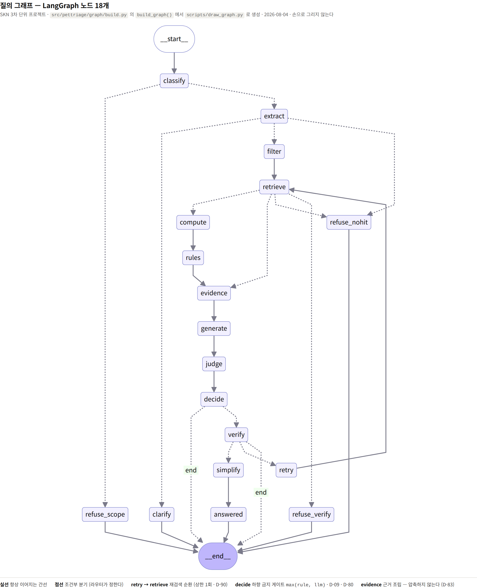
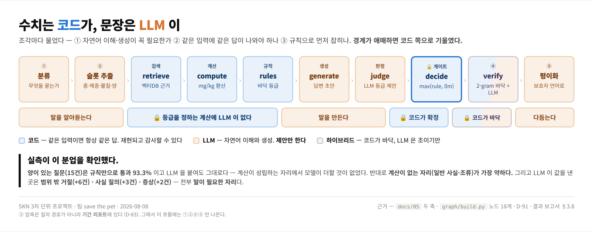
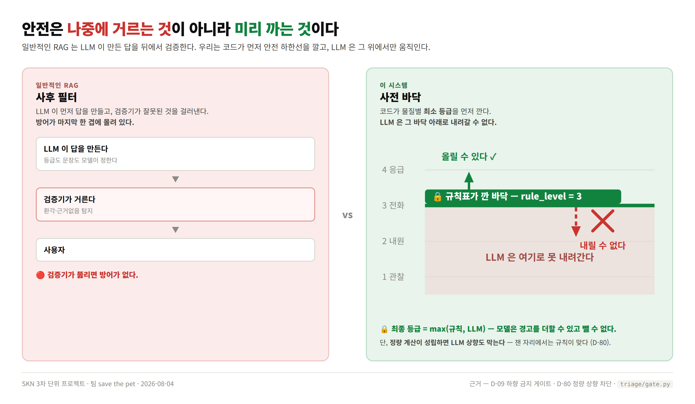
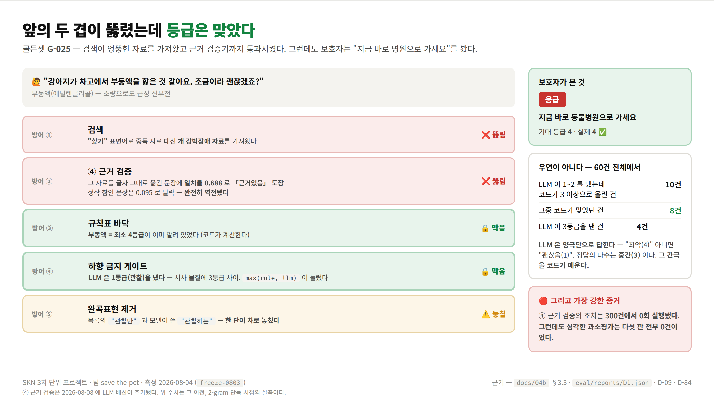

<div align="center">

# 🐾 PetTriage

### 반려동물 헬스케어 다이어리 &amp; 응급 대응

**RAG가 근거를 가져오고, 코드가 등급을 판정하며, LLM은 그 위로만 움직인다.**

개 · 고양이 · **앵무새**

<br>

[](https://github.com/SKNETWORKS-FAMILY-AICAMP/SKN32-3rd-5Team/actions/workflows/ci.yml?query=branch%3Amain+event%3Apush)


<br>

**SKN 3차 단위 프로젝트 · 팀 save the pet**

오한빈(팀장) · 이근준 · 권소라 · 이서은

<br>

[📄 결과 보고서](eval/reports/결과보고서_제출용/2026-08-04_결과보고서.md) ·
[📊 한 장 요약](eval/reports/결과보고서_제출용/결과보고서_한장요약.html) ·
[🖼 발표용 PDF](eval/reports/결과보고서_제출용/결과보고서_발표용.pdf) ·
[🗺 설계 한 장](docs/시스템설계_한장.pdf)

</div>

<br>

> ⚠️ 비상업 교육·연구 목적이며, **수의학적 진단을 대체하지 않습니다.**

---

## 무엇을 하는가

보호자가 *"우리 강아지가 다크초콜릿 60g 먹었어요. 5kg인데 괜찮을까요?"* 라고 물으면,
진단하지 않고 — 검증된 자료의 근거를 찾아 **지금 무엇을 해야 하는지**에 답한다.

> 🔴 **응급** · 지금 바로 동물병원으로 가세요
>
> 다크초콜릿의 테오브로민은 g당 약 16 mg이므로 60 g이면 약 960 mg이고, 체중 5 kg 기준
> **약 192 mg/kg** 입니다. 자료는 40–50 mg/kg에서 중증 징후가 관찰된다고 기록합니다.
>
> — 출처 `S-034` (테오브로민 중독 역치) · `S-047` (초콜릿 종류별 함량)

수치 계산은 코드가 하고, 문장은 LLM이 쓴다. **등급을 정하는 계산에 AI는 관여하지 않는다.**
일상 기록(다이어리)이 내부 문서가 되어 *"내 기록 × 공적 기준 → 판정"* 구조가 성립한다.

<div align="center">



<sub>노드 18개. 손으로 그리지 않는다 — <code>scripts/draw_graph.py</code> 가 <code>build_graph()</code> 에서 뽑는다.</sub>

</div>

파이프라인을 조각내고 **조각마다 물었다** — ① 자연어 이해·생성이 꼭 필요한가
② 같은 입력에 같은 답이 나와야 하나 ③ 규칙으로 먼저 잡히나.
경계가 애매하면 코드 쪽으로 기울였다.

<div align="center">



</div>

- 체중·섭취량·종이 없으면 추측하지 않고 **되묻는다** (상한 2회)
- 도메인 밖이면 **검색조차 하지 않고** 거절한다
- 초안의 모든 문장이 근거없음이면 **재검색 1회** → 그래도 부족하면 거절

<details open>
<summary><b>기술 스택 — 무엇을 왜 골랐나</b></summary>

<br>

| 층 | 무엇 | 왜 이것인가 |
|---|---|---|
| **오케스트레이션** | **LangGraph** `0.2.x` · `langchain-core` | 조건부 분기와 **순환**(`retry → retrieve`)이 필요했다. 노드 18개를 `StateGraph` 로 조립한다. 핵심 의존성이라 `.[api]` 만 깔아도 그래프가 돈다 |
| **LLM 연동** | **LangChain** (`ChatOpenAI`) · OpenAI SDK 직접 | 필수 산출물. **LLM 연동에만** 쓰고 벡터DB는 직접 다룬다. 두 경로가 같은 `LLMClient` 프로토콜 뒤에 있어 **설정 한 줄로 갈아 끼운다** |
| **벡터 DB** | **Chroma** `0.6.x` · 컬렉션 `external` 888청크 | 로컬 파일 기반이라 팀원이 각자 만들 수 있다. 인덱스는 커밋하지 않는다 |
| **임베딩** | **BAAI/bge-m3** (`sentence-transformers`) | 한국어 문장으로 문장화한 코퍼스라 다국어 모델이 필요했다 |
| **대형 LLM** | **gpt-4o-mini** (OpenAI 호환 엔드포인트 교체 가능) | 비교군 `A`·`A-LC` |
| **sLLM 파인튜닝** | **Qwen3-4B** + **QLoRA** (`peft` · `trl` · `bitsandbytes` 4bit) | 비교군 `C`·`D`. RTX 3080(10GB)에서 학습 |
| **API** | **FastAPI** `0.115` · **Pydantic v2** · uvicorn | **계약을 스키마로 강제한다** — 안전 불변식이 타입 검증에 들어가 있다 |
| **DB** | **MySQL** + **SQLAlchemy 2.x** (개발은 SQLite) · PyJWT · bcrypt | 계정 · 반려동물 프로필 · 다이어리 |
| **프론트** | 정적 HTML 6장 — 빌드 도구·node 없음 | API와 **같은 출처**에서 뜬다. 배달 계층의 일부다 |
| **수집·전처리** | pypdf · pdfplumber · BeautifulSoup · pandas · piexif | 원문 → 사실 표 → **코드가 문장화** |
| **품질** | pytest **589** · ruff · mypy · pre-commit · GitHub Actions | 안전 장치 회귀 테스트가 CI 게이트다 |
| **런타임** | Python **3.11** · `constraints.txt` 로 버전 고정 | 재현성 요건 |

> **버전을 상한까지 고정한 이유** — `constraints.txt` 가 잠근다.
> 실험 결과를 보고할 때 **이 파일의 커밋 해시를 함께 적는다.**

</details>

<br>

## 바로 실행하기

**`실행.bat` 을 더블클릭하면** 설치부터 시연까지 메뉴에서 고를 수 있다. 환경변수를 외울 필요가 없다.

```
   1  처음 설치        venv + 패키지          5  시연 서버 켜기
   2  .env 설정        키 입력 · 검증         6  평가 돌리기
   3  벡터 인덱스      임베딩 4~9GB           7  테스트
   4  환경 점검        doctor                 8  DB 초기화   9  자유질의 검증
```

위에서부터 **1 → 2 → 3** 을 누르면 준비가 끝난다. MySQL 도 도커도 필요 없다 — 기본값이 SQLite 파일 하나다.

| 환경 | 실행 |
|---|---|
| Windows | `실행.bat` 더블클릭 |
| macOS · Linux | `python PetTriage_Launcher` |

> ⚠️ `5`·`6`·`9` 는 LLM을 부른다(비용 발생). 시연은 **무료 폴백 모드**를 고를 수 있어
> 화면과 흐름만 볼 때는 비용이 들지 않는다.

<details open>
<summary><b>수동 설치 · make 타깃 · 설치 그룹</b></summary>

<br>

GPU가 없어도 API·테스트는 전부 돈다. 학습 의존성은 `[train]` 으로 분리되어 있다.

```bash
python -m venv .venv && source .venv/bin/activate    # Windows: .venv\Scripts\activate
make install                                          # = pip install -e '.[api,rag,ingest,db,dev]' -c constraints.txt
cp .env.example .env                                  # 키 입력 (OPENAI_API_KEY · JWT_SECRET_KEY)
pytest                                                # 589 passed  (-q 를 붙이지 않는다)
python scripts/build_index.py --store chroma          # 벡터 인덱스는 커밋되지 않는다. 각자 만든다
make serve                                            # http://127.0.0.1:8000
```

🪟 **Windows 에는 `make` 가 없다.** `Makefile` 을 열면 각 타깃의 명령이 그대로 적혀 있으니 직접 쓴다.
CI 와 같은 검사를 돌리려면 — `ruff check src tests scripts eval` · `ruff format --check src tests scripts eval` · `pytest`

| 설치 그룹 | 언제 |
|---|---|
| `.[api]` | 배달 계층만. 팀원 대부분이 이것으로 충분 |
| `.[rag]` | 임베딩 · 벡터DB · LangGraph · LangChain |
| `.[db]` | 계정 · 반려동물 프로필. **`DATABASE_URL` 을 켜면 필수** |
| `.[ingest]` | PDF·HTML 파싱, EXIF 제거 |
| `.[qwen]` | 로컬 Qwen 서빙 (비교군 C·D) |
| `.[train]` | GPU 전용 — torch · peft · trl · bitsandbytes |
| `.[dev]` | pytest · ruff · pre-commit |

🔴 **`[db]` 를 빠뜨리지 않는다.** 없어도 설치는 성공하지만 `tests/test_auth_api.py` 가 모듈째
건너뛰어져 인증·프로필 25건이 안 도는데 요약줄에는 `1 skipped` 로만 보인다.

```bash
make facts     # 사실 표 검사          make eval     # 평가 하네스
make golden    # 골든셋 검사            make verify   # 층 0 — 코퍼스 정합성
make index     # 사실 표 → 청크         make todo     # 남은 일 목록
```

컨테이너는 `make up` (API + MySQL). MySQL 은 로컬에 설치하지 않는다.
새 기계라면 먼저 `python scripts/doctor.py` — 무엇이 없는지 한 줄씩 나온다.

</details>

<br>

## 목차

[핵심 주장](#핵심-주장--안전은-사후-검증이-아니라-사전-바닥에서-온다) ·
[안전 장치](#안전-장치--지표가-아니라-구조로-막는다) ·
[측정 결과](#측정-결과) ·
[아직 못 한 것](#아직-못-한-것) ·
[필수 산출물](#필수-산출물-넷) ·
[역할 분담](#역할-분담) ·
[저장소 구조](#저장소-구조) ·
[데이터](#데이터는-이-저장소에-없다) ·
[라이선스](#라이선스)

---

## 핵심 주장 — 안전은 사후 검증이 아니라 사전 바닥에서 온다

일반적인 RAG는 **사후 필터** 구조다. LLM이 먼저 답을 만들고 검증기가 잘못된 것을 걸러낸다.
검증기가 뚫리면 방어가 없다.

이 시스템은 반대로 **코드가 안전 하한선을 먼저 깔고 LLM은 그 위에서만** 움직인다.

<div align="center">



</div>

### 이것을 증명한 실측 — G-025

*"강아지가 차고에서 **부동액을 핥은** 것 같아요. 조금이라 괜찮겠죠?"*
(에틸렌글리콜 — 소량으로도 급성 신부전)

| 방어 층 | 이 건에서 | |
|---|---|---|
| 검색 | "핥기" 표면어로 중독 자료 대신 **개 강박장애 자료**를 가져왔다 | ❌ 뚫림 |
| ④ 근거 검증 | 그 자료를 옮긴 문장에 일치율 0.688로 「근거있음」 도장. 정작 참인 문장은 0.095로 탈락 | ❌ 뚫림 |
| 규칙표 바닥 | **부동액 = 최소 4등급**이 이미 깔려 있었다 | 🔒 막음 |
| 하향 금지 게이트 | LLM은 1등급(관찰)을 냈다 — 치사 물질에 3등급 차이. `max(rule, llm)` 이 눌렀다 | 🔒 막음 |

<div align="center">



</div>

**앞의 두 겹이 뚫렸는데 보호자는 "지금 바로 동물병원으로 가세요"를 봤다.**

### 우연이 아니다 — 60건 전체에서

| | |
|---|---|
| LLM이 1~2등급으로 봤는데 코드가 3등급 이상으로 올린 건 | **10건** |
| 그중 코드가 맞았던 건 | **8건** |
| LLM 등급 분포 | 4가 18 · **1이 12** · 3이 4 · 2가 4 |
| 정답 등급 분포 | **3이 19** · 4가 9 · 1이 7 · 2가 3 |

LLM은 양극단으로 답한다 — "최악(4)" 아니면 "괜찮음(1)". 정답의 다수는 중간(3)인데
LLM이 3을 낸 것은 4건뿐이다. **그 간극을 코드가 메운다.**

### 그리고 가장 강한 증거 — 우발적 절제

④ 근거 검증의 **조치**는 300건을 도는 동안 한 번도 실행되지 않았다
(발동 조건 `all_ungrounded` 가 사문이었다). 그런데도 **심각한 과소평가는 다섯 번 측정 전부 0건**이었다.

> 검증기의 조치가 통째로 놀고 있는 동안에도 안전 지표가 유지됐다는 것이,
> **이 시스템의 안전 마진이 어디서 오는지**를 그대로 보여준다.

⚠️ 다만 선은 정확히 긋는다. **지켜진 것은 등급이지 문장이 아니다** — G-025에서 배지는
맞았지만 본문에는 *"관찰하세요"* 가 실려 나갔다.

---

## 안전 장치 — 지표가 아니라 구조로 막는다

**🔒 트리아지 하향 금지 게이트**
규칙이 낸 등급은 확정이 아니라 **바닥**이다. LLM은 등급을 낮출 수 없다.
단, 정량 계산이 성립하면 LLM 상승도 막는다 — 잰 자리에서는 규칙이 맞다.

**바닥이 없는 자리도 코드가 올린다**
규칙표에 없는 물질이라도 근거가 독성 자료면 관찰로 끝내지 않고 "지금 전화"로 올린다.
*"모르는 것을 안전으로 읽지 않는다."*

**종 미확인 시 답변 금지**
포유류 기준의 조류 적용은 치명적이다. 종이 없으면 검색 자체를 하지 않는다.

**근거를 필드로 낸다**
정량계산 · 최악가정 · 양미상 · 정성 · 모델판정 — 무엇에 근거해 등급을 냈는지 밝히고,
**밝히지 않으면 계약이 응답을 거부한다.**

**연락처는 코드가 뺀다**
코퍼스가 전부 미국 자료라 답변에 미국 핫라인이 실린다. 출력 직전 문장 단위로 제거하고,
계약이 한 번 더 확인한다.

**유사도로 거절하지 않는다**
근거 있음(0.547~0.733)과 없음(0.494~0.659) 분포가 겹친다. 어떤 값을 잘라도 한쪽이 틀린다.
거절은 앞의 ①분류(범위 밖)와 뒤의 ④검증이 만든다.

### 같은 비대칭이 세 층에서 각자 나왔다

| 층위 | 규칙 |
|---|---|
| **등급** | `max(rule_level, llm_level)` — 모델은 올릴 수만 있다 |
| **문장** | 완곡 표현 제거 — 모델은 경고를 뺄 수 없다 |
| **④ 검증** | 2-gram이 바닥, LLM은 조이기만 한다 |

> ### 모델은 경고를 더할 수 있고 뺄 수 없다.
> 세 층은 서로 다른 시점에 각자 발명됐다. **우연이 세 번이면 원리다.**

트리아지 등급은 임의로 정하지 않고 코퍼스의 행동 지시어에서 도출했다.

| 값 | 정수 | 배지 | 사용자에게 |
|---|---|---|---|
| `EMERGENCY` | 4 | 응급 | 지금 바로 동물병원으로 가세요 |
| `CALL_NOW` | 3 | 전화 | 지금 수의사에게 전화해 상태를 알리세요 |
| `VISIT_SOON` | 2 | 내원 | 오늘 중 진료를 받으세요 |
| `MONITOR` | 1 | 관찰 | 집에서 지켜보고, 아래 증상이 나타나면 연락하세요 |

숫자가 클수록 위험하므로 `max()` 가 그대로 성립한다. → [`triage/levels.py`](src/pettriage/triage/levels.py)

---

## 측정 결과

골든셋 60건 · 동결 커밋 `freeze-0803` · 같은 시험을 **세 가지 구성**으로 각각 풀렸다.

| | **none**<br>코드·규칙만 | **A**<br>LLM 연동 | **A-LC**<br>LangChain |
|---|---|---|---|
| 통과 | 45.0% (27/60) | **65.0%** (39/60) | **65.0%** (39/60) |
| 상태 일치 | 63.3% | **83.3%** | **83.3%** |
| 과소평가 | 7.4% (2) | **0.0%** (0) | 2.8% (1) |
| **중대 과소평가** | **0건** | **0건** | **0건** |
| **등급 못 낸 긴급 건** | **25.0%** (7/28) | **3.6%** (1/28) | **3.6%** (1/28) |
| must_cite (any) | 59.0% | **79.5%** | **79.5%** |
| 인용률 | 99.5% ⚠️무효 | **66.1%** | 66.3% |
| 지연 (answered p50) | 0.15 s | 10.43 s | 10.24 s |
| 5태스크 전부 모델 | 0/60 | **60/60** | **60/60** |

**가장 큰 효과는 통과율이 아니라 안전 쪽이다.** 정답이 3등급 이상인 28건 중 규칙만으로는
7건이 등급을 못 내고 되묻거나 거절했다. AI를 붙이자 1건으로 줄었다.
환각을 막으려고 넣은 모델이 실제로는 **침묵을 줄이는 자리**에서 값을 냈다.

> ⚠️ `none` 의 인용률 99.5%는 **무효값**이다. LLM이 없으면 `draft = context` 라
> 표절 검사기가 자기 자신을 비교한 것이다. 건당 문장 수가 그것을 드러낸다 —
> `none` 12.6문장 vs `A` 4.0문장. 등급 일치도도 같은 이유로 나란히 놓지 않는다.

### 필수 요건 — LangChain 연동의 동작 증명

같은 모델을 ① OpenAI SDK로 직접 부른 판과 ② LangChain으로 부른 판을 따로 측정했다.
통과 39/60으로 같고 **실패 21건의 `case_id` 까지 동일**하다.

그런데 LLM 등급은 3건에서 갈렸다. 그래도 채점 결과가 같았다는 것이 더 강한 증거다 —
**흔들림을 흡수한 것은 프롬프트가 아니라 바닥과 게이트**다. 갈린 유일한 최종 등급은
`rule=None`, 바닥이 없는 자리였다.

<details open>
<summary><b>AI는 어디에서 값을 냈나 — 유형별 분해</b></summary>

<br>

| 유형 | n | 통과 none → A | 읽는 법 |
|---|---|---|---|
| 범위 밖 질문 | 9 | 33.3% → **100%** | *"우리가 답할 수 없는 질문"* 을 정확히 거절하게 됐다 |
| **양이 있는 질문** | 15 | **93.3% → 93.3%** | 🔴 **AI 기여 0** — 수치 판정은 코드가 이미 완성했다 |
| 종에 관한 질문 | 9 | 44.4% → **66.7%** | 등급 정확도 100% |
| 증상 질문 | 3 | 0% → **66.7%** | 등급 정확도 100% |
| 일반 사실 질문 | 12 | 16.7% → **41.7%** | 계산이 없는 영역 — 가장 약하다 |
| 정보 부족 질문 | 9 | 44.4% → 33.3% | 오히려 내려갔다 — 미결 설계 |
| 예방 질문 | 3 | 0% → 0% | 구조가 다른 질문 — 별도 설계 필요 |

계산이 성립하는 자리가 가장 강하고, 계산이 없는 자리가 가장 약하다.
*"수치는 코드, 문장은 LLM"* 이라는 분업이 실제로 작동한다는 증거다.

</details>

<details open>
<summary><b>이 숫자를 믿어도 되는 이유</b> — 오차를 먼저 확정하고, 예측하고 나서 쟀다</summary>

<br>

한 번 재서 나온 값이 아니라, **여덟 번 재면서 고친 것과 움직인 것을 맞춰 본** 값이다.

| 회차 | 통과율 | 무엇을 했나 |
|---|---|---|
| B1·B2·B3 | 55.0 / 55.0 / 56.7% | 아무것도 안 바꾸고 3번 반복 → 흔들린 건 60건 중 2건.<br>**측정 오차 ±1건(±1.7pp)을 먼저 확정했다** |
| C1 | 60.0% | 고칠 항목을 지목 → 지목한 건이 그대로 움직였다 |
| C2 | 65.0% | **어느 3건이 통과할지 미리 적어 두고 맞혔다** |
| **D1 (동결)** | **65.0%** | 오차 범위 안에서 예측대로 — 이 값을 보고한다 |

**우연히 오른 건이 하나도 없다.**

### 틀린 21건을 전부 분류했다 (미분류 0)

| 뿌리 | n | 손댈 곳 |
|---|---|---|
| 예방형 질의 구조 | 5 | 설계 (설계안 있음) |
| 골든셋 정정 대기 | 4 | 시험 문제 |
| 문구만 미달 | 4 | 채점 기준 · 생성 |
| 되물어야 하는데 답했다 | 3 | 설계 |
| 규칙 표의 빈칸 | 3 | 자료 |
| 검색 0건 | 2 | 코퍼스 |

> ### 더 좋은 AI 모델로 바꿔서 해결되는 항목이 하나도 없다.
> 21건 중 12건이 미결 설계와 시험 문제, 3건이 규칙표의 빈칸, 2건이 자료 부족이다.

### 분모를 섞지 않는다

| 지표 | 분모 | 왜 |
|---|---|---|
| 통과 · 상태 일치 | 60 (전건) | |
| 등급 일치 · 과소 · 과대 | 양쪽 다 등급이 있는 건만 | 등급을 안 낸 건을 "틀렸다"로 세면 **거절이 과소평가로 둔갑한다** |
| 등급 못 낸 긴급 건 | 정답이 3등급 이상인 28건 | 등급 오류가 아니다. 과소평가율에 섞지 않는다 |
| must_not_contain | `answered` 이면서 금지 문구가 정의된 건 | 거절·되묻기는 금지 문구를 쓸 기회가 없어 거저 통과한다 |

</details>

<details open>
<summary><b>재현 — API 키 없이 기준선을 다시 잴 수 있다</b></summary>

<br>

```bash
git checkout freeze-0803          # 093d101 · provenance.dirty = false
pip install -e '.[api,rag,ingest,db,dev]' -c constraints.txt
export PETTRIAGE_PROFILE=eval     # Windows: $env:PETTRIAGE_PROFILE="eval"

python eval/harness/run_eval.py --arm none  --json eval/reports/재현_none.json
python eval/harness/run_eval.py --arm A     --json eval/reports/재현_A.json     # OPENAI_API_KEY 필요
python eval/harness/run_eval.py --arm A-LC  --json eval/reports/재현_A-LC.json  # OPENAI_API_KEY 필요
```

`--arm none` 기준선은 키 없이 누구나 재현할 수 있다 — 코드·규칙 부분의 검증에는 그것으로 충분하다.
`--arm` 은 관련 환경변수를 **전부 비우고** 시작한다. 손으로 맞추면 빠뜨리고, 빠뜨리면
다른 조건으로 재고도 모른다.

결과 비교는 총계가 아니라 케이스 단위로 한다 — `python scripts/diff_reports.py A.json B.json`

</details>

---

## 아직 못 한 것

이 절을 지우지 않는 이유 — 위 §핵심 주장의 설득력이 여기서 나온다.
**결함을 정확히 아는 시스템과, 결함을 모르는 시스템은 다르다.**

| | |
|---|---|
| **지켜진 것은 등급이지 문장이 아니다** | G-025에서 배지는 맞았지만 본문에 *"관찰하세요"* 가 실려 나갔고 출처 목록에 무관한 문서가 붙었다. 문장 수준 사실성은 통제되지 않았다 |
| **④의 조치가 사실상 발동하지 않는다** | 판정은 매 문장 돌지만, 조치(재검색·거절)의 발동 조건 `all_ungrounded` 가 사문이다. 답변당 문장이 4개 안팎이고 인용률이 66%라 넷 중 하나는 근거를 옮겨 온다 |
| **10.4초 침묵** | 스트리밍을 쓰지 않으므로 이 값이 그대로 사용자가 겪는 침묵이다. 응급 상황에서 그 자체로 설계 결함 |
| **통과율 65.0%는 답변 품질이 아니다** | 문구 조건이 `any` 라 필수 문구가 빠져도 통과하고, 통과 39건 중 10건은 채점 조건이 0개인 거절 케이스다 |
| **골든셋이 물질 중심으로 편향돼 있다** | 골든셋 밖 20건을 돌려 보니 `answered` 11건 중 **3건(27%)** 에서 무관한 자료가 근거로 실렸다. *"강아지가 아파요"* 한마디에 등급 4가 섰다 |
| **어휘 표에 구멍이 있다** | *"초콜릿"* 은 통과하는데 *"초코"* 는 거절된다. 별칭 표에 없어서다 |
| **`prevent` 유형 통과 0% · 조류 정량 역치 0행** | 예방형 질의는 구조가 다르고, 조류는 체중당 자료가 없어 정성 표에만 의존한다 |

> ℹ️ **④ 근거 검증의 하이브리드 구조**(2-gram이 바닥, LLM은 조이기만 — D-91)는
> **2026-08-03 에 구현돼 시연까지 마쳤다.** 다만 **동결은 그 구현이 없는 브랜치에서 잡았으므로,
> `freeze-0803` 과 이 문서의 모든 측정 수치는 2-gram 단독 판정**이다.
>
> 위 표의 *"④의 조치가 사실상 발동하지 않는다"* 는 **그대로 남아 있다** — 판정기를 바꾼 것이지
> 발동 조건(`all_ungrounded`)을 바꾼 것이 아니다.

### 파인튜닝 결과 — 다른 축의 측정

작은 모델(Qwen3-4B + QLoRA)을 우리 과제에 학습시켰을 때 **④ 근거 검증 태스크에서
가장 크고 명확한 개선**이 나왔다 — held-out 20건에서 베이스 10/20 → 어댑터 20/20
(Fisher 정확검정 p = 0.0004). 분류·슬롯은 베이스도 이미 만점이라 차이가 보이지 않는다.

> ⚠️ **골든셋 60건과 다른 시험지다**(학습 데이터에서 떼어 둔 문제). 위 측정 표와 나란히 놓지 않는다.

남은 과제의 우선순위는 [결과 보고서 §9](eval/reports/결과보고서_제출용/2026-08-04_결과보고서.md)와
[`docs/06` §8](docs/06_설계결정기록.md)에 있다. 첫 번째는 **근거 적합성 검사** —
질문의 물질과 출처의 물질이 다르면 근거에서 제외한다. 가드레일 모델도 LLM 호출도 필요 없고,
`substance` 슬롯과 사실표 열의 **문자열 대조 한 번**이면 된다.

---

## 필수 산출물 넷

| 산출물 | 어디 |
|---|---|
| ① **수집 데이터 · 전처리 문서** | [`docs/01`~`01e`](docs/) · `data/facts/` 888행 · `data/manifests/` 대장 4종 · [`ingest/`](src/pettriage/ingest/) |
| ② **시스템 아키텍처** | [`docs/02`](docs/02_시스템-아키텍처.md) · [한 장 요약 PDF](docs/시스템설계_한장.pdf) · LangGraph 실물 [`graph/build.py`](src/pettriage/graph/build.py) |
| ③ **RAG + 벡터DB + LangChain 연동 코드** | `--arm A` ≡ `--arm A-LC` **실패 21건 완전 일치**로 동작 증명 |
| ④ **테스트 계획 · 결과 보고서** | [`docs/04`](docs/04_테스트-평가계획.md) + [`결과보고서_제출용/`](eval/reports/결과보고서_제출용/) 3종 |

**설계 결정 기록**(D-01~D-98)을 맥락·대안·트레이드오프와 함께 남겼다 →
[`docs/06`](docs/06_설계결정기록.md)

---

## 역할 분담

| 담당 | 맡은 것 |
|---|---|
| **오한빈** (팀장) | 시스템·파이프라인 기획 · 설계 · 구축 · 검증 — LangGraph 그래프 조립, 판정 게이트와 규칙표, 검색·전처리, 평가 하네스와 결과 보고서, 설계 문서 전체와 설계 결정 기록<br>확장 제안 ② 브이로그 다이어리 통합 · 사실 표 888행 구축 · 골든셋 확장과 정정 · 프로젝트 총괄 |
| **이근준** | 백엔드 — UI와 이어지는 DB 설계, 반려동물 프로필 · 계정 · 다이어리 API<br>**LangGraph를 채팅 경로에 배선** — `POST /api/ask` 에서 `GraphEngine` 을 켜고 대화 이력을 붙였다 |
| **권소라** | 확장 제안 ① 관찰 지표 기반 트리아지 (체취 · 털 · 피부 등 육안 관찰 지표로 내원 필요성 판단)<br>**UI 화면 전체 구성 및 검토** — 로그인 · 프로필 · 채팅 · 기록장 6장. 프로필 설정과 반려동물 전환 · 수정 · 삭제 API · 발표 자료 |
| **이서은** | 원 제안 — 반려동물 중독 응급 대응 QA<br>**파인튜닝 담당 및 검토** (Qwen3-4B QLoRA · 학습 데이터 생성 스크립트) · **골든셋 기준선 25건 작성** · ④ 근거 검증 하이브리드 설계 합의와 구현 |

> 한 사람이 전부 한 프로젝트가 아니다. 그래프를 **조립**한 것과 그것을 **API에 배선**한 것,
> 골든셋을 **처음 만든 것**과 **확장하고 정정한 것**은 서로 다른 일이고 둘 다 필요했다.
>
> 도메인도 제안 하나로 정해지지 않았다 — 원 제안(중독 응급 QA)에 확장 ①(관찰 지표)과
> 확장 ②(다이어리 통합)가 얹혀 지금 형태가 됐고, 그 과정에서 원안의 약점 둘
> (내부 문서 부재 · 요약 필연성 부족)이 해소됐다. →
> [`docs/도메인검토`](docs/도메인검토-반려동물-헬스케어.md)

설계 결정 기록은 **결정한 그 시점에** 맥락·대안·트레이드오프를 적은 문서다. 회의록도 사후
정리본도 아니다. **팀원의 기여가 있는 항목은 그 자리에 표시했다** — 표시가 없으면 팀장 단독 판단이다.

작업 분담의 상세와 시점별 변경은 [`docs/07`](docs/07_작업배분.md) 에 있다.

---

## 저장소 구조

<details open>
<summary><b>디렉터리 지도</b></summary>

<br>

```
├── configs/            ⚙️ 재현에 필요한 값 전부 (모델·학습·검색·서빙). 커밋된다
├── docs/               설계 문서 · 그림 · 한 장 요약 — 여기부터 읽는다
├── src/pettriage/
│   ├── paths.py        프로젝트 루트 탐색 — 설치 형태와 무관하게 configs/·web/ 을 찾는다
│   ├── config.py       YAML + 환경변수 로딩 (못 찾으면 크게 실패한다)
│   ├── schemas.py      Fact · Chunk
│   ├── ingest/         수집 → 사실 추출 → 템플릿 문장화 → 청킹
│   ├── retrieval/      임베딩 · 벡터DB · 검색 · 중복 접기
│   ├── compute/        비-RAG 계산 노드 (에너지·독성 임계치)
│   │   ├── rules.py    규칙 테이블 조회 — 이 표를 읽는 유일한 경로
│   │   └── tables/     정량임계치.csv — 생성물. 손으로 고치지 않는다
│   ├── triage/         등급 정의 + 하향 금지 게이트  🔒
│   ├── graph/          LangGraph 상태·노드 18개
│   ├── models/         멀티태스크 sLLM — ML 모델이다 (ORM 은 app/models.py)
│   │   ├── tasks.py    태스크 5종 — 그래프 노드·지표와 1:1
│   │   ├── prompts.py  학습·추론 공용 템플릿
│   │   ├── datasets/   샘플 스키마 · 태스크 혼합 · 누수 검사
│   │   ├── training/   Qwen3-4B QLoRA (PEFT + TRL)
│   │   └── serving/    LLMClient — 로컬 Qwen · API · LangChain · Echo
│   ├── privacy/        ⚠️ 비어 있다. 관문 5단계가 들어올 자리
│   ├── safety/         출력 직전 관문 — 외국 핫라인 차단
│   ├── app/            FastAPI — 계약 · 라우터 · 세션 · 저장소
│   │   ├── models.py   ORM 모델 (User · Pet · DiaryEntry · ChatSession)
│   │   └── web/        데모 프론트 — 정적 HTML 6장
│   └── tools/          운영 도구 (코퍼스 검증)
├── eval/               골든셋 60건 · 평가 하네스 · 결과 보고서
├── scripts/            진입점 — 인덱스 빌드 · 검사기 · 학습 데이터 생성 · 진단
├── tests/              안전 장치 회귀 테스트 589건
├── data/               🔴 대장 + 사실 표만 커밋. 원문은 커밋 금지
└── .github/            CI · PR/이슈 템플릿 · 기여 규약
```

> **`models/` 가 두 가지를 뜻한다.** `src/pettriage/models/` 는 **ML 모델**이고,
> `src/pettriage/app/models.py` 는 **ORM 모델**이다. 웹 쪽 관례로는 후자가 `models` 라
> 처음 보면 헷갈린다 — 이름을 바꾸는 대신 여기 적어 둔다.

폴더마다 `README.md` 가 있어 무엇이 들어가고 무엇이 들어가면 안 되는지를 그 자리에서 알 수 있다.
협업 규약은 [`.github/CONTRIBUTING.md`](.github/CONTRIBUTING.md).

**설정과 비밀을 나눈 기준** — `configs/*.yaml` 은 재현에 필요하므로 커밋하고,
`.env` 는 환경마다 다르거나 비밀이므로 커밋하지 않는다.

```bash
PETTRIAGE_PROFILE=eval make test          # configs/eval.yaml 이 default 를 덮는다
PETTRIAGE__RETRIEVAL__TOP_K=8 make serve  # 파일을 고치지 않고 한 번만
```

</details>

<details open>
<summary><b>API — 엔드포인트와 응답 계약</b></summary>

<br>

계약은 [`app/contracts.py`](src/pettriage/app/contracts.py) 한 곳이고, 스펙은 `/docs` 에서 볼 수 있다.

| 엔드포인트 | 용도 |
|---|---|
| `POST /api/ask` | 질의응답. **항상 200**, `status` 로 분기 |
| `POST /api/records` · `GET /api/report` | 다이어리 기록(하루 1건 upsert) · 기간 리포트 |
| `POST /api/auth/signup` · `login` · `logout` · `GET /api/users/me` | 계정 (JWT + bcrypt) |
| `POST`·`GET /api/pets` · `GET`·`PATCH`·`DELETE /api/pets/{id}` | 반려동물 프로필 |
| `GET /api/triage-levels` | 등급 정의 + **도출 근거 원문** — 프론트가 등급 표현을 하드코딩하지 않게 한다 |
| `GET /api/health` | 현재 엔진 (`stub` / `graph`) + `model_loaded` |

```
status = answered   근거를 찾아 판정했다   → 배지 + 근거 + 감사정보(규칙/LLM/차단여부)
         clarify    슬롯이 비어 되묻는다   → 최대 2회, 초과하면 refused 로 전환
         refused    근거없음·판정불가      → 사유 + 수의사 상담 권고
```

**거절을 4xx로 내보내지 않는다.** 거절은 장애가 아니라 설계된 경로이고,
4xx로 만들면 프론트가 에러 핸들러에서 처리해 거절 화면이 장애 화면처럼 보인다.

정책을 문서가 아니라 **스키마로** 강제한 지점 셋:

- `answered` 인데 `citations` 가 비면 **응답 객체 생성이 실패한다** — 근거 없는 답은 만들 수 없다
- `MONITOR` 인데 상승 조건이 없으면 실패한다 — 조건 없는 "관찰"은 과소평가다
- 경로 ②(사실추출) 근거에 원문 인용을 실으면 실패한다

엔진 교체는 [`app/deps.py`](src/pettriage/app/deps.py) 한 줄이다.
`PETTRIAGE__SERVE__ENGINE=graph` 로 `StubEngine` → `GraphEngine` 이 바뀌고,
계약·프론트·테스트는 손대지 않는다.

</details>

<details open>
<summary><b>개발 규칙</b></summary>

<br>

- 새 판단 지점이 생기면 **3문**(docs/05 §1)을 먼저 적용하고 결과를 문서에 남긴다
- LLM에 맡기기로 했다면 **같은 PR에 검증 코드를 함께** 넣는다
- 안전 관련 조정은 **한 방향(위험도 상향)으로만** 허용한다
- **자료를 수집하기 전에** 이용 조건 게이트를 통과시킨다 — 받고 나서 버리지 않는다
- `data/` 아래 자료 파일을 커밋하지 않는다. `git add -f` 를 쓰지 않는다
- **파라미터를 코드에 박지 않는다.** `configs/*.yaml` 로 뺀다 — 재현성 요건이다
- 무거운 임포트(torch·transformers)는 **함수 안에서** 한다. GPU 없는 팀원과 CI가 깨진다
- **의존성이 늘어난 모듈은 분류가 바뀐 것이다.** `[db]` 가 필요해졌으면 조건부 라우터로 옮긴다
- **의존성을 건드리면 깨끗한 venv 로 먼저 돌린다.** 내 환경에 이미 깔린 것 때문에 통과하는 일이 있다
- **`pytest` 에 `-q` 를 붙이지 않는다.** `addopts` 에 이미 있어 `-qq` 가 되면 통과 개수가 안 보인다
- **`1 skipped` 를 한 건으로 읽지 않는다.** 모듈 단위 스킵이면 파일 하나가 통째로 빠진 것이다
- **두 곳에 같은 것을 적지 않는다.** `.gitignore` ↔ `check_no_data.sh`, `Makefile` ↔ `ci.yml` 처럼
  짝지어진 곳은 한쪽을 고치면 반드시 다른 쪽도 본다
- **결정을 폐기하면 구현될 자리에도 폐기 표시를 남긴다.** 문서에만 적으면 언젠가 구현된다 (D-98)
- **기본값으로 분류를 만들지 않는다.** 출처에 등급·급여 가부가 없으면 그 절을 통째로 뺀다
- **측정 중에는 골든셋·코드를 고치지 않는다.** 그 판은 옛 파일을 본다
- **검증하지 않은 가정을 테스트로 적지 않는다.** 그 테스트가 가정을 사실로 보이게 만든다 (D-87)
- **선언과 실제가 어긋나면 선언 쪽이 거짓말이다.** 보고를 의심하지 말고 실물을 다시 읽는다

</details>

<details open>
<summary><b>문서 — 읽는 순서</b></summary>

<br>

| 순서 | 문서 | 내용 |
|---|---|---|
| 1 | [`05_설계원칙`](docs/05_설계원칙-코드와LLM의분업.md) | 두 축 · 3문 · 정지 판정 · 안티패턴 — *왜 이렇게 만드는가* |
| 2 | [`02_아키텍처`](docs/02_시스템-아키텍처.md) | 파이프라인 · LangGraph 노드 18개 · 검색 정책 · 계약 |
| 3 | [**결과 보고서**](eval/reports/결과보고서_제출용/2026-08-04_결과보고서.md) | 측정 · 발견 · 한계 — *무엇이 실제로 일어났는가* |
| 4 | [`06_결정기록`](docs/06_설계결정기록.md) | D-01~D-98 의 맥락·대안·트레이드오프 |

**깊이 보려면** — [`04b_발견`](docs/04b_발견_근거검증과출처분해.md) ④ 근거 검증의 실체와 출처 분해 ·
[`00_기획`](docs/00_기획-요구사항분석.md) 과제 해석과 전체 지도

데이터: [`01`](docs/01_데이터-수집및전처리.md) 방침 · [`01a`](docs/01a_자료분석보고.md) 분석 ·
[`01b`](docs/01b_자료검증보고.md) 검증 · [`01c`](docs/01c_데이터-작업지시.md) 작업지시 ·
[`01d`](docs/01d_자료보관규칙.md) 보관 · [`01e`](docs/01e_사실표작성지침.md) 사실 표 지침

모델: [`03`](docs/03_모델-멀티태스크학습.md) · [`03a`](docs/03a_파인튜닝-구현기획.md) ·
평가: [`04`](docs/04_테스트-평가계획.md) · [`04a`](docs/04a_골든셋작성지침.md) ·
배분: [`07`](docs/07_작업배분.md) · 새 기계: [`09`](docs/09_새환경-준비.md)

> *"단점은 없나요?"* → §아직 못 한 것 · `docs/06` 의 트레이드오프 문장
> *"자료를 왜 버렸나요?"* → [`DELETION_LOG.csv`](data/manifests/DELETION_LOG.csv)

</details>

---

## 데이터는 이 저장소에 없다

이 저장소는 공개이고, 코퍼스에는 이용약관 제약이 있는 자료가 섞여 있다.
따라서 **원문은 커밋하지 않는다.** 올리는 것은 둘뿐이다.

| 올리는 것 | 왜 |
|---|---|
| `data/manifests/` 대장 4종 | 무엇을 어디서 어떤 조건으로 받았는지 |
| `data/facts/*.csv` **사실 표 888행** | 원문이 아니라 **우리 산출물**이다 — 스키마·분류·문장화를 우리가 만들었다 |

수집한 자료에 **수집 전 게이트**를 소급 적용했다 (30개 도메인 약관 전수 확인).
아래는 **2026-07-31 1차 판정** 기준이다 — 62건을 훑은 시점의 숫자다.

| 판정 | 건수 | 뜻 |
|---|---|---|
| 자유 이용 | **8** | 약관상 원문 적재가 가능했던 것 (FDA · Frontiers CC BY · 농진청) |
| 사실추출 한정 | **38** | 원문 미적재. 사실만 뽑아 우리 문장으로 재구성 |
| ⛔ 삭제 | **15** | 약관이 AI 활용 자체를 금지 |

> *"use of **artificial intelligence** … to rewrite, adapt, or **repurpose** this content"*
> — 삭제 근거 중 하나

🔴 **그리고 결론은 더 나아갔다.** 원장이 확정되면서 자유 이용은 **7건**이 됐고,
2026-08-01 에 **그 7건마저 원문으로 넣지 않기로** 했다. 두 경로를 함께 켜면 같은 사실이
두 번 적재되어 top-k 를 잠식하고, 원문의 완화 표현과 사실 표의 등급이 ④ 근거 검증에서
모순으로 잡히기 때문이다.

> **지금 벡터DB에 들어가는 것은 전부 우리가 쓴 문장이다. 원문 청크는 0건이다.**

그래서 **경로 ②(사실 추출 + 문장화)가 예외가 아니라 유일한 경로**가 됐다.
그 결과 문장화 자체가 검증 대상이 되었고, 평가에 **층 0(데이터)** 을 신설했다.

```
원문 → [사실 표 추출] → [템플릿 문장 생성 — 코드] → 청킹 → 벡터DB
              ↑ 여기만 검증하면 된다 (문장이 아니라 필드)
```

**문장화는 LLM이 아니라 코드가 한다.**
→ [`ingest/verbalize.py`](src/pettriage/ingest/verbalize.py) · [`templates.py`](src/pettriage/ingest/templates.py)

제약이 설계를 바꾼 결과이고, 그래서 **검증 대상이 문장에서 필드로 줄었다.**

<details open>
<summary><b>대장 4종</b></summary>

<br>

| 대장 | 내용 |
|---|---|
| `MANIFEST.csv` | 팀이 전달한 원본 |
| `SNAPSHOT_MANIFEST.csv` | 웹·PDF 텍스트 스냅샷 (품질 5등급 판정 포함) |
| `SOURCES_CITED.csv` | 원문을 담지 않는 출처의 인용 정보 |
| `DELETION_LOG.csv` | 삭제 이력 — SHA-256 해시 · 약관 원문 · 판정 근거 |

원문(스냅샷 50건)은 팀 내부 배포본으로만 돈다 → [`data/README.md`](data/README.md)
학습 샘플도 커밋하지 않는다 — **만드는 절차를 `scripts/generate_*` 로 남긴다.**

</details>

---

## 라이선스

**세 부분으로 나뉘며 조건이 각각 다르다. 셋 다 상업적 이용을 허용하지 않는다.**

| 대상 | 라이선스 | 요약 |
|---|---|---|
| **코드**<br><sub>`src/` `scripts/` `tests/` `eval/harness/` `configs/` `notebooks/`</sub> | [PolyForm Noncommercial 1.0.0](LICENSE) | 비상업적 목적으로만. 교육기관 · 비영리단체 · 공공기관의 이용은 허용된다 |
| **문서 · 그림 · 골든셋**<br><sub>`docs/` `eval/reports/` `eval/goldenset/` `README.md`</sub> | [CC BY-NC 4.0](LICENSE-docs) | 출처를 밝히고 비상업적으로 이용 가능 |
| **데이터 · 규칙표**<br><sub>`data/` `src/pettriage/compute/tables/*.csv`</sub> | 🔴 **부여할 수 없다** | 각 출처의 이용 조건을 따른다. 원문은 재배포하지 않는다 |

> ⚠️ **코드는 OSI 오픈소스가 아니다.** 읽고 배우고 비상업적으로 쓰는 것은 자유이나,
> 상업적 이용은 허용하지 않는다. 상업 이용을 원하면 저작권자에게 문의한다.
>
> ⚠️ `src/pettriage/compute/tables/*.csv` 는 경로가 `src/` 안이지만 **코드가 아니다.**
> 사실 표에서 파생된 생성물이라 데이터와 같은 조건이다.

`data/` 는 우리가 권리를 가진 저작물이 아니다. 사실을 추출해 재구성한 `data/facts/` 와
수집 원장 `data/manifests/` 만 저장소에 있고 원문 스냅샷은 포함하지 않는다.

저작권자 표기와 세 갈래 조건은 [`NOTICE`](NOTICE) 에 있다 — PolyForm 의 「Notices」 절에 따라
`Required Notice:` 줄과 함께 **파생물에도 전파된다.**

**커밋 시점에 따라 조건이 다르다.** 라이선스 변경은 앞으로만 적용되고,
이미 배포된 커밋의 조건은 **소급하여 변경되지 않는다.**

<details>
<summary>적용 시점 — 어느 커밋을 받았는지에 따라 조건이 다르다</summary>

<br>

| 시점 | 코드 | 문서 |
|---|---|---|
| ~ 2026-08-03 | MIT | MIT |
| 2026-08-04 ~ 08-05 | Apache-2.0 | CC BY-NC 4.0 |
| **2026-08-06 ~** | **PolyForm Noncommercial 1.0.0** | CC BY-NC 4.0 |

받은 사본이 어느 조건인지는 **그 커밋의 `LICENSE` 파일**이 정한다. 같은 표가
[`NOTICE`](NOTICE) 에도 있고, 그쪽이 파생물에 전파되는 정본이다.

</details>

<div align="center">

<br>

Copyright © 2026 **오한빈 · 이근준 · 권소라 · 이서은**

<sub>본 프로젝트는 비상업 교육·연구 목적이며, 의료 행위를 대체하지 않는다.</sub>

</div>
