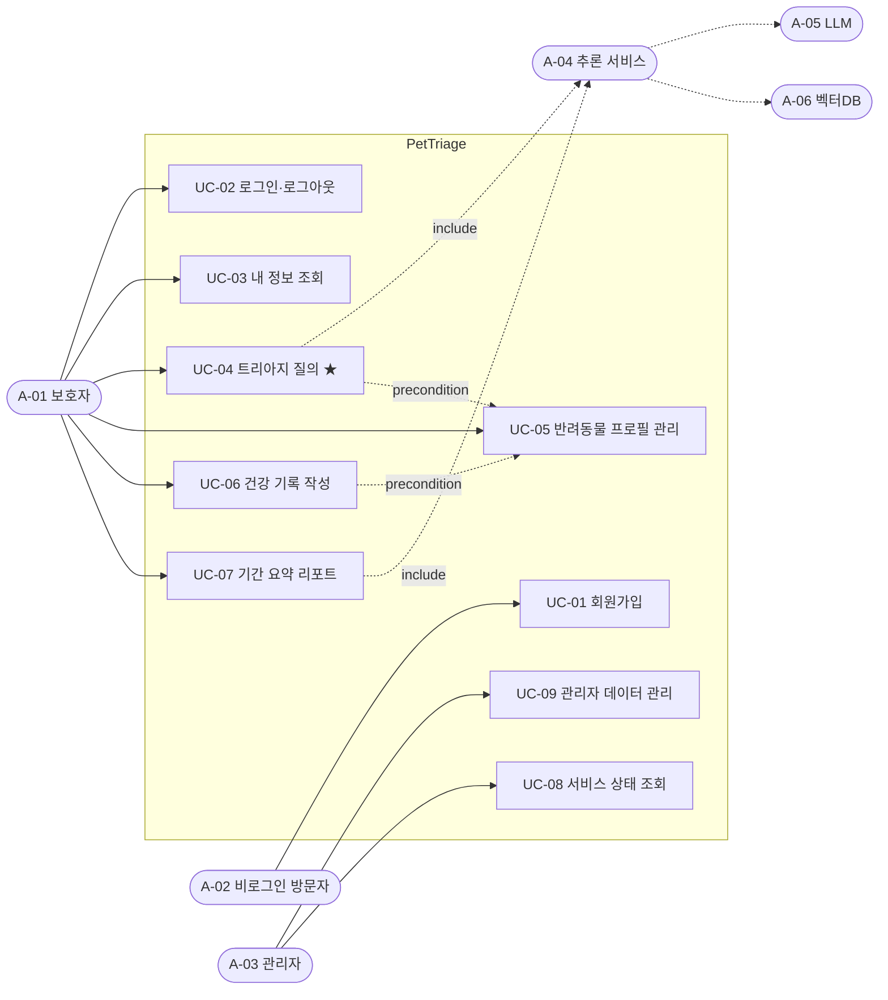
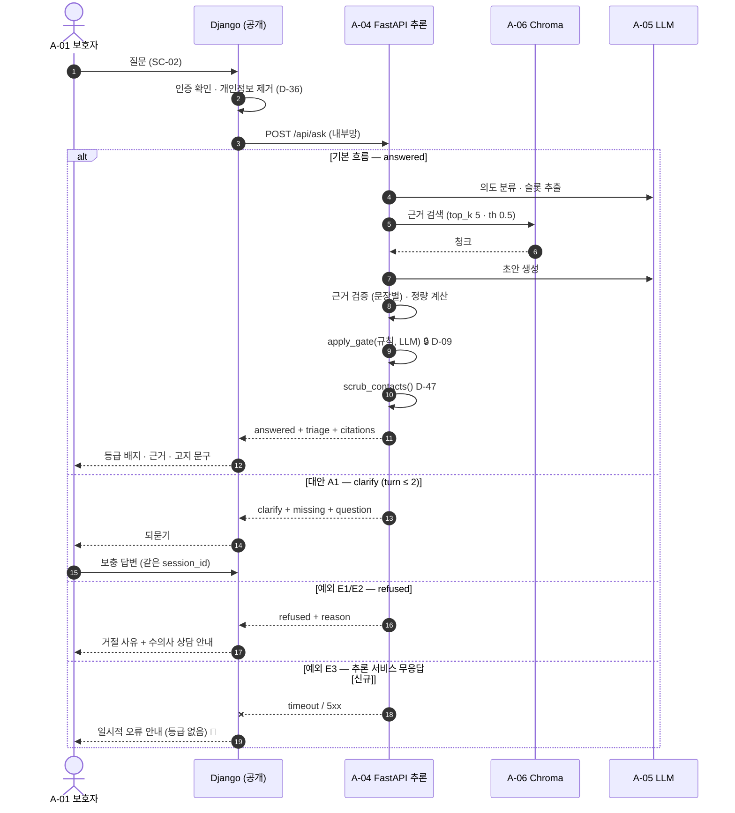

# 10 · 요구사항 정의서 — PetTriage (4차)

> **SKN 4차 단위 프로젝트** · 팀 `save the pet` · 제품 `PetTriage`
> **통합: 오한빈(팀장)** · **내용 기여: §10 기여 이력** · 검토: 전원
> 팀원 원본은 `docs/<브랜치명>/` 에 남는다 (`.github/CONTRIBUTING.md` — 산출물 문서는 어떻게 쓰나)
> 상위 문서: `14_전환설계.md` · 결정 원장: `06_설계결정기록.md`
>
> 최초 작성: 2026-08-24 · 기준 커밋 `43264e3`

---

## 0. 이 문서를 쓰는 법 — 먼저 읽는다

🔴 **이것이 요구사항의 정본이다. 제출용 `.xlsx` 는 여기서 생성한다.**

```bash
make reqs-xlsx                                        # macOS · Linux
python scripts/build_requirements_xlsx.py --write     # Windows (make 가 없다)
```

**사람이 고치는 파일은 이 `.md` 하나뿐이다.** 2026-08-27 에 요구사항 표가 `.xlsx` 로
**두 벌**(`docs/ksr` v3 · `docs/lgj` v4) 돌아다녔고, 그 사이에서 **요구사항 한 줄이**
**소리 없이 사라졌다** (DB 백업 · 지금 NFR-23). `.xlsx` 는 diff 가 안 돼 PR 로도 안 보였고,
두 판본이 우연히 다 남아 있어서 겨우 알았다. **생성물로 만들면 갈라질 자리가 없다** (D-22).

---

**이 문서는 더 이상 뼈대가 아니다.** 2026-08-27 에 팀원 셋의 표·덱·배포계획서를 흡수해
**FR 47건 · NFR 24건 · UC 11개**가 됐고, 모든 줄에 근거와 측정 방법이 붙었다.
팀원 표와의 ID 대응은 §11.

**한 사람이 통합하고 내용은 여러 사람이 낸다.** 자기 몫은 `docs/<브랜치명>/` 에 자유 형식으로
올리면 팀장이 검토해 여기 반영하고, **반영한 자리에 `★흡수(브랜치, 날짜)` 를 남긴다.**
그 표시가 §10 기여 이력으로 모인다 — 표시를 빠뜨리면 통합본이 한 사람이 쓴 것처럼 보이고,
3차에서 설계 문서가 117:0 으로 기록된 데에는 그 몫도 있다.

### 0.1 다섯 가지 규율

**① 한 줄에 검증 가능한 것 하나.**
`"사용자는 반려동물을 등록하고 수정할 수 있다"` 는 요구사항 **둘**이다. 나눈다.
합쳐 두면 7단계에서 테스트를 하나만 쓰고 절반이 검증되지 않은 채 통과로 잡힌다.

**② 비기능 요구사항(NFR)에는 측정 방법과 현재 실측값을 단다.**
`"빠르게 응답한다"` 는 요구사항이 아니라 희망이다. `"answered 응답 p95 ≤ 20s
(현재 16.2s · `baseline_before.json:latency.answered_p95_ms`)"` 가 요구사항이다.
**잴 방법이 없으면 NFR 칸에 쓰지 않는다.** §7 의 값 대부분은 0단계에서 실측한 것이다.

**③ 근거 칸을 비우지 않는다.**
3차 설계 결정이면 `D-39`, 코드에 이미 있으면 `app/contracts.py:281` 처럼 **파일:줄**.
근거가 없는 줄은 *"있으면 좋겠다"* 이지 요구사항이 아니므로 §9 미결로 내린다.

**④ 4차 신규는 `[신규]` 로 표시한다.** 🔴
3차에 이미 동작하던 것과 4차에서 처음 만드는 것을 섞으면,
8단계 회귀 확인에서 **"있던 게 없어졌다"(회귀)** 와 **"새 것이 아직 없다"(미착수)** 를
가를 수 없다. 이 표시 하나가 그 둘을 가른다.

**⑤ ID 는 재사용하지 않는다.**
요구사항을 지우면 번호는 비워 두고 `~~FR-12~~ (철회 · 사유)` 로 남긴다.
번호를 당겨 쓰면 추적표·테스트·회의록이 서로 다른 것을 가리키게 된다.

### 0.2 손으로 맞추지 않는다 (D-69)

§8 추적표는 §4·§6·§7 과 **같은 사실을 두 번 적는 자리**다. 어긋나면 문서가 거짓말을 한다.

```powershell
python scripts/check_requirements.py      # ID 중복 · 끊긴 참조 · 빈 근거 · 고아 요구사항
```

**커밋 전에 돌린다.** 통과 못 하면 커밋하지 않는다 — `check_facts.py` · `check_goldenset.py`
와 같은 규율이다 (3차 07 §5).

### 0.3 다이어그램은 Mermaid 로

`.md` 안에 ```` ```mermaid ```` 블록으로 직접 쓴다. 이미지 파일을 만들지 않는다 —
GitHub 이 그대로 렌더하고, diff 가 보이고, 고칠 때 원본을 찾을 필요가 없다.
`scripts/draw_graph.py` 가 그래프를 `.mmd` 로 뽑는 방식과 같다.

---

## 1. 범위

### 1.1 이 시스템이 하는 일

반려동물(개·고양이·조류) 보호자가 **증상이나 이물 섭취 상황을 묻고**,
내부 문서 근거에 기반한 **응급도 판정(4등급)과 안내**를 받는다.
보호자는 반려동물 프로필과 건강 기록을 남기고 기간 요약을 본다.

### 1.2 이 시스템이 하지 않는 일 — 경계

| 하지 않는 것 | 근거 |
|---|---|
| 수의학적 **진단**을 내리지 않는다 | D-01 · 모든 응답에 고지 문구 |
| 근거 문서 밖의 내용을 답하지 않는다 — 없으면 **거절**한다 | D-39 예외 흐름 · `RefusalReason` |
| 사진을 판정 입력으로 쓰지 않는다 | D-11 · 기록의 첨부물일 뿐 |
| 외국 응급 연락처를 노출하지 않는다 | D-47 · 출력 직전 코드가 제거 |
| 개인정보를 LLM 에 보내지 않는다 | D-36 · 코드가 먼저 벗긴다 |

### 1.3 4차에서 달라지는 것

3차는 FastAPI 단일 서버였다. 4차는 **Django(공개 진입점) + FastAPI(추론, 내부 전용)** 로
나누고 AWS 에 배포한다 (D-99 · 14 §1).

🔴 **판정 결과는 달라지지 않는다.** 전환의 성공 기준이 *"골든셋 60건 결과가 같다"* 이므로
(D-102), 이 문서의 요구사항 중 **UC-04 관련은 3차 동작을 그대로 기술한다.**
여기서 "개선"을 적으면 8단계 회귀 확인이 성립하지 않는다.

---

## 2. 이해관계자와 액터

| ID | 액터 | 유형 | 설명 |
|---|---|---|---|
| **A-01** | 보호자 (User) | 주 액터 · 사람 | 계정을 만들고 반려동물을 등록해 질의·기록한다 |
| **A-02** | 비로그인 방문자 | 주 액터 · 사람 | 서비스 소개와 회원가입만 접근한다 |
| **A-03** | 관리자 (Admin) | 주 액터 · 사람 | `[신규]` Django 관리자에서 계정·기록을 조회·정정한다 |
| **A-04** | 추론 서비스 | 부 액터 · 시스템 | FastAPI. Django 가 내부 네트워크로 호출한다 (D-99) |
| **A-05** | LLM 제공자 | 부 액터 · 외부 | OpenAI API 또는 로컬 sLLM (`model.provider`) |
| **A-06** | 벡터 DB (Chroma) | 부 액터 · 시스템 | 근거 문서 888청크 검색 (D-44 · D-101) |

> **A-04 를 부 액터로 둔 것이 4차의 핵심 변화다.** 3차에서 같은 프로세스 안의 함수 호출이던
> 것이 **네트워크 경계**가 된다. 따라서 "추론 서비스가 응답하지 않을 때" 가
> 새로운 예외 흐름으로 생긴다 (§4 UC-04 E3 · NFR-08).

---

## 3. 유스케이스

### 3.1 다이어그램



> `UC-04 → UC-05` 는 포함이 아니라 **선행 조건**이다. 반려동물이 등록돼 있지 않아도
> 질의는 되지만(`pet_id` 는 선택), 체중이 없으면 되묻기로 빠진다 (`AskRequest.weight_kg`).

### 3.2 목록

| ID | 유스케이스 | 주 액터 | 엔드포인트 (3차 기준) | 화면 | 우선순위 |
|---|---|---|---|---|---|
| **UC-01** | 회원가입 | A-02 | `POST /api/auth/signup` | SC-01 | 필수 |
| **UC-02** | 로그인·로그아웃 | A-01 | `POST /api/auth/login` · `logout` | SC-01 | 필수 |
| **UC-03** | 내 정보 조회 | A-01 | `GET /api/users/me` | SC-06 | 필수 |
| **UC-04** | **트리아지 질의** ★ | A-01 | `POST /api/ask` | SC-02 | **핵심** |
| **UC-05** | 반려동물 프로필 관리 | A-01 | `/api/pets` (POST·GET·PATCH·DELETE) | SC-04 · SC-05 | 필수 |
| **UC-06** | 건강 기록 작성 | A-01 | `POST /api/records` | SC-03 | 필수 |
| **UC-07** | 기간 요약 리포트 | A-01 | `GET /api/report` | SC-03 | 선택 |
| **UC-08** | 서비스 상태 조회 | A-03 | `GET /api/health` · `/api/triage-levels` | — | 필수 |
| **UC-09** | 관리자 데이터 관리 `[신규]` | A-03 | Django admin | SC-07 | 필수 |
| **UC-10** | 대화 이력 열람 `[신규]` | A-01 | `/history/` · `/history/<session_id>/` | SC-09 · SC-10 | 필수 |
| **UC-11** | 반려동물 전환 `[신규]` | A-01 | 사이드바 · `?pet_id=` | SC-04 · 전 화면 | 필수 |

★ = 4차 발표의 핵심 카드. **UC-04 만 §4 에 완전 명세가 있다 (본보기).**
나머지 여덟은 §4.1 템플릿으로 각자 채운다.

### 3.3 화면 목록 (정식 명세는 `11_화면설계서.md`)

여기서는 **추적표가 가리킬 ID 만** 고정한다. 화면의 내용은 11 이 단일 출처다 (D-22).

> 🔄 **2026-08-24 갱신.** 3차 `web/*.html` 기준이던 목록을 **실제 이식된 Django 템플릿**
> 기준으로 고쳤다. 기존 ID 의 의미는 유지하고 새 화면만 번호를 늘렸다 — 개정 내역은 11 §1.1.

| ID | 화면 | 구현 |
|---|---|---|
| SC-01 | 로그인 | `templates/accounts/login.html` |
| SC-02 | 대화 · 트리아지 ★ | `chat/templates/chat/room.html` |
| SC-03 | 다이어리 · 리포트 | `diary/templates/diary/diary.html` |
| SC-04 | 반려동물 목록 | `templates/pets/pet_list.html` |
| SC-05 | 반려동물 등록 · 설정 | `templates/pets/pet_form.html` |
| SC-06 | 내 프로필 | 🔴 **미이식** — 만들지 철회할지 §8 |
| SC-07 | 관리자 `[신규]` | Django admin — ✅ `/django-static/` (11 §6.2) |
| SC-08 | 회원가입 `[신규]` | `templates/accounts/signup.html` |
| SC-09 | 채팅 내역 목록 `[신규]` | 🟡 DB 를 가른 환경에서만 503 (11 §4.5) |
| SC-10 | 채팅 내역 상세 `[신규]` | 🟡 11 §4.5 |

⬜ **SC-09 · SC-10 에 대응하는 UC · FR 이 아직 없다** (11 §7). 만들거나 범위 밖으로 내린다.

---

## 4. 유스케이스 명세

### 4.1 템플릿 — 여덟 개를 이 형식으로 채운다

```markdown
### UC-0N · <이름>

| 항목 | 내용 |
|---|---|
| 주 액터 | A-0N |
| 사전 조건 | 무엇이 참이어야 시작할 수 있나 |
| 사후 조건 | 성공했을 때 무엇이 바뀌어 있나 (DB · 화면 · 세션) |
| 트리거 | 사용자가 무엇을 눌렀나 |
| 관련 FR | FR-NN, FR-NN |
| 근거 | D-NN · `파일:줄` |

**기본 흐름**
1. …

**대안 흐름 A1 · <조건>**
1a. …

**예외 흐름 E1 · <조건>**
1e. …
```

> **사후 조건을 빠뜨리지 않는다.** 학생 산출물에서 가장 흔한 누락이고,
> 7단계에서 통합 테스트의 `assert` 가 바로 이 칸에서 나온다.
> 사후 조건이 비면 "무엇을 확인해야 통과인지" 를 테스트 작성자가 추측하게 된다.

---

### UC-04 · 트리아지 질의 ★ (본보기 — 완전 명세)

| 항목 | 내용 |
|---|---|
| 주 액터 | A-01 보호자 |
| 부 액터 | A-04 추론 서비스 · A-05 LLM · A-06 벡터DB |
| 사전 조건 | 로그인 상태. 반려동물 등록은 **선택**(`pet_id` optional) |
| 사후 조건 | ① `AskResponse` 가 세 상태 중 하나로 반환된다 ② 대화가 `chat_messages` 에 적재된다 ③ `session_id` 가 되묻기 턴을 이어 준다 |
| 트리거 | SC-02 에서 질문을 입력하고 전송 |
| 관련 FR | FR-10 ~ FR-19 |
| 근거 | D-39 · D-09 · D-81 · D-47 · `app/contracts.py:379` |

**기본 흐름 — `status: "answered"`**

1. 보호자가 질문을 입력한다. 화면은 등록된 반려동물의 `species` · `weight_kg` 를 함께 보낸다.
2. 시스템이 `AskRequest` 로 검증한다 (질문 1~2000자 · 체중 0<w≤200).
3. 개인정보를 제거한다 — **LLM 에 닿기 전에** (D-36).
4. 의도를 분류한다. 허용 목록 밖이면 키워드 폴백으로 내린다.
5. 슬롯(종·체중·물질·섭취량)을 추출한다. **충분하다.**
6. 벡터DB 에서 근거를 검색하고 임계값·중복을 정리한다 (top_k 5 · threshold 0.5).
7. 정량 계산이 가능하면 체중당 용량을 계산한다 (`compute.rules`).
8. 초안을 생성하고 **문장별로 근거를 검증한다** (④ · 02 §2).
9. 등급을 판정한다. **규칙과 LLM 판정을 `apply_gate()` 로 병합한다 — 직접 `max()` 를 쓰지 않는다** (D-09).
10. 쉬운 말로 다듬고, 출력 직전 연락처를 제거한다 (D-47).
11. `answered` · `triage` · `citations` · `grounding` 을 반환한다. 화면이 등급 배지와 근거를 표시한다.

**대안 흐름 A1 · 슬롯이 부족하다 — `status: "clarify"`**

5a. 필수 슬롯이 비면 `ClarifyPrompt(missing, question, turn)` 를 반환한다.
5b. 보호자가 답하면 같은 `session_id` 로 5 로 돌아간다.
5c. **`turn` 이 `MAX_CLARIFY_TURNS`(2) 를 넘으면** 예외 흐름 E1 (`되묻기상한`) 으로 간다.

> 되묻기 상한이 2인 것은 D-49 의 결정이다. 이 숫자를 바꾸면 골든셋 결과가 바뀌므로
> **4차에서 바꾸지 않는다** (§1.3).

**예외 흐름 E1 · 답할 수 없다 — `status: "refused"`**

시스템은 **모르는 것을 지어내지 않고 거절한다.** 사유는 다섯 가지다.

| `RefusalReason` | 언제 |
|---|---|
| `근거없음` | 검색 결과 없음 또는 유사도 임계 미만 |
| `검증실패` | 근거 검증 실패 후 재검색도 실패 |
| `되묻기상한` | 슬롯을 끝내 못 채움 (A1-5c) |
| `판정불가` | 규칙·LLM 판정이 모두 없음 |
| `범위밖` | 도메인 밖 질문 |

**예외 흐름 E2 · 조건 없는 MONITOR — 출력을 막는다** 🔒

9e. 판정이 `MONITOR`(1등급) 인데 **상승 조건이 비어 있으면 응답에 싣지 않는다**
   (`app/contracts.py:281` · D-39). *"지켜보세요"* 만 있고 *"이러면 병원에 가세요"* 가 없는
   안내는 보호자를 방치하기 때문이다. 거절로 전환된다.

> ⚠️ 이 전환은 **채점상 과소평가로 보인다.** 0단계 기준선에서 `등급을 못 낸 긴급 건 3.6%(1/28)`
> 로 잡힌 것이 이것이다. 지표를 읽을 때 등급 오류와 섞지 않는다 (04 §1.2).

**예외 흐름 E3 · 추론 서비스가 응답하지 않는다** `[신규]` 🔴

11e. Django 가 내부 호출에 실패하면 **판정을 지어내지 않고** 실패를 그대로 알린다.
    화면은 등급 배지를 그리지 않는다. → NFR-08

> **4차에서 처음 생기는 흐름이다.** 3차에서는 같은 프로세스 안의 함수 호출이라
> 이 실패가 존재하지 않았다. 여기서 Django 가 기본 등급(예: `MONITOR`)을 채워 넣으면
> **근거 없는 판정을 사용자에게 보이는 것**이고, D-09 가 막으려던 바로 그 위험이다.

### 4.2 시퀀스 — UC-04 세 흐름



---

---

### UC-01 · 회원가입

| 항목 | 내용 |
|---|---|
| 주 액터 | A-02 비로그인 방문자 |
| 사전 조건 | 없음 |
| 사후 조건 | ① `auth_user` 에 계정 1건 ② **세션이 즉시 시작된다**(가입 후 자동 로그인) ③ `/pets/` 로 이동 |
| 트리거 | SC-08 에서 가입 |
| 관련 FR | FR-01 · FR-02 |
| 근거 | `accounts/views.py:35~43` · 11 §4.1 |

**기본 흐름**

1. 아이디(영문/숫자 4~16자)·비밀번호(8자 이상)·비밀번호 확인을 입력한다.
2. 아이디를 입력하는 동안 `/accounts/check-id/` 가 **중복을 미리 알려 준다.**
3. 계정을 만들고 **바로 로그인시킨다** (`create_user` → `login`).
4. `/pets/` 로 보낸다 — 펫이 없으면 등록을 유도한다 (11 §5).

**예외 E1 · 아이디 중복 / 비밀번호 불일치**

3e. 같은 화면을 `error` 와 함께 다시 그린다. 입력값은 잃지 않는다.

> ⚠️ **이메일을 받지 않는다.** 계정 모델은 Django 기본 `auth.User` 로 확정됐고(D-104),
> 그 모델에 `email` 필드가 이미 있다 — **받을지 말지만 남았다** (§8).

---

### UC-02 · 로그인 · 로그아웃

| 항목 | 내용 |
|---|---|
| 주 액터 | A-01 보호자 |
| 사전 조건 | 계정이 있다 |
| 사후 조건 | 로그인 — 세션 쿠키 발급 · `/pets/` 로 이동 / 로그아웃 — **세션 파기** · `/accounts/login/` 로 이동 |
| 트리거 | SC-01 |
| 관련 FR | FR-03 · FR-04 |
| 근거 | `accounts/views.py:7~22, 51` · D-99(세션 인증) |

**기본 흐름**

1. 아이디·비밀번호를 입력한다.
2. `authenticate()` 가 확인하고 `login()` 이 세션을 연다.
3. 이미 로그인 상태로 이 화면에 오면 **입력 없이 통과시킨다** (`request.user.is_authenticated`).

**예외 E1 · 인증 실패** — 같은 화면에 `error`. **어느 쪽이 틀렸는지 말하지 않는다.**

**예외 E2 · 미인증 접근** — 보호된 화면에 오면 `LOGIN_URL`(`/accounts/login/`)로 302.

---

### UC-03 · 내 정보 조회 🔴

| 항목 | 내용 |
|---|---|
| 주 액터 | A-01 보호자 |
| 사전 조건 | 로그인 상태 |
| 사후 조건 | 아이디·가입일이 표시된다. **상태가 바뀌지 않는다** (읽기 전용) |
| 트리거 | SC-06 |
| 관련 FR | FR-05 |
| 근거 | 🔴 **Django 구현 없음** — 11 §1.2 |

🔴 **이 유스케이스는 지금 성립하지 않는다.** SC-06 화면이 이식되지 않았고,
남아 있는 `GET /api/users/me` 는 JWT 인증이라 세션 로그인 사용자가 쓸 수 없다.

**만들 것인지 철회할 것인지 먼저 정한다** (§8). 사이드바(11 §2.1)가 활성 펫을 이미
보여 주므로, 아이디 표시 외에 낼 것이 없다면 FR-05·UC-03·SC-06 을 함께 철회한다.
철회하면 이 절은 `~~UC-03~~ (철회 · 사유)` 로 남긴다 (§0.1 ⑤).

---

### UC-05 · 반려동물 프로필 관리

| 항목 | 내용 |
|---|---|
| 주 액터 | A-01 보호자 |
| 사전 조건 | 로그인 상태 |
| 사후 조건 | ① `pets` 에 행이 생기거나 바뀌거나 지워진다 ② **소유자는 언제나 요청자다** ③ 사이드바 카드가 갱신된다 |
| 트리거 | SC-04 목록에서 등록·수정·삭제 |
| 관련 FR | FR-06 · FR-07 · FR-08 |
| 근거 | `pets/views.py` · `pets/urls.py` · 11 §4.2 |

**기본 흐름**

1. 목록(`/pets/`)에서 등록 또는 기존 프로필을 연다.
2. 필수(이름·종·체중)와 표시용(크기·나이·성별·소개·메모·사진)을 입력한다.
3. 저장한다. 사진은 개별 삭제가 가능하다 (`/pets/<id>/photo/delete/`).

**대안 A1 · 펫이 하나도 없다** — `어떤 아이로 시작할까요?` 로 등록을 유도한다.

**예외 E1 · 남의 펫 🔒**

2e. 요청자 소유가 아니면 404 다. **403 이 아니라 404 로 답한다** — 403 은
*"있긴 있다"* 를 알려 주기 때문이다. 조회·수정·삭제 **모두**에 적용한다 (D-52).

> **종은 개·고양이·조류 셋뿐이다** (FR-08 · D-03). 넷째 종을 넣으면 규칙 테이블과
> 근거 코퍼스가 그 종을 모르므로 **판정이 조용히 무너진다.**

---

### UC-06 · 건강 기록 작성

| 항목 | 내용 |
|---|---|
| 주 액터 | A-01 보호자 |
| 사전 조건 | 로그인 · **반려동물이 1마리 이상 등록돼 있다** |
| 사후 조건 | ① `diary_entries` 에 행 1건 ② 캘린더의 해당 날짜가 채워진다 ③ **벡터 인덱스에는 들어가지 않는다**(`indexed=False`) |
| 트리거 | SC-03 에서 저장 |
| 관련 FR | FR-09 |
| 근거 | `diary/views.py` · `POST /api/records` · 11 §4.3 |

**기본 흐름**

1. 날짜를 고르고 식사 4칸·증상·체중·자유 메모를 적는다. 조류는 배변 칸이 더 있다.
2. 저장하면 Django 가 소유권을 확인하고 기록한다.

**대안 A1 · 체중을 안 잰 날** — 비워 둔다. **`NULL` 을 그대로 둔다** (D-52).
0 으로 채우면 체중 그래프와 정량 계산이 함께 망가진다.

> 🔴 **기록은 판정 입력이 아니다.** 다이어리에 적은 증상이 트리아지(UC-04)에
> 자동으로 반영되지 않는다. 사진도 마찬가지다 (D-11). 화면이 이것을 말해야 한다 (§8).

---

### UC-07 · 기간 요약 리포트

| 항목 | 내용 |
|---|---|
| 주 액터 | A-01 보호자 · **A-04 추론 서비스** |
| 사전 조건 | 로그인 · 해당 기간에 기록이 있다 |
| 사후 조건 | ① 요약문이 표시된다 ② **`summary_by`("model"/"code")가 함께 온다** ③ 저장 상태는 바뀌지 않는다 |
| 트리거 | SC-03 에서 기간 선택 |
| 관련 FR | FR-20 |
| 근거 | `GET /api/report` · `internal_report.py` · 12 §4.4 |

**기본 흐름**

1. Django 가 소유권을 확인하고 기간의 기록을 ORM 으로 읽는다.
2. 행 목록을 `POST /internal/report/summarize` 로 **추론 서비스에 보낸다.**
3. `summarize_period()` 가 요약하고 `{summary, summary_by}` 를 돌려준다.
4. 화면이 요약과 체중 그래프를 그린다.

**예외 E1 · 추론 서비스 무응답** `[신규]` 🔴

2e. **요약을 지어내지 않는다.** 실패를 그대로 알린다 → NFR-08.
기록 목록 자체는 Django 가 이미 갖고 있으므로 그것만이라도 보여 줄 수 있다.

> **`summary_by` 를 화면에서 숨기지 않는다.** 모델이 아니라 코드가 만든 요약이면
> 그렇다고 말한다 — 폴백을 감추면 품질이 떨어진 것을 아무도 모른다 (04 §8).

---

### UC-08 · 서비스 상태 조회

| 항목 | 내용 |
|---|---|
| 주 액터 | A-03 관리자 · **SC-02 화면**(기동 시) |
| 사전 조건 | 없음 — 인증을 요구하지 않는다 |
| 사후 조건 | 상태가 반환된다. **아무것도 바뀌지 않는다** |
| 트리거 | 운영 점검 / 대화 화면 진입 |
| 관련 FR | FR-21 |
| 근거 | `routes/meta.py:42, 66` · 11 §3.1 |

**기본 흐름**

1. `GET /api/health` — 엔진 종류와 모델 적재 여부를 돌려준다.
2. `GET /api/triage-levels` — **등급 4종의 이름·배지·문구와 고지 문구**를 돌려준다.

> **2 는 운영용이 아니라 화면용이다.** SC-02 가 기동 시 이것을 받아 등급 표시를 만든다.
> 등급 문구를 화면이 정하지 않게 하는 장치이고, D-40(계약을 먼저 고정한다)의 실물이다.
> **이 응답을 바꾸면 화면이 즉시 따라 바뀐다** — 반대로, 화면만 고치면 두 곳이 어긋난다.

---

### UC-09 · 관리자 데이터 관리 `[신규]`

| 항목 | 내용 |
|---|---|
| 주 액터 | A-03 관리자 |
| 사전 조건 | `is_staff` 계정으로 로그인 |
| 사후 조건 | 조회한 경우 변화 없음. 정정한 경우 해당 행이 바뀐다 |
| 트리거 | `/admin/` |
| 관련 FR | FR-22 |
| 근거 | `webapp/urls.py` · `INSTALLED_APPS` 의 `django.contrib.admin` |

**기본 흐름**

1. 관리자로 로그인한다.
2. 계정·반려동물·다이어리를 조회한다 (`pets/admin.py` · `diary/admin.py` 등록됨).

**예외 E1 · 화면이 깨진다** 🔴

2e. **지금 `/admin/` 의 CSS·JS 가 로드되지 않는다.** nginx 가 `/static/` 을 통째로
FastAPI 로 보내는데 Django 관리자도 `/static/` 을 쓴다 (12 §3.1 · 11 §6.2).
**배포 전 필수 수정이다.**

> **범위가 미정이다** — 조회만인가, 정정까지인가. 정정을 허용하면 **누가 무엇을 고쳤는지**
> 남아야 한다. 의료 성격의 기록이라 조용한 수정은 위험하다 (§8).

### UC-10 · 대화 이력 열람 `[신규]`

| 항목 | 내용 |
|---|---|
| 주 액터 | A-01 보호자 |
| 사전 조건 | 로그인 상태 · 반려동물이 최소 1마리 |
| 사후 조건 | **변화 없음 — 읽기 전용이다** |
| 트리거 | 사이드바 *채팅 내역* |
| 관련 FR | FR-23 · FR-24 · FR-25 · FR-26 |
| 근거 | `docs/lse/PetTriage_화면정의서.pptx` 9·10쪽 (이서은) · `chat/views.py` |

**기본 흐름**

1. 보호자가 *채팅 내역* 을 연다 (`/history/`).
2. 자기 반려동물의 대화 세션이 **최신순** 목록으로 나온다.
   각 카드에 날짜 · 첫 질문 미리보기 · **그 세션의 최고 응급도 배지**가 붙는다.
3. 카드를 고르면 그 세션의 대화 전체가 순서대로 재생된다 (`/history/<session_id>/`).
4. *목록으로* 로 2 로 돌아간다.

**예외 E1 · 대화가 없다**

2e. 빈 목록 대신 *"아직 나눈 대화가 없어요"* 를 보여 준다.

**예외 E2 · 남의 세션을 지목한다** 🔒

3e. `session_id` 가 내 반려동물의 것이 아니면 **404** 다.
*"권한이 없다"* 가 아니라 **없는 것처럼** 답한다 — 존재 여부 자체가 정보다.

**예외 E3 · 🟡 DB 를 가른 환경에서는 화면 전체가 503 이다**

2e. `chat_sessions` · `chat_messages` 를 **쓰는 쪽은 FastAPI** 인데, D-104 로 웹앱 DB 를
가르면 Django 쪽에 그 표가 없다 (11 §4.5). 그럴 때 안내와 함께 503 을 낸다 —
빈 목록은 *"대화가 없다"* 는 거짓말이라 E1 과 구분되어야 한다 (D-58).
한 MySQL 로 합친 환경에서는 그대로 보인다 (2026-08-27 수동 통과).

> ⚠️ **대화 기록은 증거가 아니다** (D-105). 적재 실패가 응답을 막지 않으므로
> **빠진 턴이 있을 수 있다.** 이 유스케이스는 *편의* 이지 감사 수단이 아니다.

> 📎 **범위 축소가 하나 있다** — 활성 반려동물이 정해져 있으면 목록이 그 아이로
> 좁혀진다. 화면이 그렇다고 말하고 `?all=1` 로 넓힐 수 있다 (11 §4.4.1).
### UC-11 · 반려동물 전환 `[신규]`

| 항목 | 내용 |
|---|---|
| 주 액터 | A-01 보호자 |
| 사전 조건 | 로그인 상태 · 반려동물 1마리 이상 |
| 사후 조건 | **활성 반려동물이 바뀌고 화면 사이를 옮겨도 유지된다** |
| 트리거 | 사이드바 *반려동물* · 목록 카드 클릭 · `?pet_id=` |
| 관련 FR | FR-38 |
| 근거 | `chat/context_processors.py` · `chat/views.py:38` (세션 저장) |

**기본 흐름**

1. 보호자가 반려동물 목록(SC-04)에서 한 마리를 고른다.
2. 그 아이 기준으로 대화 화면이 열리고, **선택이 세션에 남는다.**
3. 기록장·채팅 내역처럼 주소에 `pet_id` 가 없는 화면도 그 아이를 이어 쓴다.

**우선순위** — `?pet_id` → 세션에 남은 값 → **등록순 첫 마리** (FR-38).

> 🔴 **"첫 마리"가 오래 우연이었다.** `Pet.Meta` 에 `ordering` 이 없어 `.first()` 가
> 랜덤 UUID 순으로 돌았다. 마리가 하나뿐이면 영원히 안 드러나고, 테스트도 초록이다.
> 2026-08-27 권소라의 수동 테스트(TC-FR-CHAT-006)가 잡아 `ordering = ["created_at"]`
> 으로 못박았다. **이 유스케이스가 사후 조건을 가진 이유가 그것이다** — "어느 아이인지"가
> 판정 입력(체중·종)을 바꾸므로, 흔들리면 답이 흔들린다.

## 5. 기능 요구사항 (FR)

> `[신규]` = 4차에서 처음 만드는 것. 표시가 없으면 3차에 이미 동작한다.
>
> **상태 — 구현과 검증을 구분한다** (2026-08-26 개정)
>
> | | 뜻 |
> |---|---|
> | ✅ | 구현됐고 **CI 가 검증한다** |
> | 🟡 | 구현됐으나 **검증되지 않는다** — 코드는 있는데 테스트가 없다 |
> | 🔴 | 미구현 |
> | ⬜ | 미착수 |
>
> 🔴 **Django 앱은 전부 🟡 다.** `testpaths = ["tests"]` 가 `accounts`·`pets`·`diary`·`chat`
> 을 보지 않아 **CI 가 그 코드를 한 줄도 실행하지 않는다** (13 §5).
> 예전 표기(`🔄 전환 대상`)는 머지 전에 쓴 것이라 지금 상태를 말해 주지 못했다.

| ID | 요구사항 | UC | 상태 | 근거 | 분류 | 순위 |
|---|---|---|---|---|---|---|
| FR-01 | 방문자는 아이디와 비밀번호로 가입할 수 있다 | UC-01 | 🟡 | `accounts/views.py:42` `create_user()` | 인증 | 상 |
| FR-02 | 비밀번호는 평문으로 저장되지 않는다 | UC-01 | 🟡 | `accounts/views.py:42` — Django 가 PBKDF2 로 해싱 | 인증 🔒 | 상 |
| FR-03 | 보호자는 로그인해 **세션**을 얻는다 | UC-02 | 🟡 | `accounts/views.py:16` (D-99 세션) | 인증 | 상 |
| FR-04 | 보호자는 로그아웃할 수 있다 | UC-02 | 🟡 | `accounts/views.py:51` | 인증 | 상 |
| FR-05 | 보호자는 자기 계정 정보를 조회할 수 있다 | UC-03 | 🔴 | **Django 화면 없음** (11 §1.2) | 계정 | 중 |
| FR-06 | 보호자는 반려동물을 등록할 수 있다 (종 · 이름 · 체중) | UC-05 | 🟡 | `pets/views.py:39` | 반려동물 | 상 |
| FR-07 | 보호자는 자기 반려동물만 조회·수정·삭제할 수 있다 🔒 | UC-05 | 🟡 | `pets/views.py` — 전부 `user=request.user` | 반려동물 🔒 | 상 |
| FR-08 | 종은 개 · 고양이 · 조류 셋으로 제한된다 | UC-05 | ✅ | `compute.vocabulary.SPECIES` 단일 출처 · D-03 | 반려동물 | 상 |
| FR-09 | 보호자는 건강 기록을 남길 수 있다 (식사 · 증상 · 체중) | UC-06 | 🟡 | `diary/views.py:87` | 기록장 | 상 |
| FR-10 | 보호자는 증상·섭취 상황을 자연어로 질의할 수 있다 | UC-04 | ✅ | `routes/ask.py:29` | 판정 | 상 |
| FR-11 | 시스템은 응급도를 4등급으로 판정한다 | UC-04 | ✅ | D-39 · `TriageLevel` | 판정 | 상 |
| FR-12 | 규칙 판정과 LLM 판정은 하향 금지 게이트로 병합한다 🔒 | UC-04 | ✅ | D-09 · `triage/gate.py` | 판정 🔒 | 상 |
| FR-13 | 답변의 각 문장은 근거 문서로 검증된다 | UC-04 | ✅ | `graph/nodes/verify.py` | 판정 | 상 |
| FR-14 | 근거는 각주가 아니라 필드(`citations`)로 반환된다 | UC-04 | ✅ | D-81 | 판정 | 상 |
| FR-15 | 슬롯이 부족하면 최대 2회까지 되묻는다 | UC-04 | ✅ | D-49 · `MAX_CLARIFY_TURNS` | 판정 | 상 |
| FR-16 | 답할 근거가 없으면 사유와 함께 거절한다 | UC-04 | ✅ | `RefusalReason` 5종 | 판정 | 상 |
| FR-17 | 상승 조건 없는 MONITOR 는 응답에 싣지 않는다 🔒 | UC-04 | ✅ | D-39 · `contracts.py:281` | 판정 🔒 | 상 |
| FR-18 | 응답에서 외국 연락처를 제거한다 | UC-04 | ✅ | D-47 | 판정 | 중 |
| FR-19 | 모든 응답에 수의학적 진단이 아니라는 고지를 붙인다 | UC-04 | ✅ | D-01 · `DISCLAIMER` | 판정 | 상 |
| FR-20 | 보호자는 기간 요약 리포트를 조회할 수 있다 | UC-07 | 🟡 | `diary/views.py:273` + `internal_report.py` | 기록장 | 중 |
| FR-21 | 관리자는 서비스 상태를 조회할 수 있다 | UC-08 | ✅ | `routes/meta.py:42` (FastAPI 유지) | 운영 | 중 |
| FR-22 | 관리자는 계정·반려동물·기록을 조회·정정할 수 있다 `[신규]` | UC-09 | 🟡 | `pets/admin.py` · `diary/admin.py` (11 §6.2) | 운영 | 중 |
| FR-23 | 보호자는 자기 반려동물의 대화 세션을 최신순 목록으로 본다 `[신규]` | UC-10 | 🟡 | `chat/views.py:44` · 수동 통과 TC-FR-HIST-001 (11 §4.5) | 대화이력 | 상 |
| FR-24 | 세션 카드에 그 세션의 **최고 응급도**를 배지로 표시한다 `[신규]` | UC-10 | 🟡 | `chat/views.py:68` `TRIAGE_MAP` · 수동 통과 TC-FR-HIST-004 | 대화이력 | 중 |
| FR-25 | 보호자는 한 세션의 대화 전체를 **읽기 전용**으로 재생한다 `[신규]` | UC-10 | 🟡 | `chat/views.py:82` · 수동 통과 TC-FR-HIST-003 | 대화이력 | 상 |
| FR-26 | 남의 세션은 목록에 없고 직접 지목해도 **404** 다 🔒 `[신규]` | UC-10 | 🟡 | `chat/views.py:83` · 수동 통과 TC-FR-HIST-002 | 대화이력 🔒 | 상 |
| FR-27 | 아이디는 4자 이상, 비밀번호는 8자 이상이다 | UC-01 | 🟡 | `accounts/views.py:34` · `:38` | 인증 | 중 |
| FR-28 | 가입 전에 아이디 중복을 확인할 수 있다 | UC-01 | 🟡 | `accounts/views.py:54` `check_id` | 인증 | 중 |
| FR-47 | 가입에 성공하면 **바로 로그인된 상태**가 된다 | UC-01 | 🟡 | `accounts/views.py:43` `login(request, user)` | 인증 | 중 |
| FR-29 | 로그인이 필요한 화면은 미인증 접근을 로그인으로 돌린다 🔒 | UC-02 | 🟡 | `@login_required` · `LoginRequiredMixin` — 화면 8개 전부 | 인증 🔒 | 상 |
| FR-30 | 로그아웃은 **POST 로만** 받는다 🔒 | UC-02 | 🔴 | `accounts/views.py:49` 가 GET 도 받고 `templates/pets/pet_list.html:105` 가 링크다 | 인증 🔒 | 중 |
| FR-31 | 보호자는 자기 반려동물을 목록으로 본다 | UC-05 | 🟡 | `pets/views.py:23` | 반려동물 | 상 |
| FR-32 | 한 계정에 여러 마리를 등록할 수 있다 | UC-05 | 🟡 | `Pet.user` FK `related_name="pets"` | 반려동물 | 중 |
| FR-33 | 프로필을 남긴 채 사진만 지울 수 있다 | UC-05 | 🟡 | `pets/views.py:132` | 반려동물 | 하 |
| FR-34 | 반려동물 삭제는 **POST 로만** 처리한다 🔒 | UC-05 | 🟡 | `pets/views.py:127` — 주소를 여는 것만으로 지워지지 않는다 | 반려동물 🔒 | 중 |
| FR-35 | 업로드 사진은 저장 전에 관문을 지난다 — **EXIF 제거 · 재인코딩** 🔒 | UC-05 | 🟡 | D-43 · `privacy/images.py` · `pets/views.py:13` `_gate` | 반려동물 🔒 | 상 |
| FR-36 | 대화 화면은 예시 질문을 제공한다 | UC-04 | 🟡 | `chat/templates/chat/room.html:97` `chipRow` | 대화 | 하 |
| FR-37 | 같은 세션 안에서 대화 맥락을 유지한다 | UC-04 | 🟡 | `room.html:149` `sessionId` | 대화 | 상 |
| FR-38 | 반려동물을 지정하지 않으면 **등록순 첫 마리**를 고른다 | UC-11 | 🟡 | `pets/models.py` `Meta.ordering` · `chat/views.py:35` | 대화 | 중 |
| FR-39 | 표기가 다른 입력을 교정하고 **교정 사실을 화면에 밝힌다** | UC-04 | ✅ | `contracts.py:415` `corrected_from` · `room.html:243` | 판정 | 중 |
| FR-40 | 보호자는 날짜를 골라 그 날 기록을 조회한다 | UC-06 | 🟡 | `diary.html:478` `renderCalendar()` | 기록장 | 상 |
| FR-41 | 같은 날 다시 저장하면 덮어쓴다 (하루 한 벌) | UC-06 | 🟡 | `diary/views.py:81` `post()` | 기록장 | 상 |
| FR-42 | 체중 변화를 시계열 그래프로 보여 준다 | UC-06 | 🟡 | `diary.html:185` `weightChart` | 기록장 | 중 |
| FR-43 | 종·크기 기준 정상 체중대와 견주어 표시한다 | UC-06 | 🟡 | `diary.html:411` `renderWeightStatus()` | 기록장 | 중 |
| FR-44 | 체중이 급변하면 알린다 — **성장기는 제외** | UC-06 | 🟡 | D-103 · `diary/views.py:188` `_detect_weight_change()` | 기록장 | 중 |
| FR-45 | 연속 기록 일수를 보여 준다 | UC-06 | 🟡 | `diary/views.py:236` `_calculate_streak()` | 기록장 | 하 |
| FR-46 | 배설물 항목은 **조류에만** 받는다 | UC-06 | 🟡 | D-36 최소 수집 · `diary/views.py:96` | 기록장 🔒 | 하 |

> 🔄 **2026-08-27 · FR-23~26 을 채웠다.** 이서은의 화면정의서(`docs/lse`) 9·10쪽이
> 대화 이력 화면의 요구사항을 처음으로 글로 적었다. 그것을 이 문서의 ID 체계로 옮긴 것이
> FR-23~26 이고, **11 §7 의 빈칸 둘이 이것으로 닫힌다.**
> `FR-HIST-001~004` → `FR-23~26` 의 쪼갬은 통합하며 정한 것이라, **원저자 확인이 필요하다**
> (11 §9.1).
>
> **넷 다 🟡 다.** 수동으로는 통과했으나 **CI 가 한 번도 열어 보지 않는다** — 7b 에서 자동화한다.

> **위 22개는 코드에서 읽어 낸 것**이지
> 새로 정한 것이 아니다.
>
> 🔴 **22개 중 9개가 🟡 다.** 회원가입·로그인·로그아웃·펫 등록·소유권·기록·리포트·관리자 —
> **사용자가 실제로 만지는 것 대부분이 검증되지 않고 있다.** D-48 이 이 상태에서
> *"회원가입이 한 건도 되지 않는 것"* 을 발견했다. 13 §5.2 의 최소 4건이 그 대응이다.

---

## 6. 비기능 요구사항 (NFR)

**모든 값은 잴 수 있어야 한다** (§0.1 ②). 아래 실측값은 0단계 기준선에서 나온 것이고,
출처는 `eval/reports/baseline_before.json` (커밋 `43264e3` · 2026-08-24 · 2판) 이다.

| ID | 요구사항 | 측정 방법 | 현재 실측 | 근거 |
|---|---|---|---|---|
| NFR-01 | answered 응답 p95 ≤ 20초 | `latency.answered_p95_ms` | **16.2s** | 02 §12.4 |
| NFR-02 | 과소평가율 0% 🔴 | 골든셋 60건 · `under_rate` | **0.0%** | D-09 · D-13 |
| NFR-03 | 중대 과소 0건 🔴 | 골든셋 60건 | **0건** | D-13 |
| NFR-04 | 전환 전후 판정 동일 — 통과 건수 차 ≤ 1건 | `diff_reports.py` | 소음대 **±1건** | D-102 |
| NFR-05 | answered 응답은 근거를 1건 이상 싣는다 | `must_cite` 적중(any) | **79.5%** ⚠️ | D-81 |
| NFR-06 | 응답에 외국 연락처가 없다 | `must_not_contain` | **91.7%** ⚠️ | D-47 |
| NFR-07 | 개인정보가 LLM 요청에 포함되지 않는다 | 단위 테스트 | 통과 | D-36 |
| NFR-08 | 추론 서비스 장애 시 등급을 지어내지 않는다 `[신규]` 🔴 | 통합 테스트 (E3) | ⬜ | §4 UC-04 E3 |
| NFR-09 | 추론 서비스(**8001**)는 공개 인터넷에 노출되지 않는다 `[신규]` 🔒 | 보안 그룹 · 포트 점검 | ⚠️ 배포계획서 V-04 — **증거 미첨부** | **12 §8** |
| NFR-10 | 단위 테스트 564건이 전환 후에도 그대로 통과한다 | `pytest` | **627건 통과** | 14 §1.1 ② |
| NFR-11 | 임베딩 모델은 프로세스당 1회만 적재한다 | 기동 메모리 | 약 2GB | 14 §1.2 |
| NFR-12 | 판정 응답 계약을 두 벌 정의하지 않는다 | 코드 검토 | — | D-22 · D-100 |
| NFR-13 | 배달(Django)과 추론(FastAPI)은 **별도 프로세스**로 돈다 | 서비스 2개 · 포트 2개 | **통과** TC-NFR-ARCH-001 | D-99 · 12 §2 |
| NFR-14 | 공개 진입점은 **하나**다 | 밖에서 열리는 포트 세기 | **통과** TC-NFR-ARCH-002 | 12 §6 |
| NFR-15 | 세션 쿠키는 `HttpOnly` 이고 배포에서 `Secure` 다 🔒 | `manage.py check --deploy` | **통과** (0 issues) | `settings.py:218` |
| NFR-16 | CSRF 토큰 없는 POST 는 거절된다 🔒 | 토큰 뺀 POST 가 403 인가 | **통과** TC-NFR-SEC-002 — 폼 · DRF 둘 다 | `CsrfViewMiddleware` |
| NFR-17 | 배포에서 정적 파일은 **nginx 가 직접** 낸다 | `/django-static/` 응답 헤더 | 🔴 **미적용** — §6.1 | 12 §6.3 ② · 11 §6.2 |
| NFR-18 | 사이드바 화면은 900px 이하에서 오프캔버스로 바뀐다 | 창 좁혀 확인 | **통과** TC-FR-UI-003 (햄버거) | `base.html:112` |
| NFR-19 | 비밀값은 `.env` 로만 주입하고 저장소에 두지 않는다 🔒 | `check_no_data.sh` · `git ls-files` | **통과** | D-29 · 12 §8 |
| NFR-20 | 운영 서비스는 systemd 로 기동하고 **재부팅 시 자동 복구**된다 | `systemctl is-active` 넷 | ⚠️ 배포계획서 V-01 — **증거 미첨부** | D-107 · 12 §6 |
| NFR-21 | MySQL · Chroma · 미디어는 재생성 뒤에도 남는다 | 서비스 재기동 후 조회 | ⚠️ TC-NFR-DEPLOY-003 통과 — *"도커 기준이지만"* 이라 **무엇을 쟀는지 불명** | EBS · 12 §6 |
| NFR-22 | 공개 진입은 HTTPS 이고 HTTP 는 리다이렉트한다 🔒 | `curl -I http://…` 가 301 인가 | **통과** TC-NFR-DEPLOY-002 (2026-08-27) | ACM + ALB · 12 §6 |
| NFR-23 | DB · 벡터 · 이미지의 **복구 경로**가 있다 🔴 | 백업본 존재 · 복원 1회 성공 | 🔴 **미구성** | 12 §10 · 배포계획서 §8 |
| NFR-24 | 운영 지표와 로그를 관측할 수 있다 🔴 | CPU · 디스크 · 앱 로그 조회 | 🔴 **미구성** | 12 §10 · 배포계획서 §8 |

> 🆕 **NFR-13~24 는 2026-08-27 에 팀원 표에서 흡수했다.** 원래 이 문서의 NFR 은
> **판정 품질**(지연·과소평가·근거 인용)에 깊고 **인프라에 텅 비어 있었다.**
> 팀원 표는 정확히 그 반대였다 — 아키텍처·보안·배포는 촘촘한데 *"완료"* 한 값이라
> **잴 수가 없었다.** 둘을 합치면서 **모든 줄에 측정 방법을 붙였다** (§0.1 ②).
>
> ✅ **2026-08-27 · 인프라 실측 대부분이 채워졌다.** 권소라가 `TC-NFR-*` 15건을 실제
> 배포에 대고 돌렸다 (`docs/ksr/…(최종).xlsx`). 미실행 19건 → **4건**으로 줄었다.
>
> ⚠️ **NFR-09 · NFR-20 의 실측은 아직 "증거 미첨부" 다.** 배포는 실제로 됐는데
> 배포계획서 §7 의 검증표 결과 칸과 캡처 4장이 비어 있다. **했다는 말은 증거가 아니다** —
> 한 번 재서 채우면 세 줄이 같이 닫힌다.

> ⚠️ **NFR-05 · NFR-06 은 지금 요구를 못 채우고 있다.** 79.5% · 91.7% 는 목표가 아니라
> **현재 값**이다. 이 둘은 §8 미결로 올린다 — 4차에서 고칠 것인지, 3차 수준을 유지하고
> 회귀만 막을 것인지 팀이 정해야 한다. 🔴 **고치기로 하면 D-102(판정 동일)와 충돌한다.**

### 6.1 🔴 NFR-17 을 "통과"로 받지 않는 이유

권소라의 최종 보고서는 `TC-NFR-PERF-001` 을 **통과**로 적었다. 그런데 실제결과 칸의 내용은
이렇다.

> *"별도 정적 파일(CSS·JS 등)을 운영 경로에서 제공하는 구성은 **현재 적용하지 않았음.**
> 프로젝트 내 별도 static 디렉터리 및 정적 파일 참조가 없어 Nginx 정적 서빙은
> **검증 대상에서 제외함.**"*

**안 했고 안 쟀다고 적어 놓고 상태는 통과다.** 이건 실수라기보다 *"우리 잘못이 아니니까"* 가
통과로 번역된 자리다. **요구사항을 못 채운 것과 요구사항이 필요 없는 것은 다르다** (D-58).

**그리고 전제가 틀렸다.** *"정적 파일 참조가 없다"* 는 우리 템플릿에 대해서는 맞다
(`` 만 있고 `` 호출이 없다). 하지만 **`django.contrib.admin`
이 켜져 있고**(`settings.py:41`) 관리자 화면은 우리 명세의 **SC-07** 이다. Django 관리자는
자기 CSS·JS 를 `/django-static/admin/…` 에서 가져온다.

```
DEBUG=false  →  Django 는 정적 파일을 내주지 않는다
nginx.conf   →  /django-static/ 블록이 없다
따라서       →  배포된 /admin/ 은 CSS 없이 뜬다
```

🔴 **`11 §6.2` 의 "✅ 2026-08-26 해결" 은 절반만 해결이었다.** `STATIC_URL` 을 갈라
로컬은 고쳤지만, **내보내는 쪽은 아무도 안 만들었다.** 그 절의 ⚠️ 경고가 그대로 살아 있다.

**확인 방법** — 배포 도메인에서 `/admin/` 을 열어 본다. 글자만 나오면 이 판정이 맞다.
고치는 일은 D-107 ①(EC2 nginx 설정을 `deploy/` 로 반입)과 같은 작업이다.

---

## 7. 요구사항 추적표

**손으로 맞추지 않는다** — `python scripts/check_requirements.py` 가 검사한다 (§0.2).
`TC-` 는 7단계에서 이서은이 채운다.

| FR | UC | 화면 | 테스트 | 상태 |
|---|---|---|---|---|
| FR-01 | UC-01 | SC-08 | ⬜ 7b | 🟡 |
| FR-02 | UC-01 | — | 수동 TC-NFR-SEC-004 | 🟡 |
| FR-03 | UC-02 | SC-01 | ⬜ 7b | 🟡 |
| FR-04 | UC-02 | SC-01 | ⬜ 7b | 🟡 |
| FR-05 | UC-03 | SC-06 | ⬜ | 🔴 |
| FR-06 | UC-05 | SC-05 | ⬜ 7b | 🟡 |
| FR-07 | UC-05 | SC-04 · SC-05 | 수동 TC-NFR-SEC-003 | 🟡 |
| FR-08 | UC-05 | SC-05 | `test_vocabulary.py` | ✅ |
| FR-09 | UC-06 | SC-03 | ⬜ 7b | 🟡 |
| FR-10 | UC-04 | SC-02 | `test_api.py` | ✅ |
| FR-11 | UC-04 | SC-02 | `test_rules.py` | ✅ |
| FR-12 | UC-04 | — | `test_triage_gate.py` | ✅ |
| FR-13 | UC-04 | SC-02 | 골든셋 60건 | ✅ |
| FR-14 | UC-04 | SC-02 | `test_triage_evidence.py` | ✅ |
| FR-15 | UC-04 | SC-02 | `test_api.py` | ✅ |
| FR-16 | UC-04 | SC-02 | 골든셋 60건 | ✅ |
| FR-17 | UC-04 | SC-02 | `test_triage_evidence.py` | ✅ |
| FR-18 | UC-04 | SC-02 | `test_contacts.py` | ✅ |
| FR-19 | UC-04 | SC-02 | `test_api.py` | ✅ |
| FR-20 | UC-07 | SC-03 | ⬜ 7b | 🟡 |
| FR-21 | UC-08 | — | `test_api.py` | ✅ |
| FR-22 | UC-09 | SC-07 | ⬜ | 🟡 |
| FR-23 | UC-10 | SC-09 | 수동 TC-FR-HIST-001 | 🟡 |
| FR-24 | UC-10 | SC-09 | 수동 TC-FR-HIST-004 | 🟡 |
| FR-25 | UC-10 | SC-10 | 수동 TC-FR-HIST-003 | 🟡 |
| FR-26 | UC-10 | SC-09 · SC-10 | 수동 TC-FR-HIST-002 | 🟡 |
| FR-27 | UC-01 | SC-08 | ⬜ 7b | 🟡 |
| FR-28 | UC-01 | SC-08 | ⬜ 7b | 🟡 |
| FR-47 | UC-01 | SC-08 | ⬜ 7b | 🟡 |
| FR-29 | UC-02 | 전 화면 | 수동 TC-FR-AUTH-005 | 🟡 |
| FR-30 | UC-02 | SC-04 | ⬜ 7b | 🔴 |
| FR-31 | UC-05 | SC-04 | ⬜ 7b | 🟡 |
| FR-32 | UC-05 | SC-04 · SC-05 | 수동 TC-FR-PET-006 | 🟡 |
| FR-33 | UC-05 | SC-05 | 수동 TC-FR-PET-005 | 🟡 |
| FR-34 | UC-05 | SC-05 | ⬜ 7b | 🟡 |
| FR-35 | UC-05 | SC-05 | `test_image_gate.py` 11건 | ✅ |
| FR-36 | UC-04 | SC-02 | 수동 TC-FR-CHAT-001 | 🟡 |
| FR-37 | UC-04 | SC-02 | 수동 TC-FR-CHAT-005 | 🟡 |
| FR-38 | UC-11 | SC-02 · SC-04 | ⬜ 7b — **수동으로만 봤다** | 🟡 |
| FR-39 | UC-04 | SC-02 | `test_spelling.py` · G-042 (13 §6.4) | ✅ |
| FR-40 | UC-06 | SC-03 | 수동 TC-FR-DIARY-006 | 🟡 |
| FR-41 | UC-06 | SC-03 | ⬜ 7b | 🟡 |
| FR-42 | UC-06 | SC-03 | 수동 TC-FR-DIARY-004 | 🟡 |
| FR-43 | UC-06 | SC-03 | 수동 TC-FR-DIARY-005 | 🟡 |
| FR-44 | UC-06 | SC-03 | 수동 TC-FR-DIARY-010 | 🟡 |
| FR-45 | UC-06 | SC-03 | 수동 TC-FR-DIARY-011 | 🟡 |
| FR-46 | UC-06 | SC-03 | ⬜ 7b | 🟡 |

> 🔴 **`⬜ 7b` 는 "테스트가 없다"는 뜻이다.** 예전 표에는 이 자리에 `test_auth_api.py`
> 같은 이름이 적혀 있었는데, 그것들은 **FastAPI·JWT 를 검사하는 3차 테스트**라
> Django 세션 인증으로 옮겨 온 기능을 전혀 검증하지 않는다. **문서가 없는 안전망을
> 있다고 말하고 있었다.** 7b 단계에서 재작성한다 (13 §4).

---

## 8. 미결 — 팀이 정해야 하는 것

- [ ] **NFR-05 · NFR-06 을 4차에서 개선할 것인가.** 개선하면 판정이 바뀌고 D-102 회귀 확인이
      성립하지 않는다. **전환 완료 후 별도 단계로 미루는 것을 권한다** (팀장 의견)
- [x] ~~대화 이력에 대응하는 FR 이 없다~~ → **UC-10 · FR-23~26** (이서은 덱 흡수 · 11 §9.1)
- [x] ~~Django 인증 — SimpleJWT vs 세션 인증~~ → **세션 인증** (D-99). JWT 폐기
- [ ] UC-09 관리자 범위 — 조회만인가, 정정까지인가. 정정이면 **감사 로그**가 필요하다 (UC-09 E1 아래)
- [ ] 다이어리 기록·사진이 판정에 쓰이지 않는다는 안내를 화면에 넣을 것인가 (UC-06 · 11 §4.2)
- [ ] 비로그인 방문자(A-02)가 트리아지를 체험할 수 있게 할 것인가 (현재는 불가)
- [ ] 🔴 **FR-05 · UC-03 · SC-06(내 프로필)을 만들 것인가 철회할 것인가** — 화면이 이식되지 않았다 (11 §1.2)
- [x] ~~SC-09 · SC-10 에 대응하는 UC · FR~~ → **UC-10 · FR-23~26** (11 §7 빈칸 닫힘)
- [ ] **아이디에 상한도 형식 제한도 없다** — 코드는 `4자 이상` 만 본다 (FR-27).
      Django 기본 `max_length=150` 이 사실상의 상한이다. 상한·형식을 정할 것인가 (11 §4.1)
- [ ] 🔴 **FR-30 — 로그아웃이 GET 으로도 된다.** `pet_list.html` 은 링크, `base.html` 은 POST 폼이라
      **같은 동작이 화면마다 다르다.** `` 로 남이 강제 로그아웃시킬 수 있다
- [ ] **NFR-23 · NFR-24(백업 · 모니터링)를 4차 범위에 넣을 것인가** — 안 하기로 정하면
      **그렇게 적고 이유를 단다.** 표에서 지우지 않는다 (v4 에서 백업 줄이 사라진 일 · D-107 🔴③)
- [ ] **증거 미첨부 셋(NFR-09 · 20 · 22)을 누가 언제 잴 것인가** — 배포계획서 §7 검증표와 같은 칸

---

## 9. 검수 기준 — 이 문서가 언제 끝난 것인가

1. `python scripts/check_requirements.py` 가 통과한다
2. §4 의 UC-01 ~ UC-11 열한 개가 모두 **사후 조건까지** 채워져 있다
3. 모든 FR 의 근거 칸이 비어 있지 않다
4. `[신규]` 표시가 붙은 요구사항과 안 붙은 것이 구분돼 있다
5. §8 미결 중 **NFR-05·06 항목이 결론**을 얻었다 (8단계 판정 기준이 여기 걸린다)
6. §10 기여 이력이 채워져 있다 — 흡수한 자리마다 `★흡수` 표시가 있다
7. 팀장 검토 — 3차의 `★흡수` 표기와 같이, 고친 자리에 사유를 남긴다 (D-48)

---

## 10. 기여 이력

`docs/<브랜치명>/` 의 원본을 이 문서로 흡수한 기록이다.
**흡수한 자리에는 본문에도 `★흡수(브랜치, 날짜)` 를 남긴다** (CONTRIBUTING).

| 무엇 | 누구 | 원본 | 반영 |
|---|---|---|---|
| 뼈대 · 작성 지침 · UC-04 본보기 · FR 22개 | 오한빈 | — | 2026-08-24 |
| 대화 이력 요구사항 → **UC-10 · FR-23~26** | 이서은 | `docs/lse/PetTriage_화면정의서.pptx` 9·10쪽 | 2026-08-27 |
| **화면 기능 요구사항 37건** → FR-27~46 의 바탕 · 대분류/우선순위 축 | 권소라 | `docs/ksr/요구사항정의서_수정본_v3.xlsx` | 2026-08-27 |
| **인프라 · 배포 요구사항** → NFR-13~24 의 바탕 | 이근준 | `docs/lgj/요구사항정의서_수정본_v4.xlsx` · `02_AWS-최종-배포계획서.pdf` | 2026-08-27 |
| `Pet` 정렬 버그 → **UC-11 · FR-38** | 권소라 | `docs/ksr/…테스트계획및결과보고서(UI).xlsx` TC-FR-CHAT-006 | 2026-08-27 |
| 합본 · ID 통일 · 코드 대조로 상태 재판정 · 측정 방법 부여 | 오한빈 | 흡수 | 2026-08-27 |

---

## 11. 팀원 표와의 대응 — **ID 는 이 문서 것을 쓴다**

팀원 표(`docs/ksr` · `docs/lgj`)는 `FR-AUTH-002` 처럼 **분야 접두어**를 쓰고, 이 문서는
`FR-03` 처럼 **평면 번호**를 쓴다. 합치면서 **평면 번호를 남겼다.**

**왜 접두어를 안 골랐나** — 접두어가 읽기에는 낫지만, 이 문서의 ID 는 이미
`11 §7` · `13` · `14` · `scripts/check_requirements.py` 가 물고 있다. 번호를 갈면
**그 참조가 전부 끊긴다.** 얻는 것은 가독성이고 잃는 것은 추적성이라, 대신
**분류 열을 새로 두어** 읽기 편함만 가져왔다 (§5 오른쪽 두 칸 — 이것도 팀원 표에서 왔다).

| 팀원 표 | 이 문서 |
|---|---|
| `FR-AUTH-001` · `004` | FR-01 · FR-02 · FR-27 · FR-28 |
| `FR-AUTH-002` · `003` · `005` | FR-03 · FR-04 · FR-29 · FR-30 |
| `FR-PET-001` ~ `006` | FR-06 · FR-07 · FR-08 · FR-31 ~ FR-35 |
| `FR-CHAT-001` ~ `007` | FR-10 ~ FR-19 · FR-36 · FR-37 · FR-39 |
| `FR-HIST-001` ~ `004` | FR-23 ~ FR-26 |
| `FR-DIARY-001` ~ `011` | FR-09 · FR-20 · FR-40 ~ FR-46 |
| `FR-UI-001` ~ `004` | FR-38 · **NFR-18** (나머지는 화면 규칙 — 11 §2) |
| `NFR-ARCH-*` · `NFR-DB-*` | NFR-13 · NFR-14 |
| `NFR-SEC-001` ~ `004` | NFR-15 · NFR-16 · FR-02 · FR-07 · FR-26 |
| `NFR-PERF-001` · `NFR-ENV-001` | NFR-17 · NFR-19 |
| `NFR-DEPLOY-001` ~ `006` | NFR-20 ~ NFR-23 |

### 11.1 합치면서 **바꾼** 것 — 팀원 표가 사실과 달랐던 자리

| | 팀원 표 | 이 문서 | 왜 |
|---|---|---|---|
| ① | `NFR-DEPLOY-004` Docker Compose = **완료** | **철회** (D-107) | 같은 사람의 배포계획서가 systemd 라고 말한다 |
| ② | `NFR-DEPLOY-006` DB 백업 = **행이 사라짐** | **NFR-23 으로 되살림** 🔴 | 안 하기로 정한 것과 없어진 것은 다르다 |
| ③ | `FR-UI-001` *"모든 페이지"* 동일 사이드바 | **화면 규칙으로 내림** | SC-01·04·05·08 은 그 레이아웃을 안 쓴다 (11 §2) |
| ④ | `FR-AUTH-003` 로그아웃 *"POST 로 세션 종료"* = 완료 | **FR-30 · 🔴** | GET 으로도 되고 화면마다 다르다 |
| ⑤ | 구현 상태를 **"완료" 한 값**으로 | ✅ / 🟡 / 🔴 **셋으로** | Django 앱은 CI 가 한 줄도 실행하지 않는다 |

🔴 **⑤가 가장 크다.** FR 47건의 상태는 이렇다.

| | 수 | 뜻 |
|---|---|---|
| ✅ | **13** | CI 가 검증한다 — 거의 전부 판정 엔진(FR-10~19)이다 |
| 🟡 | **32** | 코드는 있는데 **CI 가 한 줄도 실행하지 않는다** — Django 앱 전부 |
| 🔴 | **2** | FR-05(내 프로필 화면 없음) · FR-30(로그아웃이 GET 으로도 된다) |

*"완료"* 로 적으면 이 **32건이 검증된 것처럼** 보인다.
**사용자가 실제로 만지는 것 대부분이 아직 자동으로 검사되지 않는다** —
이 사실을 표가 숨기지 않게 하는 것이 상태를 셋으로 가르는 이유다.

<sub>다시 세려면 — `§5` 표에서 네 번째 칸을 센다 (`check_docs.py --tests` 가 아니라 손으로).
`13 §2.1` 의 수동 테스트 51건이
지금 이 32건을 사람 손으로 가리고 있는 것이고, **7b 가 그것을 ✅ 로 옮기는 일**이다.</sub>
