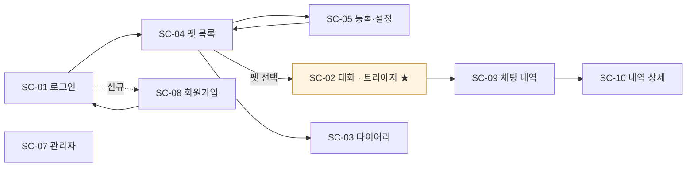

# 11 · 화면설계서 — PetTriage (4차)

> **SKN 4차 단위 프로젝트** · 팀 `save the pet` · 제품 `PetTriage`
> **통합: 오한빈(팀장)** · **내용 기여: §9 기여 이력** · 검토: 전원
> 상위 문서: `10_요구사항정의서.md`(무엇을) · `12_시스템구성도.md`(어디서)
>
> 최초 작성: 2026-08-24 · 기준: `lgj` 머지 직후

---

## 0. 이 문서의 자리

**있는 화면을 기술한다.** 4차의 화면은 이미 Django 템플릿으로 이식돼 있고
(`lse` · `ksr` · `lgj` 커밋 7개), 이 문서는 그것을 설계 문서로 되돌린 것이다.
값과 요소는 전부 템플릿 파일에서 읽었으며 출처를 `파일` 로 단다.

**화면 ID(`SC-`)는 `10_요구사항정의서.md` §3.3 과 추적표가 참조한다.** 여기서 바꾸면
그쪽이 끊긴다 — §1.1 에 이번 개정 내역을 남겼다.

---

## 1. 화면 목록

| ID | 화면 | URL | 템플릿 | 상태 |
|---|---|---|---|---|
| **SC-01** | 로그인 | `/accounts/login/` | `templates/accounts/login.html` | ✅ |
| **SC-02** | **대화 · 트리아지** ★ | `/chat/` | `chat/templates/chat/room.html` | ✅ |
| **SC-03** | 다이어리 · 리포트 | `/diary/` | `diary/templates/diary/diary.html` | ✅ |
| **SC-04** | 반려동물 목록 | `/pets/` | `templates/pets/pet_list.html` | ✅ |
| **SC-05** | 반려동물 등록 · 설정 | `/pets/new/` · `/pets/<id>/edit/` | `templates/pets/pet_form.html` | ✅ |
| **SC-06** | 내 프로필 | — | — | 🔴 **미이식** |
| **SC-07** | 관리자 `[신규]` | `/admin/` | Django admin | 🟡 §6.2 — 배포에서 CSS 없음 |
| **SC-08** | 회원가입 `[신규 ID]` | `/accounts/signup/` | `templates/accounts/signup.html` | ✅ |
| **SC-09** | 채팅 내역 목록 `[신규]` | `/history/` | `chat/templates/chat/session_list.html` | 🟡 §4.5 |
| **SC-10** | 채팅 내역 상세 `[신규]` | `/history/<session_id>/` | `chat/templates/chat/session_detail.html` | 🟡 §4.5 |

★ = 4차 발표의 핵심 화면.

> 🟡 **위의 ✅ 는 "화면이 있다"는 뜻이지 "동작이 검증됐다"는 뜻이 아니다.**
> Django 앱에는 테스트가 0건이라 CI 가 이 화면들을 한 번도 열어 보지 않는다
> (13 §5). 요구사항 쪽 상태는 `10 §5` 에서 🟡 로 구분해 두었다.

### 1.1 개정 내역 — `10 §3.3` 과의 차이

`10 §3.3` 은 3차의 `web/*.html` 6장을 기준으로 SC-01~07 을 잡았다. 실제 이식 결과가
1:1 이 아니어서 아래와 같이 정리했다. **기존 ID 의 의미는 유지하고 새 화면만 번호를 늘렸다.**

| ID | 10 §3.3 (3차 기준) | 실제 (4차) | 처리 |
|---|---|---|---|
| SC-01 | 홈 · 로그인 (`index.html`) | **로그인만** — `/` 는 `/pets/` 로 리다이렉트라 홈 화면이 없다 | 의미 축소 |
| SC-02~05 | 대화 · 다이어리 · 펫 목록 · 펫 설정 | 그대로 | 유지 |
| SC-06 | 내 프로필 (`profile.html`) | **Django 에 없다** | 🔴 미이식 |
| SC-07 | 관리자 | Django admin | 유지 |
| — | (없음) | 회원가입 · 채팅 내역 목록/상세 | **SC-08~10 신설** |

### 1.2 🔴 SC-06 이 이식되지 않았다

3차의 `web/profile.html` 에 대응하는 Django 화면이 없다.
`10` 의 **FR-05(자기 계정 정보 조회) · UC-03** 이 **화면 없이 남아 있다.**

지금은 FastAPI 의 `GET /api/users/me` 만 살아 있는데, 그것은 JWT 인증이라
Django 세션으로 로그인한 사용자가 쓸 수 없다 (12 §2 · 검토 §6).

**필요한지부터 정한다** — 아이디 표시 외에 보여 줄 것이 없다면 사이드바(§2)로 충분하고,
그렇다면 FR-05·UC-03·SC-06 을 함께 철회한다. §8 미결.

---

### 1.3 진입 경로 — 그 화면에 **어떻게 닿는가**

이서은의 화면정의서(`docs/lse`)가 화면마다 이 축을 세워 두었다. `11` 에 없던 축이라
그대로 흡수한다 — 화면을 정의할 때 *무엇을 보여 주는가* 만큼 *어떻게 닿는가* 가 중요하다.

| 화면 | 진입 경로 |
|---|---|
| SC-01 로그인 | 최초 접속(`/`) · **미인증 상태로 보호 화면 접근 시 자동 리다이렉트** (`@login_required`) |
| SC-08 회원가입 | SC-01 하단 링크 |
| SC-02 대화 ★ | **로그인 직후 기본 진입점** (`LOGIN_REDIRECT_URL = "/chat/"`) · 사이드바 *위험 체크* · SC-04 카드 클릭 |
| SC-04 펫 목록 | 사이드바 *반려동물* |
| SC-05 펫 등록·설정 | SC-04 의 *새로 만들기*(등록) · *프로필 설정*(수정) |
| SC-03 다이어리 | 사이드바 *기록장* |
| SC-09 채팅 내역 | 사이드바 *채팅 내역* |
| SC-10 내역 상세 | SC-09 카드 클릭 |
| SC-07 관리자 | `/admin/` 직접 입력 (`is_staff` 필요) |
| SC-06 내 프로필 | 🔴 **없다** — §1.2 |

🔴 **로그인 직후는 SC-02 다. SC-04 를 거치지 않는다.**
`LOGIN_REDIRECT_URL = "/chat/"` (`webapp/settings.py:180`) 이고, 첫 반려동물이
자동 선택된다 (`chat/views.py` `request.user.pets.first()`). 펫이 하나도 없을 때만
SC-05 로 보낸다.

> 흡수한 덱은 2쪽에서 이대로 적고 6쪽에서 SC-003(=SC-04)을 *"로그인 직후 기본 진입 화면"*
> 이라고 적어 **덱 안에서 어긋났다.** 코드가 2쪽 편이라 그쪽을 정본으로 삼았다 (§9.1 정정 ①).

## 2. 공통 레이아웃

`chat/templates/chat/base.html` 한 장을 **SC-02 · SC-03 · SC-09 · SC-10 이 함께 쓴다**
(``). 블록은 다섯이다.

```
      브라우저 탭
    작은 머리말
    제목
 부제
    본문
```

### 2.1 사이드바 — 활성 반려동물 카드

`chat/context_processors.py` 가 **모든 템플릿에** 현재 활성 펫을 넣는다.
종 이모지(`🐶 🐱 🦜`)와 메타 문자열(품종·나이·성별)을 코드가 조립한다.

```
🐶  콩이
    소형견 · 2살 · 수컷
```

**표시 규칙이 템플릿이 아니라 코드에 있다.** 품종이 없으면 `소형견` 처럼 크기+종으로
대체하고, 조류는 `앵무새` 로 적는다. 화면을 고칠 때 이 파일을 함께 본다.

> SC-01 · SC-08(로그인·회원가입)과 SC-04 · SC-05(펫)는 이 레이아웃을 쓰지 않는다.
> 로그인 전이거나 펫이 없을 수 있어 사이드바가 성립하지 않기 때문이다.

---

## 3. SC-02 · 대화 · 트리아지 ★ (핵심 화면)

`10 §4 UC-04` 의 세 흐름이 그대로 화면 상태 셋이 된다.

| 상태 | 화면 | 근거 |
|---|---|---|
| `answered` | 등급 배지 + 안내 + **근거 출처** + 판정 감사줄 | §3.1 |
| `clarify` | 되묻기 말풍선 + `(턴/최대)` 표시 | §3.2 |
| `refused` | 거절 사유 + 수의사 상담 안내 | §3.3 |

말풍선 왼쪽 테두리 색으로 상태를 구분한다 — `clarify` 는 꿀색, `refused` 는 흐린 회색
(`room.html` CSS 40~41행).

### 3.1 `answered` — 무엇을 보여 주는가

```
● 응급 — 지금 바로 병원에 연락하세요        ← 등급 배지 + 메시지
────────────────────────────────────
(안내 본문)
────────────────────────────────────
"체중 1kg당 20mg 이상에서 중독 증상"        ← 근거 인용 + 출처
  — ASPCA Animal Poison Control, p.14
────────────────────────────────────
규칙 3 · LLM 4 → 최종 4                     ← 판정 감사줄
```

**등급의 이름·색·문구를 화면이 정하지 않는다.** 기동 시 `GET /api/triage-levels` 로
받아 `levelMeta` 에 넣고 그것을 쓴다 (`room.html` 127~129행). 고지 문구(`disclaimer`)도
같은 응답에서 온다.

> **이것이 D-40(계약을 먼저 고정한다)의 실물이다.** 등급 문구를 바꾸려면 서버만 고치면
> 되고, 화면과 서버가 다른 말을 할 수 없다.

🔴 **판정 감사줄이 이 프로젝트의 차별점이다.**
`규칙 N · LLM N → 최종 N` 을 사용자에게 그대로 보여 준다 (`room.html` 225행).
하향 금지 게이트(D-09)가 무엇을 했는지가 화면에 드러난다 — LLM 이 3이라 했는데 규칙이 4면
**최종은 4이고, 그 사실이 숨겨지지 않는다.** 근거를 각주가 아니라 필드로 낸 D-81 의 화면 쪽 귀결이다.

### 3.2 `clarify` — 되묻기

```
● 조금만 더 알려주세요 (1/2)
   콩이의 체중을 알려주시겠어요?
```

`(턴/최대)` 를 반드시 표시한다 — `MAX_CLARIFY_TURNS`(2)에 닿으면 거절로 넘어가므로,
사용자가 **몇 번 남았는지 알아야 한다** (D-49). 부족한 슬롯 이름은 한국어로 옮겨 보여 준다
(`missingKorean`).

### 3.3 `refused` — 거절

거절 사유 다섯 종(`근거없음` · `검증실패` · `되묻기상한` · `판정불가` · `범위밖`)을
그대로 보여 주고, **수의사 상담 안내를 함께 낸다.**

> **거절은 실패 화면이 아니다.** 근거 없이 지어내지 않았다는 뜻이므로,
> 오류처럼 붉게 그리지 않는다 — 흐린 회색 테두리를 쓰는 이유다.

### 3.4 입력

한 줄 입력에 예시를 둔다 — `예: 강아지가 초콜릿을 먹었어요`.
**종·체중은 사용자가 다시 입력하지 않는다.** 사이드바의 활성 펫에서 온다 (§2.1).

---

## 4. 나머지 화면

### 4.1 SC-01 로그인 · SC-08 회원가입

| 화면 | 입력 | 비고 |
|---|---|---|
| SC-01 | `username` · `password` | 실패 시 `error` 를 같은 화면에 다시 그린다 |
| SC-08 | `username`(**4자 이상**) · `password`(8자 이상) · 비밀번호 확인 | `/accounts/check-id/` 로 아이디 중복을 **입력 중에** 확인한다 |

> 🔴 **정정 (2026-08-27).** 여기 오래 *"영문/숫자 4~16자"* 라고 적혀 있었다.
> **코드는 `len(username) < 4` 하나만 본다** (`accounts/views.py:33`) — 상한도 형식 제한도 없다.
> 이서은 덱 5쪽의 문구를 그대로 받아 적으면서 코드와 맞춰 보지 않은 자리다.
> 상한·형식을 실제로 둘 것인지는 `10 §8` 미결.

> **가입에 성공하면 바로 로그인된다** (`accounts/views.py:43`) — 로그인 화면으로 되돌리지
> 않는다. 덱 5쪽은 *"로그인 화면 이동 후 재로그인"* 으로 적었다. `10` 의 **FR-47**.

**이메일을 받지 않는다.** `accounts/views.py` 가 `User.objects.create_user(username=…)` 만 쓴다.
3차 SQLAlchemy `User` 는 이메일이 있었고 `contracts.py` 가 `EmailStr` 을 쓴다 —
**계정 모델이 정해지면 다시 볼 자리다** (검토 §3 · §8 미결).

### 4.2 SC-04 반려동물 목록 · SC-05 등록·설정

`pet_form.html` 하나가 **등록과 수정을 겸한다** (`프로필 설정프로필 생성`).

| 필드 | 형태 | 쓰이는 곳 |
|---|---|---|
| `name` · `species` · `weight_kg` | 필수 | **트리아지 판정 입력** (`AskRequest`) |
| `size` · `age` · `gender` · `intro` | 자유 입력 | 사이드바 표시 (§2.1) |
| `notes` | 긴 글 — 알러지 · 질환 | 표시만. **판정에 들어가지 않는다** |
| `photo` | 파일 | 표시만 (D-11 — 사진은 판정 입력이 아니다) |

#### 4.2.1 사진은 **그대로 저장되지 않는다** (D-43)

업로드된 사진은 저장 전에 관문을 지난다 (`src/pettriage/privacy/images.py`).
**화면이 이것을 말해야 한다** — 사용자가 올린 파일과 다시 보이는 파일이 다르다.

| 규칙 | 값 | 이유 |
|---|---|---|
| 최대 용량 | 5 MB | 초과하면 거절 |
| 최대 변 | 1280 px | 넘으면 비율 유지로 축소 |
| 허용 형식 | JPEG · PNG · WEBP | 그 외 거절 |
| 저장 형식 | **JPEG 로 재인코딩** | PNG 를 올려도 `.jpg` 로 저장된다 |
| 메타데이터 | **EXIF 전부 제거** | 🔒 **사진의 GPS 좌표가 집 주소다** |
| 파일 이름 | `uuid4().hex + .jpg` | 원본 이름을 남기지 않는다 |

회전 정보(EXIF `Orientation`)는 **버리기 전에 화소에 적용한다** — 안 그러면 세로 사진이
가로로 눕는다. 거절 시에는 폼이 오류와 함께 그대로 남고 저장이 일어나지 않는다.

> 흡수한 덱 7쪽은 사진 업로드를 *"원형 썸네일 + 사진 삭제 버튼"* 으로만 적었다.
> D-43 관문이 그 뒤에 붙은 것이 반영되지 않았다 (§9.1 정정 ④).

🔴 **`notes` 와 `photo` 가 판정에 쓰이지 않는다는 것을 화면이 말해야 한다.**
*"알러지·질환 이력"* 을 적는 칸이 있으면 사용자는 그것이 판정에 반영된다고 믿는다.
지금은 그런 안내가 없다 — §8 미결.

목록이 비면 `어떤 아이로 시작할까요?` 로 등록을 유도한다.

### 4.3 SC-03 다이어리 · 리포트

하루치를 카드로 적는다 — 식사 4칸(`🌅 아침` · `☀️ 점심` · `🌙 저녁` · `🍪 간식`) ·
증상 · 체중 · 배변(조류) · 자유 메모 · 사진.

- `POST /api/records` 로 저장 (Django 소유 · 12 §3 규칙 1)
- `GET /api/report` 로 기간 요약 — **조회는 Django, 요약은 추론 서비스** (12 §4.4)
- `📈 체중 변화` 그래프 · `기록 리포트 다운로드`
- **체중 급변 알림** (우측 하단 토스트) · **연속 기록 일수(스트릭)** ★흡수(lse, 2026-08-26)

#### 🔴 체중 급변 알림은 트리아지 배지와 달라야 한다 (D-103)

`GET /api/report` 가 `weight_alert` 를 함께 낸다. 2단계다.

| 단계 | 조건 | 문구 |
|---|---|---|
| `watch` | 직전 대비 5% 이상 | "당분간 지켜봐 주세요." |
| `vet` | 10% 이상 | "수의사와 상담해보세요." |

**SC-02 의 4등급 배지(`관찰·방문·연락·응급`)와 같은 색·같은 어조를 쓰지 않는다.**
쓰는 순간 사용자는 두 척도를 같은 것으로 읽는다. 지금 문구는 이 선을 지키고 있으므로
**바꿀 때 D-103 을 먼저 본다.**

성장기(나이가 "개월" 표기이거나 1살 미만)에는 알림 자체를 끈다 — 신생아는 하루 5~10%
증가가 정상이라 임계값이 의미를 잃는다.

> **여기가 시스템의 두 번째 LLM 사용처다.** 판정(SC-02)과 요약(SC-03)이 전부이며,
> 나머지 화면은 LLM 을 부르지 않는다.

### 4.4 SC-09 · SC-10 채팅 내역

지난 대화를 목록으로 보고(`/history/`) 하나를 펼친다(`/history/<session_id>/`).
`chat_sessions` · `chat_messages` 를 **읽기만 한다** — `chat/models.py` 가 `managed = False` 다
(12 §4.1 · 검토 §1③).

> `10` 에 이 화면들에 대응하는 FR 이 아직 없다. §8 미결.

#### 4.4.1 목록의 범위 — **활성 펫 기준이고, 화면이 그렇다고 말한다**

`ksr` 이 사이드바 프로필 카드를 붙이면서 활성 펫 개념이 생겼다
(`chat/context_processors.py` · `?pet_id` → 세션 → 첫 펫 순).
`/history/` 도 그 펫으로 목록을 좁힌다.

| 상태 | 목록 범위 | 제목 |
|---|---|---|
| 활성 펫 있음 (기본) | 그 펫의 대화만 | `<이름>의 지난 대화` + *모든 반려동물 대화 보기* 링크 |
| `?all=1` · 활성 펫 없음 | 내 모든 펫 | `지난 대화 모아보기` |

> ⚠️ **범위를 좁혔으면 화면이 그렇다고 말해야 한다** (`04 §8`).
> 흡수 시점의 `ksr` 코드는 세션 상태에 따라 **같은 주소가 다른 범위**를 보여 주는데
> 제목이 `지난 대화 모아보기` 그대로였다 — 사용자에게는 다른 펫의 대화가
> *사라진 것*으로 보인다. 제목에 이름을 달고 넓히는 길(`?all=1`)을 같이 두어 닫았다
> (2026-08-27 흡수).

#### 🟡 4.5 **환경에 따라 되기도 하고 안 되기도 한다** (503)

`chat/models.py` 가 `managed = False` 로 `chat_sessions` · `chat_messages` 를 가리키는데,
**D-104 로 DB 를 가르면서 그 표는 3차 DB 에 남았다.** 웹앱 DB 에는 없다.

```
webapp.sqlite3 의 표 — auth_* · pets · diary_entries · django_*
                       chat_sessions 없음 · chat_messages 없음
```

게다가 대화를 **쓰는 쪽은 FastAPI 의 `chat_logger`** 라, 표만 옮겨도 쓰는 곳과 읽는 곳이 갈린다.
✅ **D-105 로 방향이 정해졌다** (2026-08-26) — 적재를 Django 로 옮기고, 브라우저가
답을 받은 뒤 알려 주는 방식으로 한다. **구현은 7b**(라우터 폐기와 같은 작업).

**표가 없을 때 500 이 아니라 503 과 안내를 낸다** (`chat/templates/chat/unavailable.html`).
스택트레이스는 사용자에게 *"기록이 날아갔나"* 로 읽히고, 빈 목록은 *"대화가 없다"* 는
거짓말이다 — **무엇이 없는지 말해 준다** (D-58).

##### 🔴 정정 (2026-08-27) — *"지금은 동작하지 않는다"* 는 **우리 환경의 이야기였다**

권소라의 UI 테스트가 2026-08-27 에 이 화면들을 **통과**로 기록했다
(`docs/ksr` · TC-FR-HIST-001~004 — 세션 카드 7건 최신순, 남의 세션 404, 최고 응급도 배지).

둘 다 맞다. 갈리는 것은 **DB 를 몇 개로 두었는가** 하나다.

| 환경 | `DJANGO_DATABASE_URL` ↔ `DATABASE_URL` | `chat_sessions` | 화면 |
|---|---|---|---|
| 우리 로컬 | sqlite **두 파일** (D-104) | Django 쪽에 없다 | **503** |
| 같은 MySQL 하나 | 같은 인스턴스 | 있다 (FastAPI 가 쓴다) | **보인다** |

🔴 **문서가 환경 의존적인 사실을 절대적으로 적었다.** 이 절은 *"이 화면은 고장났다"* 라고
읽혔는데, 실제로는 *"DB 를 가른 환경에서는 안 보인다"* 였다. **되는 걸 안 된다고 적는 것도**
**D-58 위반이다** — 방향만 반대일 뿐 같은 종류의 거짓이다.

> **D-105 는 그대로다.** 한 DB 로 합치면 화면은 살아나지만 **쓰는 쪽이 FastAPI 라는 사실**은
> 안 변한다. D-99(추론은 배달을 모른다) · D-104(스키마 주인은 Django)가 여전히 적재를
> Django 로 밀고, 한 DB 로 합치는 것 자체가 D-104 가 가른 경계를 도로 무너뜨린다.
> **화면이 보이는 것과 설계가 옳은 것은 다른 문제다.**

---

## 5. 화면 흐름



**`/` 는 화면이 아니라 `/pets/` 로 리다이렉트다** (`webapp/urls.py`).
펫을 먼저 등록하게 하는 구조다 — 종·체중이 없으면 트리아지가 되묻기로 빠지기 때문이다 (§3.2).

---

## 6. 3차 화면과의 관계

### 6.1 무엇이 대체됐나

| 3차 (`src/pettriage/app/web/`) | 4차 | 상태 |
|---|---|---|
| `index.html` | — | 홈이 없어졌다 (리다이렉트) |
| `chat.html` | SC-02 `room.html` | ✅ 대체 |
| `diary.html` | SC-03 `diary.html` | ✅ 대체 |
| `pets.html` | SC-04 | ✅ 대체 |
| `pet-settings.html` | SC-05 | ✅ 대체 |
| `profile.html` | — | 🔴 미이식 (§1.2) |

**3차 6장은 아직 지워지지 않았고 FastAPI 가 `/static/` 으로 서빙한다** (12 §3).
6단계가 끝나면 함께 지운다 — 그때까지 **화면이 두 벌 살아 있다.**

### 6.2 🟡 SC-07 관리자 화면 — **로컬만 해결됐다** (2026-08-26 · 2026-08-27 재판정)

`/admin/` 의 CSS·JS 가 안 뜨고 있었다 — nginx 가 `/static/` 을 통째로 FastAPI 로 보내는데
Django 관리자도 `/static/` 을 썼다.

**`STATIC_URL` 을 `/django-static/` 으로 갈랐다** (12 §3.1 A안). 그 경로는 nginx 의
`location /` 에 걸려 Django 로 오므로 규칙을 새로 만들 필요가 없었다.

> 🔴 **배포에서는 아직 안 됐다** (2026-08-27 재판정).
> `DEBUG=false` 면 Django 가 정적 파일을 내주지 않고, `docker/nginx/nginx.conf` 에는
> **`/django-static/` 블록이 없다.** 즉 배포된 `/admin/` 은 **CSS 없이 뜬다.**
>
> 이 절이 오래 ✅ 였던 이유는 **`STATIC_URL` 을 가른 것을 해결로 셌기 때문**이다.
> 경로를 갈랐어도 **내보내는 쪽을 아무도 만들지 않았다** — 고친 것은 절반이었다.
> `10 §6.1`(NFR-17) · D-107 ①.
>
> **확인** — 배포 도메인에서 `/admin/` 을 연다. 글자만 나오면 이 판정이 맞다.
>
> 🔄 **2026-08-27** — 저장소 nginx 에 `/django-static/` 블록을 넣었다.
> **EC2 에는 아직 없다** (설정이 git 밖이다 · D-107 ①). `10 §6.1` 에 넣을 블록이 있다.

---

## 7. 화면 ↔ 요구사항 대응

`10 §7` 추적표의 화면 칸과 맞물린다.

| 화면 | UC | FR |
|---|---|---|
| SC-01 | UC-02 | FR-03 · FR-04 |
| SC-02 | **UC-04** | FR-10 ~ FR-19 |
| SC-03 | UC-06 · UC-07 | FR-09 · FR-20 |
| SC-04 · SC-05 | UC-05 | FR-06 · FR-07 · FR-08 |
| SC-06 | UC-03 | FR-05 🔴 화면 없음 |
| SC-07 | UC-09 | FR-22 |
| SC-08 | UC-01 | FR-01 · FR-02 |
| SC-09 | **UC-10** | FR-23 · FR-24 · FR-26 |
| SC-10 | **UC-10** | FR-25 · FR-26 |

✅ **2026-08-27 · 빈칸 둘이 닫혔다.** 이서은의 화면정의서가 대화 이력 화면의
요구사항을 처음으로 글로 적었고, 그것을 `10` 의 ID 체계로 옮겨 **UC-10 · FR-23~26**
이 생겼다. `check_requirements.py` 가 FR 26건 · 추적 26건으로 이어지는 것을 확인한다.

> 넷 다 🔴 다 — 화면은 있는데 표가 없어 503 이다 (§4.5). **7b 에서 함께 열린다.**

---

## 8. 미결

> 📌 **한 항목의 주인은 한 문서다.** 여러 문서에 걸치는 것은 **주인을 적고 가리킨다** —
> 지우면 그 문서만 보는 사람이 놓치고, 양쪽에 그대로 두면 한쪽만 닫힌다.

- [ ] 🔴 **SC-06(내 프로필)을 만들 것인가 철회할 것인가** — §1.2 · **주인은 `10 §8`**
      (FR-05 · UC-03 이 함께 걸리므로 요구사항 쪽에서 정한다)
- [x] ~~SC-07 관리자 `/static/` 충돌~~ → `/django-static/` (§6.2 · **로컬만**)
- [ ] 🔴 **배포의 `/admin/` 이 CSS 없이 뜬다** — §6.2 · **주인은 `12 §10`** (인프라 항목이다)
- [ ] 🔴 **`notes` · `photo` 가 판정에 안 쓰인다는 안내** — 없으면 사용자가 오해한다 (§4.2)
- [ ] 회원가입에 이메일을 받을 것인가 (§4.1) — **계정 모델은 정해졌다**(D-104 · 기본 `auth.User`).
      기본 User 에 `email` 필드가 이미 있으므로 **받을지 말지만 정하면 된다**
- [x] ~~SC-09 · SC-10 에 대응하는 UC · FR~~ → **UC-10 · FR-23~26** (`10` · 이서은 덱 흡수 · §7)
- [ ] `docs/lse` 덱의 정정 넷을 이서은에게 전달하고 슬라이드에 반영 (§9.1)
- [ ] `FR-HIST-001~004 → FR-23~26` 쪼갬을 원저자에게 확인 (§9.1)
- [x] ~~SC-09·SC-10 을 언제 되살릴 것인가~~ → **7b · (가) 방식** (D-105)
- [ ] 3차 `web/` 6장을 언제 지울 것인가 (§6.1 · = 6단계 완료 시점)
- [x] ~~반응형 — 지금은 데스크톱 기준이다~~ → **사실이 아니었다** (2026-08-27 확인).
      화면 일곱이 전부 좁은 폭에 대응한다 — 여섯은 `@media`(720~980px), `templates/pets/pet_list.html` 은
      `auto-fill` 그리드라 규칙 없이 접힌다. `TC-FR-UI-003` 통과 · `NFR-18` 통과.
      **아무도 다시 안 본 채로 오래 열려 있던 항목이다**
- [x] ~~`DESKTOP-8TOF9MK\User` 커밋의 실제 작성자~~ → **이서은** (이메일로 확인 · `12 §12.1`)
- [ ] 팀원 `git config user.name` · `user.email` 정리 — 이름으로 기여를 셀 수 있게 (회의 안건)

---

## 9. 기여 이력

| 무엇 | 누구 | 원본 | 반영 |
|---|---|---|---|
| 회원가입 · 로그인 화면 (SC-01 · SC-08) | 권소라 | 커밋 `a2f761d` | 2026-08-24 |
| 펫 목록 · 등록 화면 (SC-04 · SC-05) | 권소라 | 커밋 `8eaa49e` · `2613b0a` | 2026-08-24 |
| 다이어리 화면 (SC-03) | 이서은 | 커밋 `8dde2a9` | 2026-08-24 |
| 체중 급변 알림 · 스트릭 (SC-03) | 이서은 | 커밋 `dcda6d5` 외 7 | 2026-08-26 |
| 대화 화면 · 공통 레이아웃 · 사이드바 (SC-02 · SC-09 · SC-10) | 이근준 | 커밋 `4acc6f2` | 2026-08-24 |
| 답변 타이핑 효과 · 로딩 점 · 출처 접기 (SC-02) | 이서은 | 커밋 `05221ff` · `c248dfb` · `1800b3d` | 2026-08-27 |
| 활성 펫 사이드바 카드 · 화면 간 유지 (SC-09 · 공통) | 권소라 | 커밋 `ce7bf42` | 2026-08-27 |
| 화면 표시 시각 KST (전 화면) | 이서은 | 커밋 `2642390` | 2026-08-27 |
| 문서 통합 · 상태 설계 기술 · 미결 정리 | 오한빈 | — | 2026-08-24 |
| **화면정의서 11장** — 진입 경로 축(§1.3) · 대화 이력 요구사항(→ `10` UC-10 · FR-23~26) | 이서은 | `docs/lse/PetTriage_화면정의서.pptx` · 커밋 `f3c9d43` | 2026-08-27 |
| 목록 범위 표시 (§4.4.1) · KST 미들웨어 정리 | 오한빈 | 흡수 | 2026-08-27 |

<sub>※ **이 표의 사람 이름은 커밋 이메일로 확인한 것이다.** 저장소에는 `user.name` 이
설정되지 않은 기계에서 만든 커밋이 있어 작성자가 `DESKTOP-8TOF9MK\User` 로 남아 있고,
한 사람이 이름 둘로 나뉜 경우도 있다. **이름은 못 믿고 이메일은 믿는다** —
대조표는 `12 §12.1`.</sub>

---

### 9.1 `docs/lse` 화면정의서와의 대응

이서은이 슬라이드로 만든 화면정의서(`docs/lse/PetTriage_화면정의서.pptx`, 11장)를
2026-08-27 에 흡수했다. **ID 체계가 서로 달라** 그대로는 맞물리지 않는다.

🔴 **정본은 이 문서다.** 슬라이드는 같은 사실의 **발표용 표현**이고, 어긋나면 여기가 이긴다.
개발·테스트·추적표는 아래 오른쪽 ID 만 쓴다 (D-22).

| 덱 | 정본 | 화면 |
|---|---|---|
| SC-001 | **SC-01** | 로그인 |
| SC-002 | **SC-08** | 회원가입 |
| SC-003 | **SC-04** | 반려동물 목록 |
| SC-004 | **SC-05** | 반려동물 등록 · 수정 |
| SC-005 | **SC-02** | 위험 체크 채팅 ★ |
| SC-006 | **SC-09** | 채팅 내역 목록 |
| SC-007 | **SC-10** | 채팅 세션 상세 |
| SC-008 | **SC-03** | 기록장 |
| — | SC-06 · SC-07 | 내 프로필(미이식) · 관리자 — **덱에 없다** |

| 덱 | 정본 |
|---|---|
| `FR-AUTH-001` · `004` | FR-01 · FR-02 |
| `FR-AUTH-002` · `005` | FR-03 · FR-04 |
| `FR-PET-001` ~ `006` | FR-06 · FR-07 · FR-08 |
| `FR-CHAT-001` ~ `006` · `FR-UI-001` ~ `004` | FR-10 ~ FR-19 |
| `FR-HIST-001` ~ `004` | **FR-23 ~ FR-26** (신설) |
| `FR-DIARY-001` ~ `011` | FR-09 · FR-20 |

<sub>덱의 FR 은 화면 단위로 묶여 있고 정본의 FR 은 동작 단위라 **1:1 이 아니다.**
특히 `FR-HIST-001~004 → FR-23~26` 의 쪼갬은 통합하며 정한 것이므로 **원저자 확인이 필요하다.**</sub>

#### 덱에 돌려줄 정정 넷

흡수하면서 이 문서 쪽은 고쳤다. **슬라이드도 같이 고쳐야 두 문서가 같은 말을 한다.**

| | 슬라이드 | 무엇이 다른가 | 실물 |
|---|---|---|---|
| ① | 6쪽 | SC-003 진입 경로를 *"로그인 직후 기본 진입 화면"* 이라고 적었다. **2쪽과 어긋난다** | `LOGIN_REDIRECT_URL = "/chat/"` — 2쪽이 맞다 (§1.3) |
| ② | 9 · 10쪽 | 동작하는 화면으로 기술했다 | 🔴 **503** — 표가 다른 DB 에 있다 (§4.5 · D-105). *못 하는 것을 한다고 적지 않는다* (D-58) |
| ③ | 9쪽 | 목록 범위가 *"본인 소유 반려동물 세션 전부"* | **활성 반려동물 기준으로 좁혀졌다** (§4.4.1 · 2026-08-27 `ksr` 흡수) |
| ④ | 7쪽 | 사진을 *"원형 썸네일 + 삭제 버튼"* 으로만 적었다 | **D-43 관문** — 5MB · 1280px · EXIF 제거 · JPEG 재인코딩 (§4.2.1) |
| ⑤ | 5쪽 | 아이디 *"4~16자"* · 가입 후 *"로그인 화면 이동 후 재로그인"* | **상한이 없고**, 가입하면 **바로 로그인된다** (§4.1 정정) |

> ✅ 나머지는 실물과 맞다 — 응급도 4단계 이름, 체중 급변 5%/10%, 남의 세션 404,
> 세션 인증, 리포트 흐름. `settings.py` · `diary/views.py` · `chat/views.py` 로 대조했다.

---

## 10. 검수 기준

1. §1 의 모든 화면이 실제 URL 로 열린다
2. §7 대응표에 빈칸이 없다 (SC-09 · SC-10 포함)
3. §8 의 🔴 세 건이 닫혔다
4. `10 §3.3` 의 SC 목록과 §1 이 일치한다
