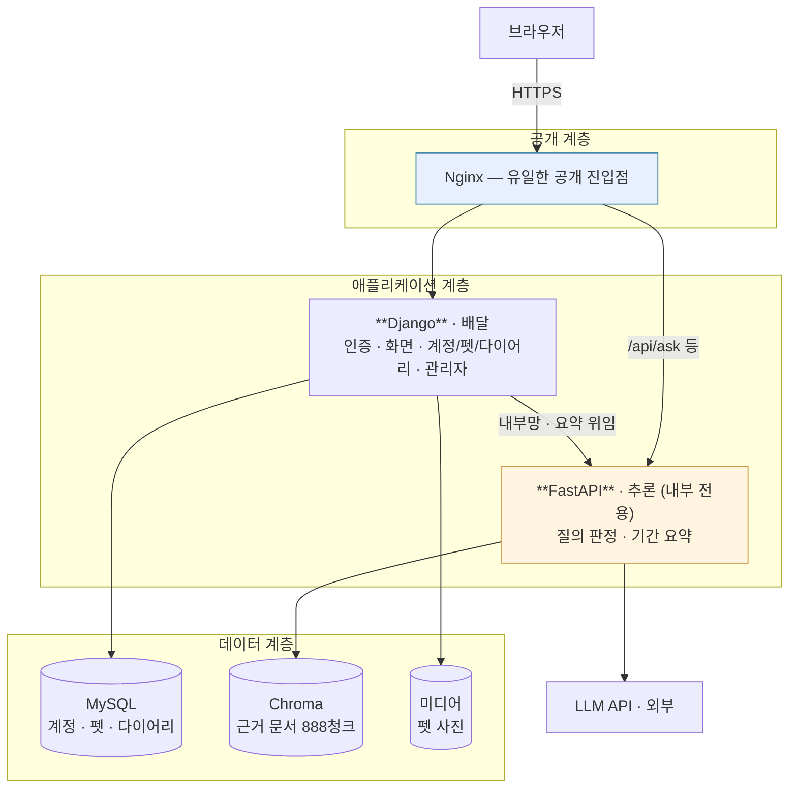
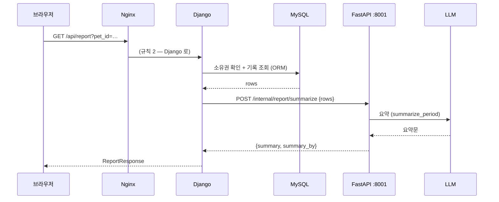
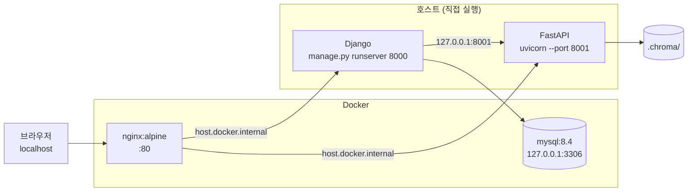
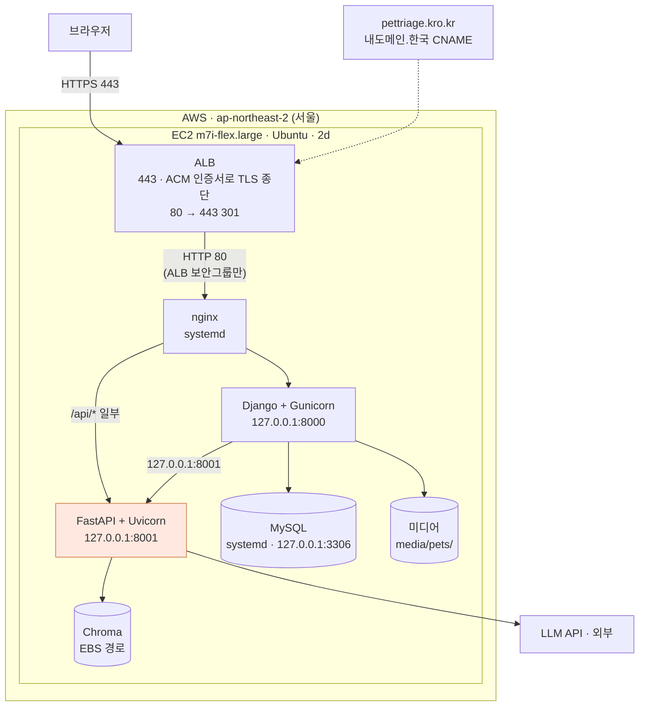

# 12 · 시스템 구성도 — PetTriage (4차)

> **SKN 4차 단위 프로젝트** · 팀 `save the pet` · 제품 `PetTriage`
> **통합: 오한빈(팀장)** · **내용 기여: §12 기여 이력** · 검토: 전원
> 상위 문서: `14_전환설계.md` (경계·근거) · 결정 원장: `06_설계결정기록.md`
>
> 최초 작성: 2026-08-24 · 기준 커밋: `lgj` 머지 직후

---

## 0. 이 문서의 자리

`14_전환설계.md` §3 에 있던 AWS 구성이 **여기로 옮겨 왔다.** 14 는 *왜 나누는가*(경계와
근거)를 다루는 내부 설계 문서이고, **구성도는 필수 산출물**이라 자기 문서를 갖는다.
14 §3 은 이 문서를 가리키기만 한다 (D-22 단일 출처).

**이 문서는 상상이 아니라 실물을 기술한다.** 모든 표의 값은 저장소의 파일에서 읽은 것이고,
출처를 `파일:줄` 로 단다. 값이 코드와 어긋나면 **코드가 아니라 이 문서가 틀린 것**이다.

---

## 1. 논리 구성 — 세 층



**한 줄 —** 브라우저가 닿는 곳은 Nginx 하나뿐이고, 추론 서비스는 **Django 뒤에 숨는다** (D-99).

> ⚠️ **지금은 `/api/ask` 가 Nginx 를 통해 FastAPI 로 직접 간다** (§3). 위 그림의
> 점선 이상(理想)은 *모든 외부 요청이 Django 를 지나는 것*이지만, 3차의 채팅 화면이
> `/api/ask` 를 직접 부르는 구조라 아직 그대로다. §10 미결.

---

## 2. 프로세스와 포트

🔴 **이 표가 이 문서에서 가장 자주 틀리는 자리다.** **옛** 14 §3.1 초안은 Django 와 FastAPI 의
포트를 **뒤바꿔** 적고 있었고, 그 결과 §3.4 가 *"8000(추론)은 보안그룹에서 차단"* 이라고
적었다. 그대로 하면 **공개해야 할 Django 를 막고 추론 서비스를 여는** 정반대 조치가 된다.

| 프로세스 | 포트 | 공개 | 근거 |
|---|---|---|---|
| **Nginx** | **80** (배포 **443**) | 🌐 **유일한 공개 진입점** | `docker/nginx/nginx.conf:13` |
| **Django** | **8000** | 🔒 Nginx 뒤 | `upstream django → :8000` · `manage.py runserver 8000` |
| **FastAPI 추론** | **8001** | 🔒 **절대 공개하지 않는다** | `upstream fastapi → :8001` · `uvicorn --port 8001` |
| MySQL | 3306 | 🔒 루프백만 | `compose.yaml` — `"127.0.0.1:3306:3306"` |

> **외우는 법 — 번호가 작을수록 바깥이다.** `80 → 8000 → 8001`.
> Nginx 가 제일 바깥, Django 가 가운데, 추론이 제일 안쪽이다.

`INFERENCE_INTERNAL_URL` 의 기본값이 한때 `http://127.0.0.1:8000`(= Django 자기 포트)이라
`GET /api/report` 가 **자기 자신을 부르는** 상태였다. 2026-08-24 에 8001 로 고쳤다
(`webapp/settings.py:172` · `.env.example`).

---

## 3. 요청 경로 — Nginx 라우팅

`docker/nginx/nginx.conf` 를 그대로 옮긴 것이다. **순서가 의미를 갖는다** — 위가 먼저 이긴다.

| # | 경로 | 보내는 곳 | 왜 |
|---|---|---|---|
| 1 | `= /api/records` | **Django** | 다이어리 쓰기는 Django 소유 (D-99) |
| 2 | `= /api/report` | **Django** | 조회는 Django, 요약만 내부로 위임 (§4.4) |
| 3 | `/api/` | **FastAPI** | `/api/ask` 등 추론 |
| 4 | `/static/` | **FastAPI** | 3차 `web/*.html` 정적 자산 |
| 5 | `/` | **Django** | 화면 · 로그인 · 관리자 |

**1·2 가 3 보다 위에 있어야 한다.** `= ` 는 정확 일치라 접두사 규칙보다 우선하지만,
읽는 사람이 헷갈리지 않게 순서도 지킨다.

### ✅ 3.1 `/static/` 충돌 — 접두사를 갈랐다 (2026-08-26 해결)

4번 규칙이 `/static/` 을 통째로 FastAPI 로 보내는데, **Django 도 `STATIC_URL = "static/"` 을 쓴다**
(`webapp/settings.py:154`). 그래서 지금 구성에서는:

- Django 관리자(`/admin/`)의 CSS·JS 가 **FastAPI 로 가서 404** 가 된다
- `MEDIA_URL = "/media/"`(펫 사진)는 5번 규칙으로 Django 에 가므로 **문제없다**.
  다만 `DEBUG=false` 에서는 Django 가 미디어를 서빙하지 않는다 (`webapp/urls.py` 끝)

**배포 전에 반드시 갈라야 한다.** 셋 중 하나다.

| 안 | 방식 |
|---|---|
| **A ✅ 채택** | Django 의 `STATIC_URL` 을 `/django-static/` 으로 바꾼다 |
| B | 3차 `web/` 정적 자산을 Django 로 옮기고 4번 규칙을 지운다 — 6단계가 끝나면 어차피 이 방향이다 |
| C | `collectstatic` 결과를 Nginx 가 직접 서빙한다 (배포에선 이쪽이 **함께** 필요하다) |

**A 로 고쳤다.** `/django-static/` 은 위 5번(`location /`)에 걸려 Django 로 오므로
**nginx 규칙을 새로 만들 필요가 없다.** 6단계에서 3차 `web/` 을 지우면 `/static/` 을 되찾는다.

그리고 `STATIC_ROOT` 를 함께 넣었다 — **없으면 `collectstatic` 이 실행되지 않아서**
배포에서 관리자·DRF 정적 파일을 nginx 가 서빙할 방법이 사라진다(C). 두 가지가 짝이다.

> 🔴 **배포에서는 C 가 추가로 필요하다.** `DEBUG=false` 면 Django 는 정적 파일을
> 서빙하지 않는다. `collectstatic` 결과(`staticfiles/`)를 nginx 가 `/django-static/` 로
> 내보내야 한다 — §9 차이표의 마지막 줄이 그것이다.

---

## 4. 데이터 저장소 — 셋이고, 소유자가 다르다

| 저장소 | 담는 것 | 소유 | 위치 |
|---|---|---|---|
| **MySQL** | 계정 · 펫 · 다이어리 · 대화 이력 | Django (전환 완료 시) | 로컬 컨테이너 / 배포 RDS |
| **Chroma** | 근거 문서 **888청크** · `BAAI/bge-m3` 임베딩 | FastAPI 추론 | 파일 (`.chroma/`) → 배포 EBS |
| **미디어** | 펫 사진 | Django | `MEDIA_ROOT` → 배포 EBS 또는 S3 |

**벡터는 MySQL 에 들어가지 않는다** (D-44). `compose.yaml` 이 pgvector 컨테이너를 걷어낸
이유이고, MySQL 은 **계정·프로필 전용**이다.

### 4.1 🔴 MySQL 의 소유권이 아직 하나가 아니다

현재 `pets` · `diary_entries` 테이블을 **Django ORM 과 SQLAlchemy 가 둘 다 소유**한다고
믿는다. 그래서 `python manage.py migrate` 가 끝까지 돌지 않는다.

이것은 구성의 문제가 아니라 **이행이 안 끝난 것**이다.

> ✅ **2026-08-26 · D-104** — 소유자는 **Django** 로 확정됐다. 계정은 Django 기본
> `auth.User` 를 쓰고, 3차의 가상 계정·펫·기록은 넘기지 않는다.
> **실행은 7b 단계**(FastAPI 의 `auth`·`users`·`pets`·`records` 라우터 폐기)에 묶여 있다 —
> 지금 폐기하면 통합 테스트 63건이 깨지는데 그것들은 7b 가 어차피 재작성할 것들이다.
>
> 그때까지는 `DJANGO_DATABASE_URL` 과 `DATABASE_URL` 이 **다른 DB 를 가리켜야 한다.**

### 4.2 Chroma 를 EBS 에 두는 이유

파일 기반이라 볼륨을 그냥 붙이면 된다 (D-101 · D-44 재검토).
컨테이너를 새로 올려도 인덱스를 다시 만들지 않는다 — **재적재에 임베딩 비용이 든다.**
일일 스냅샷을 S3 로 보낸다.

### 4.3 임베딩 모델은 프로세스당 한 번만 올라간다

`configs/default.yaml:107` 의 `warmup: true` 로 기동 시 적재한다. `BAAI/bge-m3` 는 약 **2GB** 다.
**이것이 EC2 사양을 결정한다** (§7) — 그리고 Django 를 gunicorn 워커 여러 개로 돌려도
이 2GB 가 복제되지 않는 이유가 **추론을 별도 프로세스로 뺐기 때문**이다 (D-99).

### 4.4 `GET /api/report` — 저장소 경계를 가로지르는 유일한 요청



**이 요청에 관한 한 추론 서비스는 DB 를 모른다.** 이것이 D-99 3안이고, 스키마를
두 벌로 만들지 않는 유일한 길이었다 (14 §2.4).

> 🔴 **정정 (2026-08-26).** 앞 문장을 처음에는 *"추론 서비스는 DB 를 모른 채로 남는다"* 로
> 적었는데 **틀렸다.** `POST /api/ask` 가 `log_chat_turn(db=db)` 으로 대화를 적재한다
> (`routes/ask.py:57`). 잔류 라우터 셋 중 **`ask` 하나가 DB 를 쓴다.**
>
> 이것이 7b 의 숨은 항목이었다. **D-105 로 정해졌다** — 적재를 Django 로 옮기면
> `ask` 가 DB 를 놓고, 그때 위 문장이 사실이 된다. 자세한 것은 `14 §5.3`.
`summary_by`("model"/"code")를 응답에 실어 **폴백을 숨기지 않는다** (04 §8).

---

## 5. 로컬 개발 구성 (현재)



**Nginx 와 MySQL 만 컨테이너**이고 두 앱은 호스트에서 직접 뜬다. 개발 중 재시작이 잦아서다.
`extra_hosts: host.docker.internal:host-gateway` 가 그 다리다 (`compose.yaml`).

터미널 셋이 필요하다 (`docs/lgj/01_체크해야될사항들.md` §4).

```powershell
python manage.py runserver 8000              # Django
uvicorn src.pettriage.app.main:app --port 8001   # FastAPI 추론
docker compose up nginx db -d                # Nginx + MySQL
```

> ⚠️ **`compose.yaml` 의 `api` 서비스는 이 구성과 맞지 않는다.** 컨테이너 안에서 8000 을
> 열도록 돼 있는데 Nginx 는 호스트 8001 을 본다. 3차에서 FastAPI 단일 서버였을 때의
> 잔재다. 배포 구성(§6)을 만들 때 함께 정리한다 — §10 미결.

---

## 6. 배포 구성 (AWS) — ✅ **배포됨**

> ✅ **2026-08-27 갱신.** 이 절은 오래 *목표* 였다. 이근준의
> `docs/lgj/02_AWS-최종-배포계획서.pdf` 로 **실제 배포가 확인됐다.**
> 아래는 그 실물이다 — 예전 그림(t3.large · RDS · S3 스냅샷 · nginx 가 TLS 종단)은
> **다섯 군데가 실물과 달라** 통째로 고쳤다. 무엇이 달랐는지는 §6.2.



**포트가 바깥부터 안쪽으로 줄어드는 규칙(§2)이 배포에서도 그대로다** —
ALB 443 → nginx 80 → Django 8000 → 추론 8001.
뒤의 셋은 `127.0.0.1` 에만 묶여 있고, 보안그룹이 그 셋과 3306 을 밖에서 막는다.

| 층 | 실물 | 공개 |
|---|---|---|
| 진입 | ALB `pettriage-alb` (2a · 2b · 2d) · ACM `pettriage.kro.kr` (Issued) | 🌐 443 · 80(리다이렉트) |
| 대상 그룹 | `pettriage-tg` · HTTP 80 · 상태검사 `/accounts/login/` → 200 | — |
| 웹 서버 | nginx (systemd) | EC2 80 — **ALB 보안그룹에서만** |
| 배달 | Django + Gunicorn `pettriage-django` | 🔒 `127.0.0.1:8000` |
| 추론 | FastAPI + Uvicorn `pettriage-fastapi` | 🔒 `127.0.0.1:8001` |
| DB | MySQL (systemd) | 🔒 `127.0.0.1:3306` |
| 관리 | SSH 22 | 🔒 **팀원 고정 공인 IP 만** |

### 6.1 왜 EC2 단일 인스턴스인가

| 후보 | 채택 | 이유 |
|---|---|---|
| **EC2 단일 인스턴스** | ✅ | Chroma 파일 저장소를 **EBS 로 그냥 붙일 수 있다.** 비용 최소 |
| ECS Fargate | ❌ | 파일 기반 Chroma 에 EFS 가 필요해 비용·복잡도가 함께 오른다 |
| Elastic Beanstalk | ❌ | 프로세스 2개 구성이 어색해진다 |
| Lambda | ❌ | 2GB 모델 상시 적재와 수십 초 응답에 맞지 않는다 |

**부트캠프 기간 안에 "돌아가는 것"을 만드는 것이 우선이다.** 확장은 구조로 열어두되 지금 만들지 않는다.

### 6.2 예전 그림이 틀렸던 다섯 자리

**이 표를 남기는 이유는 부끄러워서가 아니라, *목표* 로 적은 그림이 얼마나 쉽게
실물과 갈라지는지 보여 주기 때문이다.** 다음에 또 *목표* 를 그릴 때 쓴다.

| | 예전 (목표) | 실물 |
|---|---|---|
| 인스턴스 | `t3.large` | **`m7i-flex.large`** |
| DB | **RDS** `db.t4g.micro` | **EC2 안의 MySQL** (RDS 미사용) |
| TLS 종단 | **nginx** 가 443 | **ALB** 가 ACM 인증서로. nginx 는 80 |
| 실행 방식 | docker compose | **systemd 서비스** (D-107) |
| Chroma 백업 | S3 일일 스냅샷 | **없다** — 미구성 (§10) |

### 6.3 배포에서만 나오는 함정 둘

**① `proxy_params` 를 중복해 쓰면 400 이 난다.**
ALB 가 넘긴 `X-Forwarded-Proto` 를 nginx 가 그대로 전달해야 Django 가 원 스킴을 안다.
`proxy_params` 를 두 번 넣으면 헤더가 겹쳐 요청이 깨진다 — 배포계획서 §5.3 에서
실제로 겪은 것이다.

**② `DEBUG=false` 가 되는 순간 Django 가 정적·미디어를 서빙하지 않는다.**
`collectstatic` 을 돌리고 nginx 가 `/django-static/` 을 직접 물어야 한다.

> 🔴 **저장소의 `docker/nginx/nginx.conf` 에는 `/django-static/` 블록이 없다.**
> 로컬은 `DEBUG=true` 라 Django 가 대신 내주어서 드러나지 않는다. EC2 의 nginx 설정은
> 이것과 다른 파일이고 **git 에 없다** — D-107 ①이 그것을 `deploy/` 로 가져오는 일이다.

---
## 7. 사양 근거 — 모든 값에 출처가 있다

| 항목 | 값 | 근거 |
|---|---|---|
| 인스턴스 | **t3.large** (2 vCPU · **8GB**) | 임베딩 2GB + Chroma + Django + Nginx. t3.medium(4GB)은 위험 |
| 디스크 | gp3 30GB | Chroma 인덱스 + 펫 사진 + 로그 |
| DB | RDS MySQL db.t4g.micro | 계정·프로필·다이어리 전용. 프리티어 범위 |
| 임베딩 | `BAAI/bge-m3` · 약 2GB | `configs/default.yaml:68` · `warmup: true`(107행) |
| 검색 | top_k **5** · 임계 **0.50** | `configs/default.yaml:69·73` |
| 근거 코퍼스 | **888청크** · 45출처 | 3차 산출물 ① |
| 질의당 LLM 호출 | **6~7회** | `04b` · 파인튜닝 보고서 |
| 응답 지연 | answered **p50 12.8s · p95 16.2s** | `eval/reports/baseline_before.json` (2026-08-24 · 2판 · 60건) |

> **지연이 이 구성에 미치는 영향.** 질의 하나가 십수 초를 쓰는데 스트리밍이 없다
> (02 §12.4). 그 시간 동안 **워커 하나가 통째로 붙잡힌다.** Django 를 워커 4개로 돌려도
> 추론이 별도 프로세스라 화면·로그인은 계속 응답한다 — **이것이 D-99 의 실질적 이득**이다.

---

## 8. 보안 — 공개면을 최소로

| 포트 | 배포 시 | 왜 |
|---|---|---|
| **443** | 🌐 공개 | 유일한 서비스 진입점 |
| 22 | 🔒 관리자 IP 만 | SSH |
| 80 | ↪ 443 리다이렉트 | |
| **8000** (Django) | 🔒 **차단** | Nginx 를 통해서만 |
| **8001** (추론) | 🔒 **차단** 🔴 | **여기가 열리면 D-99 가 통째로 무너진다** |
| 3306 | 🔒 EC2 보안그룹만 | RDS |

🔴 **8001 을 막는 것이 이 시스템에서 가장 중요한 한 줄이다.**

`/api/ask` 는 3차에서 **무인증**이었다. 4차에서 추론 서비스가 외부에 없으므로 구조적으로
닫히는데, 그 전제가 **포트 차단 하나**다. `POST /internal/report/summarize` 에 별도 인증을
걸지 않은 이유도 같다 (`internal_report.py` 머리말) — **포트가 안 열린다는 가정 위에 서 있다.**

> **옛** 14 §3.4 초안이 *"8000(추론)은 보안그룹에서 차단"* 이라고 적고 있었다. <!-- 대조제외: 과거 오기의 기록이다 -->
> 8000 은 Django 다. **그대로 하면 공개해야 할 것을 막고 막아야 할 것을 연다.** (§2)

### 8.2 🔒 배포 자세는 기계가 확인한다

보안 설정은 **`DEBUG` 하나에 묶여 있다** (`webapp/settings.py`). 로컬은 `DJANGO_DEBUG=true`
라 열려 있고, **`.env` 를 빠뜨린 배포는 `false` 라 자동으로 잠긴다.**

그래서 로컬에서 그냥 `check --deploy` 를 돌리면 **다섯 개가 경고로 나온다** — 꺼져 있는 게
정상이기 때문이다. 배포 자세를 보려면 `DEBUG` 를 잠깐 꺼서 잰다.

```powershell
$env:DJANGO_DEBUG="false"; python manage.py check --deploy; Remove-Item Env:DJANGO_DEBUG
```

**`System check identified no issues` 여야 한다** (2026-08-26 확인).
9단계 배포 절차서의 항목이고, 설정을 건드린 PR 에서도 돌린다.

> ⚠️ 이 검사는 **설정만** 본다. `CSRF_TRUSTED_ORIGINS` 처럼 **도메인이 정해져야 채워지는
> 값**은 비어 있어도 통과한다 — 배포 때 `.env` 에 넣는다.

### 8.1 그 밖에 3차에서 닫는 것

- MySQL 포트를 루프백에 묶었다 — `"127.0.0.1:3306:3306"`. `"3306:3306"` 은 `0.0.0.0` 이라
  같은 Wi-Fi 의 누구나 붙을 수 있었다 (`compose.yaml`)
- 비밀번호에 기본값을 두지 않는다 — `${VAR:?...}` 로 비면 죽는다
- `DJANGO_SECRET_KEY` 가 없으면 **Django 가 기동을 멈춘다** (`webapp/settings.py:23` · D-41)
- `DEBUG` 기본값은 **`false`** — `.env` 를 빠뜨린 배포가 디버그 페이지를 켜지 않는다 (2026-08-24)

---

## 9. 로컬과 배포의 차이 — 여기만 다르다

**차이를 적어 두지 않으면 "로컬에선 됐는데" 가 시작된다.**

| 항목 | 로컬 | 배포 (실물) |
|---|---|---|
| TLS 종단 | 없음 | **ALB** · ACM `pettriage.kro.kr` |
| Nginx | **컨테이너** · :80 | **systemd** · :80 (ALB 뒤) |
| 실행 방식 | `docker compose` | **systemd 서비스** (D-107) |
| Django | `runserver` (개발 서버) | **Gunicorn** `127.0.0.1:8000` |
| FastAPI | 호스트 직접 실행 | **Uvicorn** `127.0.0.1:8001` |
| Nginx→앱 | `host.docker.internal` | `127.0.0.1` |
| MySQL | `mysql:8.4` 컨테이너 | **EC2 안의 systemd MySQL** (RDS 미사용) |
| Chroma | `./.chroma/` | **EBS 경로** |
| 미디어 | `MEDIA_ROOT` · Django 서빙 | `media/pets/` · **EBS** (S3 미사용) |
| `DEBUG` | `true` (`.env`) | **`false`** |
| 정적 파일 | Django(`/django-static/`) · FastAPI(`/static/`) | **`collectstatic` → Nginx** |
| 백업 · 모니터링 | — | 🔴 **미구성** (§10) |

마지막 두 줄이 9단계에서 가장 자주 사고가 나는 자리다 — `DEBUG=false` 가 되는 순간
Django 는 정적·미디어를 서빙하지 않는다.

---

## 10. 미결

> 📌 **한 항목의 주인은 한 문서다.** 여러 문서에 걸치는 것은 **주인을 적고 가리킨다** —
> 지우면 그 문서만 보는 사람이 놓치고, 양쪽에 그대로 두면 한쪽만 닫힌다.

- [x] ~~`/static/` 충돌~~ → **`/django-static/` 으로 갈랐다** (§3.1 · A안). 배포 시 C 도 필요
- [x] ~~MySQL 스키마 소유권~~ → **Django 소유** (D-104). 실행은 7b (§4.1)
- [ ] `compose.yaml` 의 `api` 서비스가 현재 구성과 안 맞는다 (§5) — **로컬 개발용으로 역할을
      좁혀 정리한다** (D-107 ②). 운영은 systemd 다
- [ ] 🔴 **배포의 `/admin/` 이 CSS 없이 뜬다** — `DEBUG=false` + `/django-static/` 블록 부재.
      D-107 ① 로 nginx 설정을 반입할 때 같이 넣는다 (11 §6.2 · `10 §6.1`)
- [ ] 🔴 **배포는 DB 를 하나로 합쳤다** (`TC-NFR-DB-001` 통과 · *"동일한 인스턴스"*).
      D-104 가 그은 경계가 배포에서 무너져 있다 — 채팅 내역이 보이는 이유이기도 하다.
      **7b 에서 어느 쪽으로 맞출지 정한다**
- [ ] 🔴 **EC2 의 `nginx.conf` · systemd unit 이 git 에 없다** — 지금 그 기계가 죽으면
      아무도 같은 것을 다시 세우지 못한다. `deploy/` 로 가져온다 (D-107 ①)
- [ ] 🔴 **배포에서 `pets` · `diary` 마이그레이션이 안 돌았다** — 배포계획서 §6-7 이
      `migrate auth sessions contenttypes admin` 이다. D-104 와 어긋난다 (D-107 🔴①)
- [ ] 🔴 **배포 절차의 설치 그룹에 `[rag]` · `[ingest]` 가 없다** — 그대로면 AI 응답이
      못 나온다. 실물과 문서 중 어느 쪽이 맞는지 맞춘다 (D-107 🔴②)
- [ ] **백업 · 모니터링 미구성** — EBS Snapshot · CloudWatch (배포계획서 §8).
      `NFR-DEPLOY-006` 은 **지우지 말고 상태로 표시한다** (D-107 🔴③)
- [ ] 배포계획서 §7 검증 결과표의 결과 칸과 캡처 4장이 비어 있다 — 증거를 붙인다
- [x] ~~`/api/ask` 를 Django 경유로 할 것인가~~ → **하지 않는다** (D-105 · (나) 기각).
      인증은 **상시 공개하지 않는 운영 결정** + `limit_req` + 보안그룹으로 버틴다.
      상시 제공으로 바뀌면 그때 (나)를 다시 본다

  <details><summary>판단 재료 (2026-08-26 정리)</summary>

  **Django 경유가 좋아 보이는 이유 셋**
  - `/api/ask` 는 3차에서 **무인증**이었다. Django 를 거치면 로그인한 사람만 질의한다
  - 8001 이 진짜로 내부 전용이 되고 nginx 규칙이 단순해진다 (`/api/` 전부 Django)
  - **로컬에서 nginx 가 필요 없어진다** — 프로세스 셋이 둘로 준다.
    2026-08-26 에 실제로 걸렸다: 팀장 PC 에 Docker 가 없어 전체 시연을 못 띄웠다

  🔴 **그런데 D-99 의 근거와 정면으로 충돌한다.**
  14 §1.3 이 *"질의 1건에 LLM 6~7회, 수십 초가 워커를 점유한다"* 를 배달 계층을 나눈
  이유로 들었다. Django 가 프록시하면 **그 수십 초 동안 Django 워커도 함께 붙잡힌다** —
  스트리밍이 없어(02 §12.4) 응답이 다 나올 때까지 놓지 못한다.
  gunicorn 워커 4개면 **동시 질의 4건에 화면·로그인이 멈춘다.**

  **그래서 "로컬만 프록시" 는 답이 아니다.** 로컬과 배포가 다른 경로를 타면
  9단계에서 로컬에 없던 문제가 배포에서 처음 나온다 (§9 차이표가 경계하는 것).

  **결론이 필요한 질문** — 인증을 얻는 대가로 워커 점유를 받을 것인가.
  받는다면 비동기 프록시(스트리밍 포함)를 함께 설계해야 하고, 그것은 4차 범위 밖이다.
  </details>
- [x] ~~배포 보안 설정~~ → `settings.py` 에 6종 추가 (`DEBUG` 에 묶음 · 2026-08-26 점검 C)
- [x] ~~`/api/ask` 속도 제한~~ → nginx `limit_req` 분당 6건 (점검 D). **인증은 여전히 미결**
- [x] ~~`chat_sessions`·`chat_messages` 가 웹앱 DB 에 없다~~ → **D-105** · 구현은 7b (11 §4.5)
- [x] ~~TLS — Let's Encrypt vs ACM+ALB~~ → **ACM + ALB** (배포 완료 · §6)
- [x] ~~미디어를 EBS 에 둘 것인가 S3 로 뺄 것인가~~ → **EBS** · `media/pets/` (S3 미사용 · §6)
- [x] ~~`TIME_ZONE = "UTC"` 인데 화면은 한국어다~~ → **`webapp/middleware.py` `KSTMiddleware`**
      (`ksr` · 2026-08-27 흡수). 저장·계산은 UTC 그대로 두고, **요청마다**
      `timezone.activate(Asia/Seoul)` 해서 **템플릿에 찍히는 시각만** KST 로 바꾼다.
      `diary/views.py` 의 `_KST` 는 "오늘"을 **파이썬에서** 직접 계산하므로 이중 변환되지 않는다.

      > ⚠️ `activate()` 는 **스레드 로컬**이다. 흡수 시점 코드에는 `deactivate()` 가 없어,
      > 같은 워커 스레드를 물려받는 요청 외 작업(관리 명령·백그라운드)까지 KST 로 물들 수
      > 있었다. `finally: timezone.deactivate()` 로 요청 경계 안에 가뒀다.

---

## 11. 검수 기준

1. §2 포트 표가 `nginx.conf` · `settings.py` · 설치 메모와 **셋 다** 일치한다
2. §7 의 모든 값에 `파일:줄` 또는 리포트 출처가 달려 있다
3. §9 차이표의 각 줄이 9단계 배포 절차서의 항목과 1:1로 대응한다
4. §10 의 🔴 두 건이 배포 전에 닫혔다

---

## 12. 기여 이력

| 무엇 | 누구 | 원본 | 반영 |
|---|---|---|---|
| 구성도 · 포트 정정 · 사양 근거 · 보안 | 오한빈 | `14 §3` 이관 | 2026-08-24 |
| nginx 라우팅 · docker 구성 | 이근준 | 커밋 `4acc6f2` | 2026-08-24 |
| Django 설정 · 내부 요약 경계 | 이서은 | 커밋 `2a1c508` · `f2debfe` | 2026-08-24 |
| 실행 셋업 절차 (§5) | 이근준 | `docs/lgj/01_체크해야될사항들.md` | 2026-08-24 |
| 다이어리 시간대(KST) 처리 | 이서은 | `diary/views.py` `_KST` | 2026-08-26 |
| 화면 표시 시각 KST 미들웨어 | 이서은 | 커밋 `2642390` | 2026-08-27 |
| `[db]` 에 `cryptography` 등록 (MySQL 8 인증) | 이서은 | 커밋 `3da4d2f` | 2026-08-27 |
| 미들웨어 요청 경계 정리 · 의존성 범위 정정 (D-106) | 오한빈 | 흡수 | 2026-08-27 |
| **AWS 배포 실행 + 배포계획서** — §6 전체 · 6.3 함정 둘 | 이근준 | `docs/lgj/02_AWS-최종-배포계획서.pdf` | 2026-08-27 |
| 배포 형태 확정(D-107) · §6 재작성 · 6.2 차이 기록 | 오한빈 | 흡수 | 2026-08-27 |

### 12.1 커밋 신원 대조표

**이름은 못 믿는다. 이메일이 사람이다.** `user.name` 이 설정되지 않은 기계에서 만든
커밋은 작성자가 기계 이름으로 남고, 한 사람이 이름 둘로 갈리기도 한다.
기여 이력을 채울 때는 반드시 이 표를 거친다.

| git 이름 | 이메일 | 사람 | 커밋 수 |
|---|---|---|---|
| `오한빈` | `dhgksqls0825@gmail.com` | 오한빈 (팀장) | 27 |
| `DESKTOP-8TOF9MK\User` | `lxxsxxeun@gmail.com` | **이서은** (lse) | 16 |
| `sora` · `oojo-9` | `rnjsthfk123@gmail.com` | **권소라** (ksr) | 5 + 3 |
| `geunlee00` | `kendong1818@gmail.com` | **이근준** (lgj) | 1 |

<sub>측정: `git log --no-merges --format='%an <%ae>' --all | sort | uniq -c` (2026-08-27).
병합 커밋을 뺀 값이라 실제 기여량과 다르다 — **누가 썼는지**를 가리는 표이지
**얼마나 썼는지**를 재는 표가 아니다.</sub>

> 🔧 각자 한 번만 설정하면 앞으로는 이름이 제대로 남는다.
> **과거 커밋은 고치지 않는다** — 이력을 다시 쓰는 비용이 얻는 것보다 크고,
> 이미 올라간 PR 의 해시가 전부 바뀐다. 이 표가 대신 지킨다.
>
> ```bash
> git config --global user.name "이서은"
> git config --global user.email "lxxsxxeun@gmail.com"
> ```
