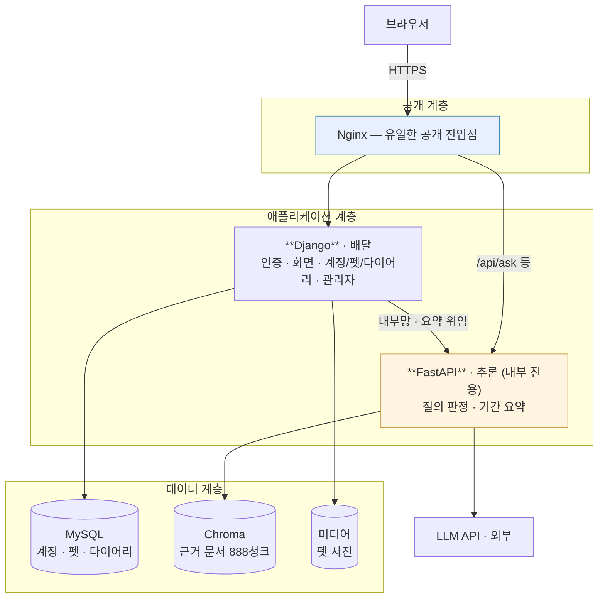
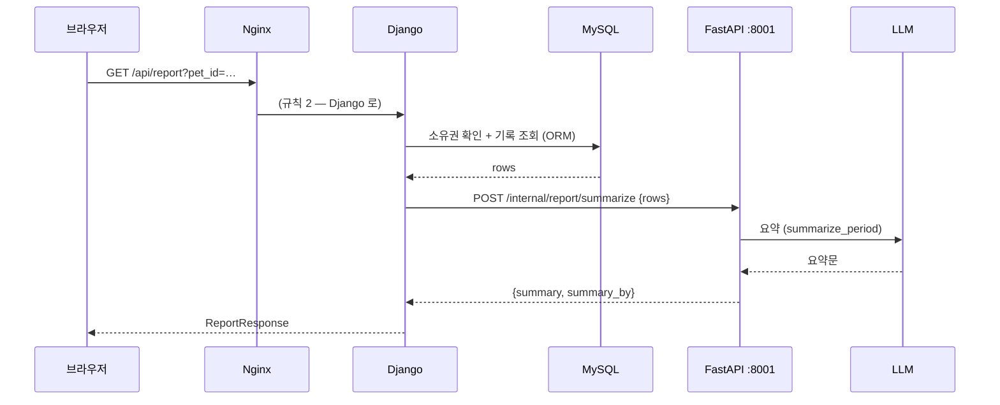
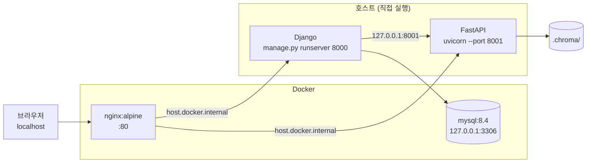
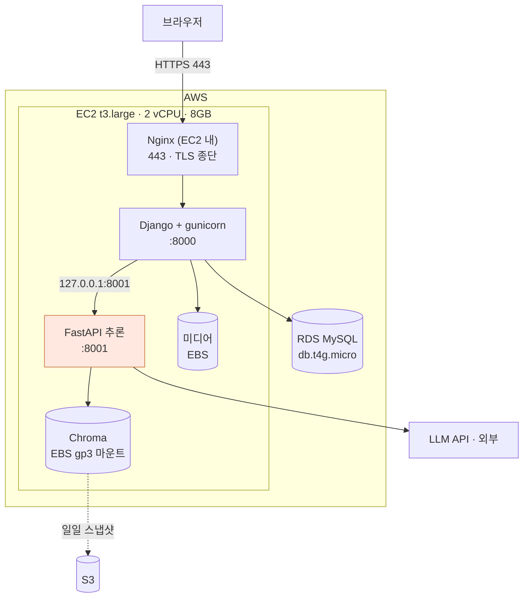

# 12 · 시스템 구성도 — PetTriage (4차)

> **SKN 4차 단위 프로젝트** · 팀 `save the pet` · 제품 `PetTriage`
> **통합: 오한빈(팀장)** · **내용 기여: §12 기여 이력** · 검토: 전원
> 상위 문서: `14_전환설계.md` (경계·근거) · 결정 원장: `06_설계결정기록.md`
>
> 최초 작성: 2026-08-24 · 기준 커밋: `lgj` 머지 직후

---

## 0. 이 문서의 자리

`14_전환설계.md` §3 에 있던 AWS 구성이 **여기로 옮겨 왔다.** 14 는 *왜 나누는가*(경계와
근거)를 다루는 내부 설계 문서이고, **구성도는 필수 산출물**이라 자기 문서를 갖는다.
14 §3 은 이 문서를 가리키기만 한다 (D-22 단일 출처).

**이 문서는 상상이 아니라 실물을 기술한다.** 모든 표의 값은 저장소의 파일에서 읽은 것이고,
출처를 `파일:줄` 로 단다. 값이 코드와 어긋나면 **코드가 아니라 이 문서가 틀린 것**이다.

---

## 1. 논리 구성 — 세 층



**한 줄 —** 브라우저가 닿는 곳은 Nginx 하나뿐이고, 추론 서비스는 **Django 뒤에 숨는다** (D-99).

> ⚠️ **지금은 `/api/ask` 가 Nginx 를 통해 FastAPI 로 직접 간다** (§3). 위 그림의
> 점선 이상(理想)은 *모든 외부 요청이 Django 를 지나는 것*이지만, 3차의 채팅 화면이
> `/api/ask` 를 직접 부르는 구조라 아직 그대로다. §10 미결.

---

## 2. 프로세스와 포트

🔴 **이 표가 이 문서에서 가장 자주 틀리는 자리다.** **옛** 14 §3.1 초안은 Django 와 FastAPI 의
포트를 **뒤바꿔** 적고 있었고, 그 결과 §3.4 가 *"8000(추론)은 보안그룹에서 차단"* 이라고
적었다. 그대로 하면 **공개해야 할 Django 를 막고 추론 서비스를 여는** 정반대 조치가 된다.

| 프로세스 | 포트 | 공개 | 근거 |
|---|---|---|---|
| **Nginx** | **80** (배포 **443**) | 🌐 **유일한 공개 진입점** | `docker/nginx/nginx.conf:13` |
| **Django** | **8000** | 🔒 Nginx 뒤 | `upstream django → :8000` · `manage.py runserver 8000` |
| **FastAPI 추론** | **8001** | 🔒 **절대 공개하지 않는다** | `upstream fastapi → :8001` · `uvicorn --port 8001` |
| MySQL | 3306 | 🔒 루프백만 | `compose.yaml` — `"127.0.0.1:3306:3306"` |

> **외우는 법 — 번호가 작을수록 바깥이다.** `80 → 8000 → 8001`.
> Nginx 가 제일 바깥, Django 가 가운데, 추론이 제일 안쪽이다.

`INFERENCE_INTERNAL_URL` 의 기본값이 한때 `http://127.0.0.1:8000`(= Django 자기 포트)이라
`GET /api/report` 가 **자기 자신을 부르는** 상태였다. 2026-08-24 에 8001 로 고쳤다
(`webapp/settings.py:172` · `.env.example`).

---

## 3. 요청 경로 — Nginx 라우팅

`docker/nginx/nginx.conf` 를 그대로 옮긴 것이다. **순서가 의미를 갖는다** — 위가 먼저 이긴다.

| # | 경로 | 보내는 곳 | 왜 |
|---|---|---|---|
| 1 | `= /api/records` | **Django** | 다이어리 쓰기는 Django 소유 (D-99) |
| 2 | `= /api/report` | **Django** | 조회는 Django, 요약만 내부로 위임 (§4.4) |
| 3 | `/api/` | **FastAPI** | `/api/ask` 등 추론 |
| 4 | `/static/` | **FastAPI** | 3차 `web/*.html` 정적 자산 |
| 5 | `/` | **Django** | 화면 · 로그인 · 관리자 |

**1·2 가 3 보다 위에 있어야 한다.** `= ` 는 정확 일치라 접두사 규칙보다 우선하지만,
읽는 사람이 헷갈리지 않게 순서도 지킨다.

### 🔴 3.1 `/static/` 이 충돌한다

4번 규칙이 `/static/` 을 통째로 FastAPI 로 보내는데, **Django 도 `STATIC_URL = "static/"` 을 쓴다**
(`webapp/settings.py:154`). 그래서 지금 구성에서는:

- Django 관리자(`/admin/`)의 CSS·JS 가 **FastAPI 로 가서 404** 가 된다
- `MEDIA_URL = "/media/"`(펫 사진)는 5번 규칙으로 Django 에 가므로 **문제없다**.
  다만 `DEBUG=false` 에서는 Django 가 미디어를 서빙하지 않는다 (`webapp/urls.py` 끝)

**배포 전에 반드시 갈라야 한다.** 셋 중 하나다.

| 안 | 방식 |
|---|---|
| **A** (권장) | Django 의 `STATIC_URL` 을 `/django-static/` 으로 바꾸고 Nginx 규칙을 추가한다 |
| B | 3차 `web/` 정적 자산을 Django 로 옮기고 4번 규칙을 지운다 — 6단계가 끝나면 어차피 이 방향이다 |
| C | `collectstatic` 결과를 Nginx 가 직접 서빙한다 (배포에선 이쪽이 정석) |

§10 미결에 올린다.

---

## 4. 데이터 저장소 — 셋이고, 소유자가 다르다

| 저장소 | 담는 것 | 소유 | 위치 |
|---|---|---|---|
| **MySQL** | 계정 · 펫 · 다이어리 · 대화 이력 | Django (전환 완료 시) | 로컬 컨테이너 / 배포 RDS |
| **Chroma** | 근거 문서 **888청크** · `BAAI/bge-m3` 임베딩 | FastAPI 추론 | 파일 (`.chroma/`) → 배포 EBS |
| **미디어** | 펫 사진 | Django | `MEDIA_ROOT` → 배포 EBS 또는 S3 |

**벡터는 MySQL 에 들어가지 않는다** (D-44). `compose.yaml` 이 pgvector 컨테이너를 걷어낸
이유이고, MySQL 은 **계정·프로필 전용**이다.

### 4.1 🔴 MySQL 의 소유권이 아직 하나가 아니다

현재 `pets` · `diary_entries` 테이블을 **Django ORM 과 SQLAlchemy 가 둘 다 소유**한다고
믿는다. 그래서 `python manage.py migrate` 가 끝까지 돌지 않는다.

이것은 구성의 문제가 아니라 **이행이 안 끝난 것**이다.

> ✅ **2026-08-26 · D-104** — 소유자는 **Django** 로 확정됐다. 계정은 Django 기본
> `auth.User` 를 쓰고, 3차의 가상 계정·펫·기록은 넘기지 않는다.
> **실행은 7b 단계**(FastAPI 의 `auth`·`users`·`pets`·`records` 라우터 폐기)에 묶여 있다 —
> 지금 폐기하면 통합 테스트 63건이 깨지는데 그것들은 7b 가 어차피 재작성할 것들이다.
>
> 그때까지는 `DJANGO_DATABASE_URL` 과 `DATABASE_URL` 이 **다른 DB 를 가리켜야 한다.**

### 4.2 Chroma 를 EBS 에 두는 이유

파일 기반이라 볼륨을 그냥 붙이면 된다 (D-101 · D-44 재검토).
컨테이너를 새로 올려도 인덱스를 다시 만들지 않는다 — **재적재에 임베딩 비용이 든다.**
일일 스냅샷을 S3 로 보낸다.

### 4.3 임베딩 모델은 프로세스당 한 번만 올라간다

`configs/default.yaml:107` 의 `warmup: true` 로 기동 시 적재한다. `BAAI/bge-m3` 는 약 **2GB** 다.
**이것이 EC2 사양을 결정한다** (§7) — 그리고 Django 를 gunicorn 워커 여러 개로 돌려도
이 2GB 가 복제되지 않는 이유가 **추론을 별도 프로세스로 뺐기 때문**이다 (D-99).

### 4.4 `GET /api/report` — 저장소 경계를 가로지르는 유일한 요청



**추론 서비스는 DB 를 모른 채로 남는다.** 이것이 D-99 3안이고, 스키마를 두 벌로
만들지 않는 유일한 길이었다 (14 §2.4).
`summary_by`("model"/"code")를 응답에 실어 **폴백을 숨기지 않는다** (04 §8).

---

## 5. 로컬 개발 구성 (현재)



**Nginx 와 MySQL 만 컨테이너**이고 두 앱은 호스트에서 직접 뜬다. 개발 중 재시작이 잦아서다.
`extra_hosts: host.docker.internal:host-gateway` 가 그 다리다 (`compose.yaml`).

터미널 셋이 필요하다 (`docs/lgj/01_체크해야될사항들.md` §4).

```powershell
python manage.py runserver 8000              # Django
uvicorn src.pettriage.app.main:app --port 8001   # FastAPI 추론
docker compose up nginx db -d                # Nginx + MySQL
```

> ⚠️ **`compose.yaml` 의 `api` 서비스는 이 구성과 맞지 않는다.** 컨테이너 안에서 8000 을
> 열도록 돼 있는데 Nginx 는 호스트 8001 을 본다. 3차에서 FastAPI 단일 서버였을 때의
> 잔재다. 배포 구성(§6)을 만들 때 함께 정리한다 — §10 미결.

---

## 6. 배포 구성 (AWS · 목표)



### 6.1 왜 EC2 단일 인스턴스인가

| 후보 | 채택 | 이유 |
|---|---|---|
| **EC2 + docker compose** | ✅ | Chroma 파일 저장소를 **EBS 로 그냥 붙일 수 있다.** 비용 최소. compose 자산 재사용 |
| ECS Fargate | ❌ | 파일 기반 Chroma 에 EFS 가 필요해 비용·복잡도가 함께 오른다 |
| Elastic Beanstalk | ❌ | 컨테이너 2개 구성이 어색해진다 |
| Lambda | ❌ | 2GB 모델 상시 적재와 수십 초 응답에 맞지 않는다 |

**부트캠프 기간 안에 "돌아가는 것"을 만드는 것이 우선이다.** 확장은 구조로 열어두되 지금 만들지 않는다.

---

## 7. 사양 근거 — 모든 값에 출처가 있다

| 항목 | 값 | 근거 |
|---|---|---|
| 인스턴스 | **t3.large** (2 vCPU · **8GB**) | 임베딩 2GB + Chroma + Django + Nginx. t3.medium(4GB)은 위험 |
| 디스크 | gp3 30GB | Chroma 인덱스 + 펫 사진 + 로그 |
| DB | RDS MySQL db.t4g.micro | 계정·프로필·다이어리 전용. 프리티어 범위 |
| 임베딩 | `BAAI/bge-m3` · 약 2GB | `configs/default.yaml:68` · `warmup: true`(107행) |
| 검색 | top_k **5** · 임계 **0.50** | `configs/default.yaml:69·73` |
| 근거 코퍼스 | **888청크** · 45출처 | 3차 산출물 ① |
| 질의당 LLM 호출 | **6~7회** | `04b` · 파인튜닝 보고서 |
| 응답 지연 | answered **p50 12.8s · p95 16.2s** | `eval/reports/baseline_before.json` (2026-08-24 · 2판 · 60건) |

> **지연이 이 구성에 미치는 영향.** 질의 하나가 십수 초를 쓰는데 스트리밍이 없다
> (02 §12.4). 그 시간 동안 **워커 하나가 통째로 붙잡힌다.** Django 를 워커 4개로 돌려도
> 추론이 별도 프로세스라 화면·로그인은 계속 응답한다 — **이것이 D-99 의 실질적 이득**이다.

---

## 8. 보안 — 공개면을 최소로

| 포트 | 배포 시 | 왜 |
|---|---|---|
| **443** | 🌐 공개 | 유일한 서비스 진입점 |
| 22 | 🔒 관리자 IP 만 | SSH |
| 80 | ↪ 443 리다이렉트 | |
| **8000** (Django) | 🔒 **차단** | Nginx 를 통해서만 |
| **8001** (추론) | 🔒 **차단** 🔴 | **여기가 열리면 D-99 가 통째로 무너진다** |
| 3306 | 🔒 EC2 보안그룹만 | RDS |

🔴 **8001 을 막는 것이 이 시스템에서 가장 중요한 한 줄이다.**

`/api/ask` 는 3차에서 **무인증**이었다. 4차에서 추론 서비스가 외부에 없으므로 구조적으로
닫히는데, 그 전제가 **포트 차단 하나**다. `POST /internal/report/summarize` 에 별도 인증을
걸지 않은 이유도 같다 (`internal_report.py` 머리말) — **포트가 안 열린다는 가정 위에 서 있다.**

> **옛** 14 §3.4 초안이 *"8000(추론)은 보안그룹에서 차단"* 이라고 적고 있었다. <!-- 대조제외: 과거 오기의 기록이다 -->
> 8000 은 Django 다. **그대로 하면 공개해야 할 것을 막고 막아야 할 것을 연다.** (§2)

### 8.1 그 밖에 3차에서 닫는 것

- MySQL 포트를 루프백에 묶었다 — `"127.0.0.1:3306:3306"`. `"3306:3306"` 은 `0.0.0.0` 이라
  같은 Wi-Fi 의 누구나 붙을 수 있었다 (`compose.yaml`)
- 비밀번호에 기본값을 두지 않는다 — `${VAR:?...}` 로 비면 죽는다
- `DJANGO_SECRET_KEY` 가 없으면 **Django 가 기동을 멈춘다** (`webapp/settings.py:23` · D-41)
- `DEBUG` 기본값은 **`false`** — `.env` 를 빠뜨린 배포가 디버그 페이지를 켜지 않는다 (2026-08-24)

---

## 9. 로컬과 배포의 차이 — 여기만 다르다

**차이를 적어 두지 않으면 "로컬에선 됐는데" 가 시작된다.**

| 항목 | 로컬 | 배포 |
|---|---|---|
| Nginx | 컨테이너 · :80 · TLS 없음 | :443 · TLS 종단 |
| Django | `runserver` (개발 서버) | **gunicorn** |
| 두 앱의 위치 | 호스트 직접 실행 | 컨테이너 |
| Nginx→앱 | `host.docker.internal` | 컨테이너 네트워크 |
| MySQL | `mysql:8.4` 컨테이너 | **RDS** |
| Chroma | `./.chroma/` | **EBS 마운트** |
| 미디어 | `MEDIA_ROOT` · Django 서빙 | EBS 또는 S3 · **Nginx 서빙** |
| `DEBUG` | `true` (`.env`) | **`false`** (기본값) |
| 정적 파일 | Django/FastAPI 가 서빙 | **`collectstatic` → Nginx** |

마지막 두 줄이 9단계에서 가장 자주 사고가 나는 자리다 — `DEBUG=false` 가 되는 순간
Django 는 정적·미디어를 서빙하지 않는다.

---

## 10. 미결

- [ ] 🔴 **`/static/` 충돌** (§3.1) — Django 관리자 CSS 가 FastAPI 로 간다. 배포 전 필수
- [x] ~~MySQL 스키마 소유권~~ → **Django 소유** (D-104). 실행은 7b (§4.1)
- [ ] `compose.yaml` 의 `api` 서비스가 현재 구성과 안 맞는다 (§5) — 배포 구성과 함께 정리
- [ ] `/api/ask` 를 Django 를 거치게 할 것인가, Nginx 가 직접 보낼 것인가 (§1)
- [ ] TLS — Let's Encrypt vs ACM+ALB (ALB 는 비용이 붙는다)
- [ ] 미디어를 EBS 에 둘 것인가 S3 로 뺄 것인가
- [ ] `TIME_ZONE = "UTC"` 인데 `LANGUAGE_CODE = "ko-kr"` 다 (`settings.py`).
      🟡 **다이어리 경로는 막혀 있다** — `diary/views.py` 가 `_KST` 로 "오늘"을 판단한다
      (*"UTC 자정~오전 9시 사이에 UTC 기준으로 판단하면 하루 전으로 잘못 센다"*).
      **다른 경로에도 같은 처리가 있는지**는 확인이 필요하다

---

## 11. 검수 기준

1. §2 포트 표가 `nginx.conf` · `settings.py` · 설치 메모와 **셋 다** 일치한다
2. §7 의 모든 값에 `파일:줄` 또는 리포트 출처가 달려 있다
3. §9 차이표의 각 줄이 9단계 배포 절차서의 항목과 1:1로 대응한다
4. §10 의 🔴 두 건이 배포 전에 닫혔다

---

## 12. 기여 이력

| 무엇 | 누구 | 원본 | 반영 |
|---|---|---|---|
| 구성도 · 포트 정정 · 사양 근거 · 보안 | 오한빈 | `14 §3` 이관 | 2026-08-24 |
| nginx 라우팅 · docker 구성 | 이근준 | 커밋 `4acc6f2` | 2026-08-24 |
| Django 설정 · 내부 요약 경계 | 이서은 | 커밋 `2a1c508` · `f2debfe` | 2026-08-24 |
| 실행 셋업 절차 (§5) | 이근준 | `docs/lgj/01_체크해야될사항들.md` | 2026-08-24 |
| 다이어리 시간대(KST) 처리 | 이서은 | `diary/views.py` `_KST` | 2026-08-26 |
