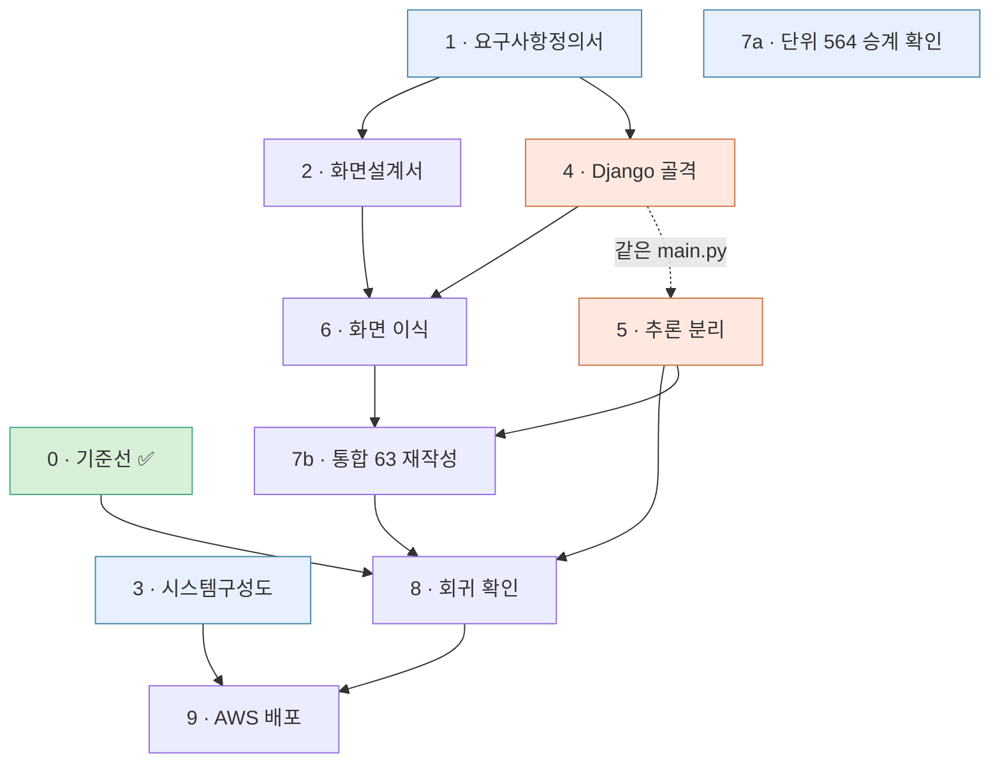

# 14 · 전환 설계 — FastAPI 단일 서버에서 Django + 추론 서비스로

> **SKN 4차 단위 프로젝트** · 팀 `save the pet` · 담당 **팀장**
> 이 문서는 필수 산출물이 아니다. **①요구사항정의서 · ②화면설계서 · ③시스템구성도 · ④테스트계획**
> 을 쓰기 전에 **경계를 못 박기 위한 팀 내부 합의문**이다. 여기가 흔들리면 네 문서를 다시 쓴다.

---

## 0. 한 줄

**두뇌는 그대로 두고 배달만 바꾼다.**
3차에서 D-40 으로 그어둔 경계 덕분에, 이 전환의 대상은 저장소 전체가 아니라 `src/pettriage/app/` 하나다.

---

## 1. 왜 전체를 Django 로 옮기지 않는가

### 1.1 근거 — 측정된 것부터

| # | 사실 | 출처 |
|---|---|---|
| ① | `app/` 밖에서 `app/` 을 부르는 곳은 **9곳뿐이고, 전부 추론 쪽에 남는 모듈**이다 | `eval/harness/run_eval.py` 6 · `scripts/` 3 |
| ② | 테스트 627개 중 FastAPI 에 묶인 것은 **63개(10.0%)** 뿐이다 [^t] | `test_api` 28 · `test_auth_api` 28 · `test_records_api` 7 |
| ③ | 기동 시 임베딩 모델을 메모리에 올린다 (`warmup: true`) | `configs/default.yaml:107` |
| ④ | 질의 1건에 LLM 을 **6~7회** 호출한다 | `04b` · 파인튜닝 보고서 |
| ⑤ | 응답 계약이 **40KB 스키마**에 안전 불변식으로 박혀 있다 | `app/contracts.py` · D-81 |

[^t]: 두 수 모두 **pytest 수집 기준**이다 — `def test_` 를 센 것이 아니다
      (`@pytest.mark.parametrize` 가 펼친다).
      기본 실행의 `addopts = -m 'not todo and not gpu'` 가 뺀 22건은 분모에서도 빠져 있다.

      🔴 **이 표의 수는 2026-08-24 기준이고 그대로 둔다.** 전환을 결정한 근거이므로
      **그때 무엇을 보고 정했는지**가 남아야 한다. 지금 수는 `13 §2` 가 단일 출처다
      (2026-08-27 현재 666건 · ①이 603 · ②는 63 그대로).
      재려면 `pytest` 와 `pytest <파일들> --collect-only -q`. 후자는 `addopts` 의 `-q` 와
      겹쳐 `-qq` 가 되어 합계 줄이 사라지니 **파일별 수를 더한다.**
      2026-08-26 측정 (최초 2026-08-24 · `43264e3`). 이전 판의 "460개 중 60개(13%)" 는 분자를 함수 수로,
      분모를 출처 불명의 수로 잡아 **단위가 어긋난 비율**이었다.

### 1.2 ③이 결정적이다

`BAAI/bge-m3` 는 약 2GB다. Django 를 gunicorn 워커 4개로 돌리면 **기동만으로 8GB** 를 먹는다.
추론을 별도 서비스로 두면 **모델은 한 벌**이고, Django 는 가볍게 여러 워커를 돌린다.
이것은 취향이 아니라 인스턴스 사양이 걸린 문제다.

### 1.3 ④는 워커 점유 문제다

수십 초짜리 요청이 Django 워커를 붙잡으면 그동안 로그인·화면 요청이 밀린다.
분리하면 서로 막지 않는다.

### 1.4 ⑤는 전환 위험이다

`contracts.py` 를 DRF Serializer 로 손번역하다 불변식 하나가 빠져도 **서버는 멀쩡히 돈다.**
그것이 최악의 실패 방식이다 — 조용하고, 테스트가 없으면 안 잡히고, 등급이 잘못 나간다.
추론 서비스를 FastAPI 로 남기면 이 파일을 **한 줄도 고치지 않는다.**

---

## 2. 경계 — 무엇이 어디로 가는가

```
[브라우저]
   │ HTTPS
   ▼
[Django]  ─ 인증 · 화면 · 계정/펫/다이어리 · 관리자 · 유일한 공개 진입점
   │ 내부 네트워크 (외부 노출 없음)
   ▼
[FastAPI 추론]  ─ contracts.py · engine · session
   │
   ▼
[LangGraph 18노드] ─→ [Chroma]  [LLM API]
```

### 2.1 `src/pettriage/app/` 파일별 행선지

| 파일 | 행선지 | 비고 |
|---|---|---|
| `contracts.py` (40KB) | **FastAPI 유지** | 계약 원본. 손대지 않는다 |
| `engine.py` · `safety_engine.py` | **FastAPI 유지** | D-47 안전 래핑 |
| `session.py` · `deps.py` | **FastAPI 유지** | 되묻기 세션 |
| `routes/ask.py` · `routes/meta.py` | **FastAPI 유지** | 추론 엔드포인트 |
| `main.py` | **분해** | 추론용 부분만 남기고 나머지는 Django |
| `routes/auth.py` · `users.py` · `pets.py` · `records.py` | **Django** | DRF ViewSet |
| `models.py` (SQLAlchemy) | **Django ORM** | 마이그레이션으로 재작성 |
| `database.py` | **Django** | `settings.DATABASES` |
| `auth.py` (bcrypt · JWT) | **Django** | `django.contrib.auth` + SimpleJWT |
| `report.py` (③ 기간 요약) | **FastAPI 유지** | LLM 태스크다 (D-83). CRUD 가 아니다 |
| `routes/records.py` | **쪼개진다** 🔴 | `POST /records` 는 Django. `GET /report` 는 §2.4 참조 |
| `chat_logger.py` · `records_store.py` | **Django** | DB 쓰기 |
| `init_db.py` | **삭제** | `manage.py migrate` 가 대신한다 |
| `web/*.html` (6장) | **Django templates** | |

### 2.3 평가 하네스는 손대지 않는다 — 그것이 경계의 증거다

`eval/harness/run_eval.py` 가 `app/` 에서 가져오는 것은 여섯 가지다.

    contracts.AskRequest · contracts.DISCLAIMER · engine.StubEngine
    safety_engine.SafetyEngine · session.SessionStore (2회)

**전부 추론 서비스에 남는 모듈이다.** `routes/` · `models` · `database` · `auth` 는
하나도 부르지 않는다. 627개 테스트 중 564개가 그대로 도는 것과 같은 이유이며,
이 경계를 그대로 두는 한 **평가 하네스는 전환의 영향을 받지 않는다.**

⚠️ 예외 하나 — `scripts/probe_freeform.py:89` 가 `app.main.create_app` 을 부른다.
`main.py` 를 분해할 때 이 진입점을 함께 손봐야 한다.

**`src/pettriage/` 의 나머지 전부(graph · triage · compute · retrieval · ingest · models · safety · privacy · config)는 이동 대상이 아니다.**

### 2.4 ✅ `GET /api/report` — 경계를 가로지르는 유일한 자리 (해결)

**§2.1 이 놓친 것이 있었다.** `report.py` 를 추론 쪽에 두기로 했는데,
그 **라우트**는 DB 를 직접 읽는다.

```python
# routes/records.py:116  report()
pet = db.query(Pet).filter(...)              # ← 소유권 확인
q   = db.query(DiaryEntry).filter(...)       # ← 기록 조회
rows = [_row_to_dict(e) for e in entries]
summary, summary_by = summarize_period(rows, ...)   # ← 여기부터가 LLM
```

앞 세 줄은 **Django 의 것**(소유권·ORM)이고 마지막 줄만 추론이다.
다른 라우트는 한쪽으로 깔끔히 갈리는데 **이것 하나만 걸쳐 있다.**

| 안 | 방식 | 대가 |
|---|---|---|
| **A ✅ 채택** | Django 가 라우트를 갖는다. ORM 으로 기록을 읽어 **행 목록을 추론 서비스에 보내고** 요약만 받는다 | 요청 본문이 커진다. 추론 서비스는 **DB 를 모른 채로 남는다** |
| B | 라우트째 FastAPI 에 두고 FastAPI 가 DB 를 읽는다 | **스키마가 두 벌**이 된다 (Django ORM + SQLAlchemy). D-22 위반이고, 마이그레이션이 한쪽에만 적용되는 사고가 난다 |

B 는 지금 편하고 나중에 비싸다 — 마이그레이션을 Django 가 관리하는 순간
FastAPI 쪽 모델 정의는 **조용히 어긋나기 시작한다.**

> ✅ **A 로 확정·구현됐다** (2026-08-25 오한빈 확정 · 커밋 `f2debfe`).
> Django `diary/views.py` 가 ORM 으로 읽어 `POST /internal/report/summarize` 로 행을 보내고,
> FastAPI 는 `report.py::summarize_period()` 를 그대로 재사용한다.
> **`report.py` 는 한 줄도 안 고쳤고 계약도 새로 만들지 않았다.**
>
> ⚠️ 다만 B 가 경고한 *"스키마가 두 벌"* 은 `pets` · `diary_entries` 에서 **실제로 일어났다.**
> 이 라우트가 아니라 **모델 소유권**의 문제다 — `코드검토_2026-08-24_팀원머지.md` §2.

### 2.2 계약을 두 벌 만들지 않는다

Django 는 **자기 모델(User · Pet · Record)에 대해서만** DRF Serializer 를 둔다.
판정 응답(`AskResponse`)은 추론 서비스가 만든 것을 **그대로 통과시킨다.**
Django 쪽에 `AskResponse` 를 다시 정의하면 계약이 두 벌이 되고, 그것은 D-22(단일 출처) 위반이다.

---

## 3. AWS 구성 → **`12_시스템구성도.md`**

**이 절의 내용은 `docs/12_시스템구성도.md` 로 옮겼다** (2026-08-24 · D-22 단일 출처).
구성도는 필수 산출물이라 자기 문서를 갖는다. 14 는 *왜 나누는가*(§1·§2)만 다룬다.

| 옛 위치 | 새 위치 |
|---|---|
| §3.1 구성도 | 12 §1(논리) · §5(로컬) · §6(배포) |
| §3.2 왜 EC2 단일 인스턴스인가 | 12 §6.1 |
| §3.3 사양 근거 | 12 §7 |
| §3.4 보안 | **12 §8** |

> 🔴 **옮기면서 오기 하나를 바로잡았다.** 옛 §3.1 은 Django 를 `:8001`, 추론을 `:8000` 으로 <!-- 대조제외: 과거 오기의 기록이다 -->
> 적었는데 **실제는 반대**다. 그래서 옛 §3.4 의 *"8000(추론)은 보안그룹에서 차단"* 은
> **공개해야 할 Django 를 막고 추론 서비스를 여는** 지시였다. 12 §2 가 정정본이다.

## 4. 06 에 편입 예정인 결정 (초안)

> 확정 후 `docs/06_설계결정기록.md` §7 에 옮긴다. 여기 있는 동안은 **초안**이다.

### D-99 · **배달 계층을 둘로 나눈다 — Django(공개) + FastAPI(추론, 내부)** 🔒 (초안)

- **상태**: 초안 (2026-08-21)
- **결정 주체**: 오한빈(팀장)
- **맥락**: 4차 요구가 "Django 기반 백엔드"다. 전부 Django 로 옮기면 `contracts.py` 40KB 를
  손번역해야 하고, 임베딩 모델 2GB 가 gunicorn 워커 수만큼 복제된다.
- **결정**: 사용자에게 보이는 모든 것(인증 · 화면 · 계정/펫/다이어리 · 관리자)은 Django 가 맡고,
  판정 파이프라인은 FastAPI 추론 서비스로 남긴다. **추론 서비스는 외부에 노출하지 않는다.**
- **무엇을 얻고 무엇을 잃었나**

  | | 전부 Django | 분리 (채택) |
  |---|---|---|
  | 계약 이식 위험 | 40KB 손번역 | **0 — 파일 그대로** |
  | 메모리 | 2GB × 워커 수 | **2GB 한 벌** |
  | 배포 복잡도 | 컨테이너 1개 | **2개** ← 잃었다 |
  | 장애 지점 | 1 | **2** ← 잃었다 |
  | 요구사항 충족 | 명백 | **구성도에 설명 필요** ← 잃었다 |

- **기각한 대안**: `django-ninja`. Pydantic 네이티브라 계약을 살릴 수 있으나,
  임베딩 모델 복제 문제(1.2)를 해결하지 못한다.

### D-100 · **판정 응답 계약은 추론 서비스에만 둔다** 🔒 (초안)

- **결정**: Django 는 `AskResponse` 를 재정의하지 않고 그대로 통과시킨다.
  DRF Serializer 는 Django 자신의 모델(User · Pet · Record)에만 둔다.
- **근거**: 계약이 두 벌이 되면 D-81(basis 를 level 과 동급으로) 같은 불변식이
  한쪽에서만 갱신될 수 있다. D-22(단일 출처)의 직접 적용이다.

### D-101 · **파일 기반 Chroma 를 EBS 볼륨에 올린다** 🔒 (초안, D-44 재검토)

- **맥락**: D-44 는 벡터DB 를 파일 기반 Chroma 로 정했다. 로컬에서는 맞았으나
  **컨테이너는 재시작하면 파일시스템이 초기화된다.** 888 청크 인덱스가 사라진다.
- **결정**: `.chroma/` 를 EBS 볼륨에 마운트하고, 일일 스냅샷을 S3 에 둔다.
  D-44 의 "파일 기반" 선택 자체는 유지한다.
- **기각한 대안**

  | 대안 | 기각 이유 |
  |---|---|
  | 이미지에 인덱스를 굽는다 | 이미지가 3GB 를 넘고, 자료 갱신마다 재빌드 |
  | 관리형 벡터DB 로 이전 | 작업량이 4차 범위를 넘는다. D-44 를 되돌릴 근거도 없다 |

### D-102 · **전환의 성공 기준은 "판정 결과가 같다"로 정한다** 🔒 (초안)

- **결정**: 전환 전에 골든셋 60건을 **두 판** 돌려 기준선과 **소음대를 함께** 박고,
  전환 후 그 폭 안이면 동일로 읽는다. 폭을 벗어나면 뒤집힌 케이스를 전수로 설명한 뒤 병합한다.
- **근거**: "잘 돌아간다"는 검증이 아니다. 3차에서 소음대(±1건)를 먼저 재고 개선을 주장한 것과 같은 순서다.
  **한 판만 박으면 기준선이 아니라 표본 하나다** — 차이가 나와도 전환 탓인지 소음인지 못 가른다.
- **집행**: `make baseline` (`scripts/freeze_baseline.py`). 더러운 작업 트리에서는 돌지 않는다 —
  `dirty=True` 인 리포트는 재현할 수 없고, 재현할 수 없는 기준선은 비교 대상이 되지 못한다 (04 §8).

---
### D-103 · **체중 급변 알림은 트리아지가 아니다** 🔒 (초안)

- **상태**: 초안 (2026-08-26) · 구현 완료 (`diary/views.py` · `webapp/settings.py`)
- **맥락**: `lse` 브랜치가 다이어리에 **체중 급변 알림**을 넣었다. 직전 두 기록을 비교해
  변화율이 5% 이상이면 *"당분간 지켜봐 주세요"*, 10% 이상이면 *"수의사와 상담해보세요"* 를 낸다.

  검토에서 팀장이 처음에 **RAG 근거 검증(④)과 하향 금지 게이트(D-09)를 안 탄다**는 이유로
  문제 삼았다. **그 판단이 틀렸다.**

  🔴 **입력이 사용자 자신의 기록이다.** *"12% 줄었다"* 는 다이어리 두 행의 산술이고,
  코퍼스에서 끌어온 주장이 아니라 **환각이 낄 자리가 없다.** 오히려 RAG 경로보다 근거가
  단단하다. 게다가 이 프로젝트의 주제가 *"내외부 문서 기반"* 이라 **내부 문서는 범위 안**이다.

  기존 정량 계산도 같은 모양이다 — `compute_metrics` 가 **사용자 체중 × 코퍼스 임계값**으로
  `dose_per_kg` 를 낸다. 사용자 데이터를 계산에 쓰는 것은 이 시스템의 정상 동작이다.

- **그런데 한 조각은 사용자 데이터가 아니다**

  > **"12% 변했다"는 사용자 기록이고, "12%면 상담하라"는 외부 의학 주장이다.**

  `5.0` · `10.0` 의 출처는 코퍼스 45출처가 아니라 웹(`myrightbird.com` 등)이다.
  정량 계산은 이 둘을 이미 나눠 두었다 — 임계값은 사실 표에서 생성되는
  `정량임계치.csv` 에 있고, `compute/rules.py` 가 *"수치를 찾는 유일한 경로"* 다.

- **결정**
  1. **알림 자체는 유지한다.** 근거 검증·게이트를 요구하지 않는다 — 계산 경로이지 RAG 경로가 아니다
  2. **임계값은 코드에서 뺀다** → `settings.DIARY_WEIGHT_ALERT_*` (D-41). `configs/*.yaml` 이
     아닌 이유는 **Django 쪽 기능**이라서다. 판정 경로로 옮겨 가면 그때 함께 옮긴다
  3. **트리아지 언어를 쓰지 않는다.** 4등급 배지(`관찰·방문·연락·응급`)와 섞이면 사용자가
     같은 척도로 읽는다. 현재 문구(*"지켜봐 주세요"* · *"수의사와 상담해보세요"*)는 이 선을
     이미 지키고 있다 — **바꿀 때 이 조항을 본다**
  4. 값의 **출처 주석은 값 옆이 아니라 상수 정의 자리에** 남긴다. 값이 설정으로 빠져도
     왜 5와 10인지는 코드를 읽는 사람에게 보여야 한다

- **왜 이 항목을 남기는가**

  팀장이 검토에서 한 번 잘못 짚었다. 적어 두지 않으면 **다음 사람이 같은 오해를 반복**하고,
  그때는 되돌리는 비용이 더 크다. *"RAG 규율을 계산 경로에 적용하지 않는다"* 가 이 항목의 요지다.

- **남은 것**: 성장기 판단(`_is_juvenile`)이 `diary/views.py` · Django 템플릿 ·
  3차 `web/diary.html` **세 곳**에 있다 (D-22 위험). 3차 파일을 지우는 6단계에서 한 번에 정리한다.

### D-104 · **계정은 Django 기본 `auth.User` 를 쓴다 — 3차 가상 데이터는 넘기지 않는다** 🔒 (초안)

- **상태**: 확정 (2026-08-26 팀 회의) · 코드 변경 없음 (이미 이 상태)
- **맥락**: `pets` · `diary_entries` 표의 **"주인" 칸을 적는 방식이 두 벌**이었다.

      3차 (SQLAlchemy)   주인 = "a3f4b2c1-9d8e-…"   ← 문자열 UUID
      4차 (Django)       주인 = 1                    ← 정수 PK

  그래서 `python manage.py migrate` 가 끝까지 돌지 않았고, 셋업 메모가
  *"pets/diary 는 빼고 4개만"* 으로 우회하고 있었다. **`pets/0001` · `pets/0002` ·
  `diary/0001` 이 한 번도 적용된 적이 없다는 뜻이다.**

  🔴 **시한이 있었다.** Django 는 사용자 모델을 *"프로젝트를 시작할 때"* 정하게 돼 있고,
  사용자 표가 한 번 만들어지면 연결된 표를 전부 다시 짜야 바꿀 수 있다.
  마이그레이션이 아직 안 돈 지금이 **값싸게 정할 수 있는 마지막 구간**이었다.

- **대안**
  1. **커스텀 User (문자열 PK)** — 3차 스키마와 1:1 로 맞고 가상 데이터를 옮길 수 있다.
     **기각** — 옮길 대상이 *시연용 가상 데이터*이고(`archive-3rd/01` §13
     *"내부 데이터 설계 (가상 프로필·기록)"*), 1:1 로 맞아서 얻는 이득이
     **4차 산출물 어디에도 필요하지 않다.** 없는 이득을 위해 시한 있는 작업을 하지 않는다
  2. **Django 기본 `auth.User`** ← 채택

- **결정**
  1. `AUTH_USER_MODEL` 을 **설정하지 않는다.** Django 기본 `auth.User`(정수 PK)를 쓴다
  2. `pets` · `diary_entries` 의 **스키마 소유자는 Django** 다 (마이그레이션으로 관리).
     SQLAlchemy 쪽 모델 정의는 폐기 대상이다
  3. 3차의 가상 계정·펫·다이어리는 **넘기지 않는다.** 시연 데이터는 스크립트로 다시 만든다
  4. **폐기와 DB 통합은 7b 단계에 묶는다** — 지금 하면 통합 테스트 63건이 깨지고,
     그것들은 7b 가 어차피 재작성할 것들이다. 게이트만 빨개진다

- 🔴 **이 결정에서 버리는 것의 범위** — 오해가 잦아 명시한다

  | | 무엇 |
  |---|---|
  | 🗑 버린다 | MySQL 의 **가상** 계정 · **가상** 펫 · **가상** 다이어리 기록 |
  | ✅ 그대로 | 근거 문서 888청크(Chroma) · 사실 표 888행 · 규칙 테이블 |
  | ✅ 그대로 | 골든셋 60건 · 0단계 기준선 · 평가 하네스 |
  | ✅ 그대로 | 판정 로직 · 단위 테스트 666건 |

  **프로젝트의 핵심 자산은 이 결정과 무관하다.**

- **완료 판정**: `python manage.py migrate` 가 **깨끗한 DB 에서 끝까지 돈다** (13 §5.2 1번).
  그 테스트가 초록이 되는 시점이 4단계가 닫히는 시점이다.

- **왜 "이미 그 상태"인데도 결정으로 남기는가**

  > 아무것도 안 하면 A 로 간다. 다만 **"안 해서 그렇게 된 것"과 "정해서 그렇게 한 것"은 다르다.**
  > 누군가 `migrate` 를 끝까지 돌리면 그 순간 굳는데, 기록이 없으면 다음 사람은
  > 그것이 **선택인지 사고인지 알 수 없다.**

### D-105 · **대화 적재는 Django 가 한다 — 브라우저가 알려 주는 방식으로** 🔒 (초안)

- **상태**: 확정 (2026-08-26) · **구현은 7b** (라우터 폐기와 같은 작업이다)
- **맥락**: 전체 점검에서 채팅 내역 화면이 503 인 것이 드러났다 (11 §4.5).
  뿌리는 화면이 아니라 **적재 위치**였다.

      브라우저 ─(nginx)→ FastAPI /api/ask → log_chat_turn(db)   ← 3차 DB 에 쓴다
      Django  /history/ → chat_sessions (managed=False)         ← 웹앱 DB 를 본다

  **쓰는 곳과 읽는 곳이 다른 DB 다.** 표를 옮겨도 안 풀린다.
  그리고 D-99(추론은 배달을 모른다) + D-104(스키마 소유자는 Django)가 함께
  **적재를 Django 로** 강제한다 — 7b 뒤에 FastAPI 가 DB 를 쥐면 D-104 가 정리한
  두-ORM 상태로 되돌아간다.

  문제는 **Django 가 그 왕복을 못 본다**는 것이다. 브라우저가 nginx 로 직접 부른다.

- **대안**
  1. **(나) Django 가 `/api/ask` 를 프록시한다** — 인증·적재·경계가 한 번에 풀린다.
     **기각.** 진짜 비용이 코드가 아니라 **배포 방식 전환(ASGI)** 이다.
     이 팀은 AWS 에 아직 한 번도 올려 보지 않았다 — **처음 하는 배포와 처음 쓰는 서버
     방식을 겹치면 문제가 났을 때 어느 쪽이 원인인지 가릴 수 없다.**
     그리고 되돌릴 때 배포까지 되돌려야 한다
  2. **(다) FastAPI 가 Django 로 POST 한다** — **계층 역전.** 추론이 배달을 부르게 된다. 기각
  3. **(가) 브라우저가 답을 받은 뒤 Django 에 적재용 POST** ← 채택

- **결정 — (가). 다음 넷을 함께 한다** (7b)
  1. Django 에 적재 엔드포인트를 둔다. **`pet_id` 소유권을 검증한다** —
     지금 `/api/ask` 는 무인증으로 `pet_id` 를 받아 남의 펫에 대화를 붙일 수 있다
     (2026-08-26 확인 · `routes/ask.py:61`)
  2. **FastAPI 에서 `log_chat_turn` · `get_optional_db` 를 걷어낸다.**
     이것이 (가)의 본체다 — 잔류 라우터 셋이 전부 무상태가 되고 **D-99 의 경계가 완성된다**
  3. 적재 실패가 **응답을 막지 않는 성질을 유지한다** (기존 `chat_logger` 와 같게)
  4. 🔴 **"대화 기록은 편의 기능"임을 문서에 못박는다** (아래)

- 🔴 **대화 기록은 증거가 아니다**

  > `chat_logger.py` 가 이미 *"저장 실패는 응답을 막지 않는다"* 로 **유실을 허용**한다.
  > (가)는 그 성질을 바꾸지 않는다 — 창을 닫으면 그 턴이 안 남고, 클라이언트가 보고하므로
  > 자기 기록을 틀리게 만들 수 있다.
  >
  > **감사·분쟁의 근거로 쓸 수 없다.** 그렇게 쓰려면 이 결정부터 뒤집어야 한다.

- **인증은 다른 층에서 푼다.** `/api/ask` 무인증은 (가)가 풀지 않는다.
  4차에서는 **상시 공개하지 않는 것**(데모 시간에만 개방) + `limit_req`(이미 있음) +
  보안그룹 IP 제한으로 버틴다. **운영 결정이라 비용이 0이고 코드를 안 건드린다.**

- **언제 (나)로 가는가** — 이 서비스를 **실제 사용자에게 상시 제공**하기로 할 때다.
  무인증 LLM 프록시를 인터넷에 상시 두는 것은 용납되지 않는다. **(가)는 4차의 답이고
  (나)는 제품의 답이다.** (가)가 (나)로 가는 길을 막지 않는다 — 적재 엔드포인트를 지우면 된다.


### D-106 · **선언 범위에 상한을 적지 않는다 — 정확한 버전은 `constraints.txt` 가 말한다** 🔒 (초안)

- **상태**: 확정 (2026-08-27) · 적용 완료
- **계기**: `ksr` 머지에서 `[db]` 에 `cryptography` 가 들어왔는데,
  `pyproject.toml` 은 `>=43,<44`, `constraints.txt` 는 `==50.0.1` 이었다.
  **핀이 범위 밖이라 `pip install -e '.[db]' -c constraints.txt` 에 해가 없다.**
  팀원 쪽에서 안 터진 이유는 constraints 없이 깔았기 때문이고,
  CI `db-deps` 잡은 이걸 잡지만 **설치까지 가서야** 잡는다.

- **왜 생기나** — 두 파일이 **같은 사실을 두 번 말한다.** 한쪽만 고치면 즉시 어긋나고,
  어긋난 상태가 문법적으로는 멀쩡하다. D-22(단일 출처)가 의존성에서 깨지는 자리다.

- **결정**
  1. `pyproject.toml` 의 범위는 **하한만** 적는다 (`>=43`). 하한은 *"이 밑으로는 기능이 없다"*
     는 사실이라 근거가 있다
  2. 상한은 **깨진다는 근거가 있을 때만** 적고, 그 근거를 주석으로 같이 적는다
     (예: `passlib` 1.7.4 ↔ `bcrypt>=4.1`, `ruff==0.8.6` 서식 규칙)
  3. **정확한 버전은 언제나 `constraints.txt` 한 곳**이다. 올릴 때 고치는 파일은 하나다

- **되짚기** — 상한이 이미 적힌 것들(`<3`·`<5`·`<2` 등)은 그대로 둔다.
  지금 어긋나지 않았고, 일괄 수정은 확인 비용만 늘린다. **어긋난 것만 고친다.**

### D-107 · **운영 배포는 systemd 다. Docker Compose 는 로컬 개발용으로 역할을 좁힌다** 🔒 (초안)

- **상태**: 확정 (2026-08-27)
- **계기**: 이근준의 `docs/lgj/02_AWS-최종-배포계획서.pdf` 로 **배포가 이미 끝난 것**이 확인됐다
  (`pettriage.kro.kr` · ACM Issued · ALB · EC2 `m7i-flex.large`). 그런데 실제 구성이
  **EC2 에 직접 설치한 systemd 서비스**(nginx · Gunicorn · Uvicorn · MySQL)였고,
  저장소의 `compose.yaml` · `docker/nginx/nginx.conf` 와 다른 물건이었다.

  그 PDF 안에서도 갈렸다 — §3·§4 는 systemd 인데 §9 배포 완료 기준은
  *"…**컨테이너**가 모두 정상 기동한다"* 이고 §8 은 *"Docker 이미지 태그로 롤백"* 이다.
  `요구사항정의서_수정본_v4.xlsx` 의 `NFR-DEPLOY-004`(Docker Compose 원클릭)도 **완료**로 서 있다.

- **결정 — 돌아가는 쪽을 정본으로 삼는다**
  1. **운영 = systemd.** EC2 의 `nginx.conf` 와 systemd unit 파일을 **저장소로 가져온다**
     (`deploy/`). 지금은 그 설정이 git 에 없어 **배포를 재현할 수 없다** — 그 기계가
     죽으면 아무도 같은 것을 다시 세우지 못한다. 이것이 이 결정의 진짜 이유다
  2. **로컬 = Docker Compose.** `compose.yaml` 은 남기되 **개발용이라고 명시한다.**
     MySQL 을 로컬에 설치하지 않기 위한 물건이다 (D-48)
  3. `NFR-DEPLOY-004` 는 **완료가 아니라 철회**다 — *"Docker Compose 로 운영 배포"* 를
     안 하기로 정한 것이지 한 것이 아니다 (D-58)

- **왜 Docker 로 다시 올리지 않는가** — 이미 도달해 있고 발표가 가깝다. 돌아가는 배포를
  문서와 맞추자고 다시 만드는 것은 **위험을 새로 사는 것**이다. 문서를 실물에 맞춘다.

- 🔴 **이 결정이 닫지 못하는 것 셋** (배포계획서에서 드러났다)
  1. **`migrate` 대상이 모자란다** — 절차 7번이 `migrate auth sessions contenttypes admin`
     이다. **`pets` · `diary` 가 없다.** D-104 가 그 스키마의 주인을 Django 로 정했는데
     배포에서는 그 마이그레이션이 안 돌았다. 7b 전에 확인해야 한다
  2. **의존성이 모자란다** — 절차 6번이 `pip install -e .[django,db]` 인데 `[rag]`·`[ingest]`
     가 없다. 그대로면 Chroma·LangGraph 가 없어 **AI 응답이 안 나와야 하는데** V-03 은
     도달한다고 적혀 있다. 실물이 문서보다 많이 깔린 상태일 것이다 — 어느 쪽인지 맞춰야 한다
  3. **모니터링·백업이 미구성이다** (PDF §8). 배포계획서는 정직하게 적었는데
     `v4.xlsx` 에서는 `NFR-DEPLOY-006`(MySQL 정기 백업) **행이 사라졌다.**
     🔴 **안 하기로 정한 것과 없어진 것은 다르다** — 요구사항은 지우지 않고 상태로 표시한다

### D-108 · **화면과 서버가 같은 판단을 두 번 하지 않는다 — 서버가 하고 화면은 받는다** 🔒 (초안)

- **상태**: 확정 (2026-08-27) · 성장기 규칙에 적용 완료
- **계기**: 권소라의 `TC-FR-DIARY-010` 비고 한 줄 — *"성장기(새끼) 제외 조건은 미검증"*.
  확인해 보니 **같은 판단이 두 곳에 따로 있었고 서로 다른 답을 냈다.**

      diary/views.py   float("0.5살")      → ValueError → 성장기 아님
      diary.html       parseFloat("0.5살") → 0.5        → 성장기

  `parseFloat` 은 앞에서부터 읽다 멈추고 `float()` 은 전체가 숫자여야 한다.
  `age` 가 자유 입력(`"2살"` · `"6개월"`)이라 이 차이가 그대로 드러났다 —
  **생후 6개월을 `0.5살` 로 적으면 배지는 "🌱 성장기" 인데 토스트는 "체중이 급증했어요" 였다.**
  같은 화면이 같은 아이에 대해 반대로 말했다.

  🔴 **그리고 둘 다 `"3주"` 를 놓쳤다.** `"개월"` 만 봤기 때문이다. 하루 5~10% 증가가
  정상인 **가장 확실한 성장기**가 알림을 그대로 맞고 있었다.

- **왜 아무도 몰랐나** — `diary/views.py` 의 docstring 이 *"`isJuvenile()`과 같은 판단"*
  이라고 **주장**했다. 주장은 검사되지 않는다. 그리고 Django 앱은 `testpaths` 밖이라
  (13 §5) 두 구현 중 **어느 쪽도 CI 가 실행한 적이 없다.**

- **결정**
  1. 규칙은 **`src/pettriage/compute/`** 로 올린다 — Django 를 모르는 순수 함수라
     `tests/` 에서 바로 검증되고 **CI 가 본다** (🟡 → ✅)
  2. **서버가 판단하고 화면은 받아 쓴다.** `diary.html` 은 더 이상 계산하지 않는다.
     등급 이름·색을 화면이 정하지 않고 `GET /api/triage-levels` 로 받는 D-40 과 같은 방식이다
  3. 테스트가 **어긋나던 입력을 이름으로 남긴다** (`TestTwoImplementationsDisagreed`) —
     규칙이 맞는지만이 아니라 **한 곳에 있는지**를 지키기 위해서다

- **일반 규칙** — 화면과 서버가 같은 것을 판단해야 하면 **서버가 한다.**
  화면이 먼저 알아야 해서 어쩔 수 없다면, 그때는 서버가 값을 실어 보낸다.
  *"같은 로직을 양쪽에 두고 맞춰 두었다"* 는 **맞춰 둔 그 순간에만 참이다.**

- **확인함 — `idealWeightRanges` 는 두 벌이 아니다.** `diary.html:381` 에만 있고
  서버에 사본이 없다. D-22 위반은 아니다.

  🔴 **대신 다른 것이 나왔다 — `bird` 가 없다.**

      dog:  { small:[2,7], medium:[10,25], large:[25,45] }
      cat:  { small:[2.5,4], medium:[4,5.5], large:[5.5,7] }
      bird: 없음

  종은 개·고양이·**조류** 셋이다 (FR-08 · `compute.vocabulary.SPECIES`). 앵무새를 고르면
  `range` 가 `undefined` 라 **체중 상태 상자가 조용히 사라진다.** 오류도 안내도 없다 —
  사용자는 그 기능이 있는 줄도 모른다. **FR-43 이 조류에 대해 성립하지 않는다.**

  권소라의 `TC-FR-DIARY-005` 는 소형견으로만 확인해서(통과) 이 구멍을 지나쳤다.

  **숫자를 지어내지 않는다.** 앵무새 정상 체중은 종에 따라 폭이 너무 크다
  (사랑앵무 30~40g · 회색앵무 400~600g). 사실 표에 근거가 생기기 전에는 채울 수 없다.
  **지금 할 수 있는 것은 조용히 사라지지 않게 하는 것**이다 — *"조류는 아직 기준이 없어요"*
  라고 말하는 편이 낫다 (D-58). §5 미결.

### D-109 · **비싼 것은 달라고 할 때만 만든다 — `GET /api/report?summary=1`** 🔒 (초안)

- **상태**: 확정 (2026-08-27) · 적용 완료
- **계기**: 시연 로그. 2분 동안 `POST /internal/report/summarize` 가 **9번** 나갔는데
  **리포트 다운로드는 0번**이었다. 아홉 번 다 버려진 LLM 호출이다.

      loadRecords()     화면 열 때·저장할 때·날짜 바꿀 때   timeline·streak·weight_alert 만 쓴다
      리포트 다운로드     버튼을 누를 때                    summary 를 쓴다

  `ReportView.get` 은 **언제나** 요약을 만들었다. 다이어리를 여는 것만으로 LLM 이 돌았다.

- **왜 아무도 몰랐나** — **아무 데도 안 틀렸기 때문이다.** 화면은 정상이고, 테스트는 초록이고,
  요구사항(FR-20)도 충족한다. 낭비는 **로그를 눈으로 읽어야만** 보인다.
  🔴 **팀원의 수동 테스트도, 자동화 테스트도, 문서 검토도 이걸 못 잡았다** —
  셋 다 *"되는가"* 를 묻지 *"몇 번 부르는가"* 를 묻지 않기 때문이다.

- **결정 — `?summary=1` 일 때만 요약을 만든다**
  1. 안 만들 때는 `summary=""` · `summary_by="skipped"` 를 준다. **빈 값만 주면**
     화면이 *"요약이 실패했나"* 로 읽는다 — 이유를 남긴다 (D-58)
  2. **기간이 비었는지로 가르지 않는다.** `loadRecords` 가 마침 빈 기간을 보내지만 그건
     우연이고, 다음 사람이 전 기간 다운로드를 만들면 조용히 깨진다

- **얻는 것 셋** — 시연 중 LLM 비용이 질의한 만큼만 나간다 · 화면이 `timeout=30.0` 동기
  호출을 안 기다린다 · **D-99 의 방향이 바로 선다** (배달 쪽 화면 로드가 추론을 깨우지 않는다).

- **일반 규칙** — **비싼 것은 기본값이 아니다.** LLM·외부 호출·무거운 계산은
  *"부르면 딸려 오는 것"* 이 아니라 *"달라고 해야 오는 것"* 으로 둔다.
  응답에 필드를 하나 더 얹는 편이 편해 보일 때가 그 자리다.

- 🟡 **같이 드러난 것 — 요약이 잘린다.** `report.py` 가 로그에 남겼다:
  *"기간 요약이 잘린 것으로 보인다 (max_tokens=700)"*. **지금은 고치지 않는다** —
  한도를 올리면 비용·지연이 같이 오르고 기록이 더 쌓이면 또 잘린다. 근본 해법은
  기간을 나눠 요약하는 것이라 발표 뒤로 미룬다. `10` FR-20 에 **알려진 한계**로 적어 둔다.

### D-110 · **대화는 턴 사이에서 끊긴다 — 거기를 보는 테스트가 있어야 한다** 🔒 (초안)

- **상태**: 확정 (2026-08-27) · 적용 완료
- **계기**: 권소라의 `TC-FR-CHAT-005` 비고 —
  *"0알 먹었어 → 되질문 발생 → 포도 or 초콜릿 답변해도 재차 되질문 후 응답불가"*

  🔴 **증상이 "제대로 답할수록 거절당한다" 였다.** UC-04 — 발표의 ★ 핵심 화면이다.

- **원인이 둘이었고 서로를 가리고 있었다**

  **① 실제 엔진이 앞 턴을 잃었다.** `GraphEngine._build_state` 가 그래프에 넘긴 것은
  `question` 하나뿐이었다. 두 번째 턴에 그래프가 본 것은 `"포도"` 한 마디였고
  *"0알 먹었어"* 는 사라진 뒤였다.

  `session.question_history` 는 **채워지고 있었다.** 읽는 곳이 `StubEngine` 하나뿐이었다 —
  `_content_of` 의 docstring 이 *"누적된 되묻기 답변까지 함께 본다"* 라고 적어 두었고
  실제로 그렇게 했다. **무료 폴백 엔진이 진짜 엔진보다 대화를 잘 이어받고 있었다.**

  **② 되묻기 예산이 안 돌아왔다.** `Session.merge()` 는 `SLOTS` 넷만 보고 진전을 판단하는데
  **물질은 거기 없다** (`SLOTS = ("species", "pet_id", "weight_kg", "amount_g")`).
  그래서 *"포도요"* 라고 답해도 `progressed=False` 였다.

  > `merge()` 의 docstring: *"진전이 있으면 되묻기 카운터를 되돌린다. 그러지 않으면
  > **협조적인 사용자가 슬롯을 하나씩 채우다가 상한에 걸려 거절된다.**"*

  **막겠다고 적어 둔 그 일이 물질에서 그대로 났다.** 방어가 있었는데 범위가 좁았다.

- **결정**
  1. `GraphState` 에 `question_history` 를 두고 엔진이 **앞 턴을 넘긴다.**
     슬롯 추출(종·체중·양·물질)은 *이번 발화 + 앞 턴* 을 함께 읽는다
  2. 진전 판정을 **`missing_slots` 가 줄었는가**로 바꾼다. 그래프가 계산한 값이라
     `SLOTS` 에 없는 물질까지 **어떤 슬롯이든** 잡힌다
  3. 🔴 **이력이 비면 동작이 이전과 완전히 같다** (`context is question`).
     골든셋 60건이 전부 단일 턴이므로 기준선이 안 흔들린다 — **D-102 를 지키기 위한 조건이다.**
     실측으로 확인했다: 기존 657건 전부 통과

- 🔴 **왜 657건이 초록인 채로 이걸 놓쳤나** — 되묻기 테스트는 있었다. 전부 **한 턴짜리**였다.

  `tests/test_state_reaches_response.py` 가 머리말에 같은 모양을 적어 두었다 —
  *"노드 단위 테스트는 노드가 키를 돌려주는가까지 보고, 계약 테스트는 응답이 유효한가부터
  본다. **그 사이가 비어 있었다.**"* 이번에 빈 곳은 **턴과 턴 사이**였다.

  `tests/test_clarify_multiturn.py` 9건이 그 자리를 본다.

- **일반 규칙** — 상태가 요청 사이를 넘어가는 기능은 **넘어가는 그 지점**을 테스트한다.
  한 번의 호출이 옳은 것과 두 번째 호출이 첫 번째를 이어받는 것은 다른 성질이고,
  후자는 **호출을 두 번 하는 테스트로만** 보인다.

## 5. 진행 순서

| 단계 | 내용 | 산출물 |
|---|---|---|
| **0** | 기준선 고정 — 현재 코드로 골든셋 60건 **2판** (`make baseline`) | `eval/reports/baseline_before.json` · `baseline_before.md` · 태그 `freeze-django-before` |
| **1** | 요구사항 정의서 (유스케이스 · 시퀀스 · 추적표) | `docs/10_요구사항정의서.md` |
| **2** | 화면설계서 — `web/*.html` 6장이 출발점 | `docs/11_화면설계서.md` |
| **3** | 시스템 구성도 — §3 을 정식화 | `docs/12_시스템구성도.md` |
| **4** | Django 골격 · 모델 · 마이그레이션 · 인증 | 코드 |
| **5** | 추론 서비스 분리 — `app/` 에서 떼어낸다 | 코드 |
| **6** | 화면 이식 (템플릿) | 코드 |
| **7** | 테스트 — 단위 400 승계 · 통합 60 재작성 | `docs/13_테스트계획.md` |
| **8** | **회귀 확인** — 골든셋 60건이 0단계와 동일한가 | 결과 보고서 |
| **9** | AWS 배포 | 구성도 갱신 |

**0단계를 건너뛰면 8단계가 성립하지 않는다.** 가장 먼저 한다.

### 0단계를 왜 두 판 도는가

`temperature=0` 이어도 `seed` 를 주지 않으므로 **같은 코드로 두 번 돌려도 결과가 흔들린다.**
그 폭을 모르면 8단계에서 나온 차이가 **전환 탓인지 소음인지 가를 수 없다.**
3차는 기준선 3판으로 소음대를 ±1건(±1.7pp)으로 재 두었고, 그 덕분에 D-86 을 개선으로,
D-87 을 회귀로 판정할 수 있었다. 그 폭은 **그때의 코드에 대한 값**이므로 여기서 다시 잰다.

절차는 `scripts/freeze_baseline.py` 가 들고 있다 — 사전 점검(더러운 작업 트리 · 태그 중복 ·
인덱스 · 키 · 프로파일) → N판 → 케이스 단위 겹쳐 보기 → 요약. **손으로 맞추면 빠뜨린다** (D-69).

⚠️ **판이 도는 동안에는 읽기만 한다.** 3차에서 골든셋 수정이 측정 중에 디스크에 닿아
세 판이 옛 파일을 본 사고가 두 번 났다.

---

### 5.1 의존 관계 — 무엇이 무엇을 기다리나

**배분보다 순서가 먼저다.** 누가 맡을지는 취향이지만, 무엇이 무엇을 기다리는지는
사실이다. 아래를 정해 두면 배분은 대체로 따라 나온다.



<sub>초록 = 끝남 · 파랑 = **지금 착수 가능** · 주황 = **미결이 막고 있다**</sub>

> 🔄 **2026-08-27 갱신.** 1·3 단계가 끝났고 **9 단계는 이미 배포까지 갔다** (D-107).
> 순서가 뒤집힌 것이 아니라, 배포가 8(회귀 확인)을 기다리지 않고 먼저 이뤄졌다 —
> **지금 떠 있는 것은 회귀를 확인하지 않은 코드다.** 8 을 건너뛴 채로 두지 않는다.

> 🔄 **2026-08-24 갱신.** `lgj` 머지로 **4·5·6 단계가 상당 부분 진행됐다** (3711줄 · 57파일).
> 위 그림은 그 전 상태다 — 아래 표가 현재다.

| 단계 | 선행 | 이미 있는 출발점 | 규모 근거 (측정값) | 막고 있는 미결 |
|---|---|---|---|---|
| **1** 요구사항정의서 | — | ✅ **끝남** — UC 10 · FR 26 · 추적 26 (`check_requirements` 통과) | — | — |
| **2** 화면설계서 | 1 (§3.2 UC↔화면) | `web/*.html` **6장** | **중** — SC-01~06 은 기술, **SC-07 은 백지** | SC-07 범위는 4단계 뒤 |
| **3** 시스템구성도 | — | ✅ **끝남** — `docs/12` · §6 이 실물로 갱신됨 | — | ✅ HTTPS·미디어 결정됨 (12 §10) |
| **4** Django 골격 | 1 | 🔄 **대부분 됨** — `webapp` · `accounts` · `pets` · `diary` · `chat` | **중(잔여)** — 마이그레이션이 안 끝났다 | ✅ 해결 (D-104) · 닫히는 시점 = 7b |
| **5** 추론 분리 | — (코드상) | 🔄 `internal_report.py` 신설 · 잔류 라우트 **4개** | **중** — `main.py` 203줄 분해 · **FastAPI DB 라우트 폐기** | 🔴 **폐기 시점 = 7b** |
| **6** 화면 이식 | 2 · 4 | 🔄 **템플릿 이식됨** — accounts 2 · pets 2 · diary 1 · chat 4 | **소(잔여)** | — |
| **7a** 단위 승계 확인 | — | 테스트 **603건**이 프레임워크 무관 | **소** — 돌려서 확인만 | — |
| **7b** 통합 재작성 | 4 · 5 · 6 | `test_api` 28 · `test_auth_api` 28 · `test_records_api` 7 = **63건** | **대** — Django 앱 **테스트 0건**도 여기 포함 | — |
| **8** 회귀 확인 | 0 · 5 · 7b | `baseline_before.json` · 소음대 ±1건 | **소** — 15분 + 판독 | — |
| **9** AWS 배포 | 3 · 8 | 🔄 **배포됨** — `pettriage.kro.kr` · ALB · ACM · EC2 systemd (D-107) | **소(잔여)** — `deploy/` 반입 · 검증 증거 · 백업/모니터링 | 🔴 `deploy/` 가 git 에 없다 |
### 5.3 7b 의 숨은 항목 — **대화 적재를 어디에 둘 것인가**

2026-08-26 전체 점검에서 채팅 내역 화면이 503 인 것이 드러났고(11 §4.5), 그 뿌리를
따라가니 **7b 의 범위가 하나 늘어난다.**

#### 지금 구조

```
브라우저 ──(nginx)──→ FastAPI /api/ask ──→ 판정
                                       └─→ log_chat_turn(db)   ← 3차 DB 에 적재
Django   /history/  ──→ chat_sessions (managed=False)          ← 웹앱 DB 를 본다 · 없다
```

**쓰는 곳과 읽는 곳이 다른 DB 다.** 표를 옮기는 것만으로는 안 풀린다.

#### 끝 그림은 강제돼 있다

D-99(추론은 배달을 모른다) + D-104(스키마 소유자는 Django) 두 결정이 함께
**대화 적재는 Django 로 간다**를 강제한다. 7b 뒤에 FastAPI 가 DB 를 계속 쥐면
두 ORM 이 한 DB 를 다시 나눠 갖는 상태로 되돌아간다.

#### 문제는 **Django 가 그 대화를 볼 수 없다**는 것

브라우저가 `/api/ask` 를 nginx 로 직접 부르므로 Django 는 그 왕복을 모른다.

| 안 | 방법 | 대가 |
|---|---|---|
| **(가)** | 브라우저가 답을 받은 뒤 **Django 에 한 번 더 POST** 해서 적재한다 | 싸다. 다만 **클라이언트가 보고하는 것**을 믿어야 하고, 창을 닫으면 빠진다 |
| **(나)** | **Django 가 `/api/ask` 를 대신 받는다**(프록시) | 아래 참조 |
| (다) | FastAPI 가 Django 로 POST 한다 | **계층 역전.** 추론이 배달을 부르게 된다. 기각 |

#### 🔴 (나)를 다시 봐야 한다 — 세 문제가 한 번에 풀린다

`12 §10` 이 프록시를 *"워커 점유 때문에 D-99 와 충돌"* 로 미뤄 두었는데, 이번 점검으로
같은 자리에 문제가 **셋** 모인 것이 드러났다.

| 문제 | 출처 | (나)가 푸는가 |
|---|---|---|
| `/api/ask` 가 **무인증**인데 공개된다 | 점검 D | ✅ 세션 인증이 앞에 선다 |
| 대화 적재를 Django 가 못 본다 | 여기 | ✅ 요청·응답을 그대로 본다 |
| 8001 이 경로로는 여전히 열려 있다 | 12 §8 | ✅ nginx 가 `/api/` 를 전부 Django 로 |

**그리고 반론의 전제가 흔들린다.** *"수십 초가 워커를 점유한다"* 는 **동기 WSGI 를 전제**한다.
이 저장소에는 `webapp/asgi.py` 가 이미 있고 Django 5.1 은 비동기 뷰를 지원한다 —
ASGI 로 띄우고 `async def` + `httpx.AsyncClient` 로 넘기면 **기다리는 동안 워커를 쥐지 않는다.**

대가는 배포가 gunicorn(WSGI) 이 아니라 ASGI 서버가 된다는 것이다 (12 §6).
**그 결정이 따라온다.**

#### 결론 — ✅ **(가) 로 확정** (2026-08-26 · **D-105**)

**지금 구현하지 않는다.** 채팅 내역은 4차 필수 산출물 5종에 없고, 🔴 필수(Django 앱 테스트
0건 · 7b · 8단계 회귀 · 9단계 배포)가 남아 있다. 07 §7 —
*"네 개가 다 60%인 것보다 하나가 100%인 편이 점수가 높다."*

**7b 에서 라우터 폐기와 함께 한다** — 어차피 같은 파일들을 연다.
근거와 함께 할 넷은 D-105 에 있다.


### 5.2 여기서 읽어야 할 것 셋

**① 회의의 1순위는 배분이 아니라 미결을 닫는 것이다.**
`lgj` 머지로 4·5·6 이 크게 진척됐지만, **마이그레이션이 끝나지 않아 4단계가 안 닫힌다.**

| 닫아야 할 미결 | 막고 있는 단계 | 정하는 데 필요한 것 |
|---|---|---|
| FastAPI DB 라우트 **폐기 시점** | 5 · 7b | 위 둘이 정해지면 따라온다 |
| 정적파일 · HTTPS | **9** | 급하지 않다. 3 을 쓰면서 정해도 된다 |

> ✅ **2026-08-26 해결.** 계정 모델과 스키마 소유권을 **D-104** 로 확정했다 —
> Django 기본 `auth.User`, 표의 소유자는 Django, 3차 가상 데이터는 넘기지 않는다.
> 남은 것은 **실행 시점**이고 7b 에 묶여 있다.

~~Django 인증 — SimpleJWT vs 세션~~ → ✅ **세션 인증으로 결정** (커밋 `a2f761d`).
~~`GET /report` — A vs B~~ → ✅ **A 안 확정·구현** (§2.4).
~~스키마 소유권 · 커스텀 User~~ → ✅ **D-104** (2026-08-26).

**② 4단계와 5단계는 `main.py` 를 함께 연다.** 🔴
§2.1 이 `main.py` 를 *"분해 — 추론용만 남기고 나머지는 Django"* 로 적었다.
**한 파일을 두 사람이 열면 충돌한다** — 3차 07 §1.5 가 노드를 파일 단위로 나눈 것과 같은 이유다.
셋 중 하나를 택한다.

- 같은 사람이 4·5 를 연달아 한다 (가장 단순)
- **5 를 먼저 끝내고** 4 를 시작한다 — `main.py` 가 추론용으로 줄어든 뒤에 Django 가 붙는다
- 4 를 하는 사람이 `main.py` 를 건드리지 않고 Django 를 **빈 프로젝트로 세운다** (병렬 가능)

**③ 7a 는 아무것도 기다리지 않는다.**
단위 테스트가 프레임워크와 무관하다는 것이 14 §1.1 ② 의 핵심 주장인데,
**아직 아무도 확인하지 않았다.** 전환 전에 한 번 돌려 두면 8단계에서
*"원래 되던 것이었나"* 를 묻지 않아도 된다. 규모가 가장 작고 선행이 없다 —
**배분 회의 전에 팀장이 해 두면 된다.**


## 6. 작업 배분 (초안)

3차에서 설계 문서 117:0 · 판정 34:0 으로 팀장에게 쏠렸다. 4차는 **겹치지 않는 네 덩어리**로 나눈다.

| 담당 | 범위 | 산출물 |
|---|---|---|
| **오한빈** | 추론 서비스 분리 · AWS 인프라 · 기준선/회귀(0·8단계) | 시스템 구성도 · 전환 설계 |
| **이근준** | Django 백엔드 골격 · ORM/마이그레이션 · 인증 · API | 요구사항 정의서(기능) |
| **권소라** | 프론트(HTML/CSS/JS) · 템플릿 이식 · 화면 흐름 | 화면설계서 |
| **이서은** | 테스트 — 통합 60건 재작성 · 커버리지 · CI | 테스트 계획 및 결과 보고서 |

각자 **자기 산출물의 1저자**가 된다. 팀장은 검토만 한다.

---

## 7. 미결

- [x] ~~Django 인증을 SimpleJWT 로 갈지 세션 인증으로 갈지~~ → **세션 인증** (`a2f761d`)
- [x] ~~`pets`·`diary_entries` 스키마 소유권~~ → **Django 소유** (D-104)
- [x] ~~커스텀 User 모델~~ → **기본 `auth.User`** · 3차 가상 데이터 미이관 (D-104)
- [ ] FastAPI 의 `auth`·`users`·`pets`·`records` 라우터 폐기 + DB 통합 — **7b 에 묶는다** (D-104 ④)
- [ ] 대화 적재를 Django 로 이관 — **7b · (가) 방식** (D-105). `log_chat_turn` 제거 포함
- [ ] 🔴 `/api/ask` 의 `pet_id` 소유권 공백 — D-105 ①에서 닫는다
- [ ] 정적 파일을 S3 로 뺄지 Nginx 가 직접 서빙할지
- [ ] 도메인·HTTPS 인증서 (Let's Encrypt vs ACM+ALB) — ALB 는 비용이 붙는다
- [ ] `scripts/make_submission.py` 를 4차 필수 산출물 5종에 맞춰 고칠지 폐기할지
- [ ] 3차의 파인튜닝 어댑터를 4차에서 쓸지 (요구사항에는 없다)
