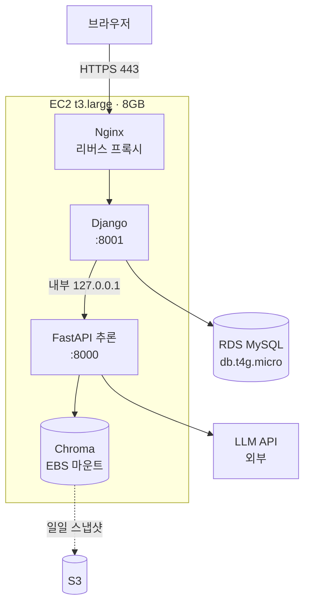

# 14 · 전환 설계 — FastAPI 단일 서버에서 Django + 추론 서비스로

> **SKN 4차 단위 프로젝트** · 팀 `save the pet` · 담당 **팀장**
> 이 문서는 필수 산출물이 아니다. **①요구사항정의서 · ②화면설계서 · ③시스템구성도 · ④테스트계획**
> 을 쓰기 전에 **경계를 못 박기 위한 팀 내부 합의문**이다. 여기가 흔들리면 네 문서를 다시 쓴다.

---

## 0. 한 줄

**두뇌는 그대로 두고 배달만 바꾼다.**
3차에서 D-40 으로 그어둔 경계 덕분에, 이 전환의 대상은 저장소 전체가 아니라 `src/pettriage/app/` 하나다.

---

## 1. 왜 전체를 Django 로 옮기지 않는가

### 1.1 근거 — 측정된 것부터

| # | 사실 | 출처 |
|---|---|---|
| ① | `app/` 밖에서 `app/` 을 부르는 곳은 **9곳뿐이고, 전부 추론 쪽에 남는 모듈**이다 | `eval/harness/run_eval.py` 6 · `scripts/` 3 |
| ② | 테스트 460개 중 FastAPI 에 묶인 것은 **60개(13%)** 뿐이다 | `test_api` 28 · `test_auth_api` 25 · `test_records_api` 7 |
| ③ | 기동 시 임베딩 모델을 메모리에 올린다 (`warmup: true`) | `configs/default.yaml:107` |
| ④ | 질의 1건에 LLM 을 **6~7회** 호출한다 | `04b` · 파인튜닝 보고서 |
| ⑤ | 응답 계약이 **40KB 스키마**에 안전 불변식으로 박혀 있다 | `app/contracts.py` · D-81 |

### 1.2 ③이 결정적이다

`BAAI/bge-m3` 는 약 2GB다. Django 를 gunicorn 워커 4개로 돌리면 **기동만으로 8GB** 를 먹는다.
추론을 별도 서비스로 두면 **모델은 한 벌**이고, Django 는 가볍게 여러 워커를 돌린다.
이것은 취향이 아니라 인스턴스 사양이 걸린 문제다.

### 1.3 ④는 워커 점유 문제다

수십 초짜리 요청이 Django 워커를 붙잡으면 그동안 로그인·화면 요청이 밀린다.
분리하면 서로 막지 않는다.

### 1.4 ⑤는 전환 위험이다

`contracts.py` 를 DRF Serializer 로 손번역하다 불변식 하나가 빠져도 **서버는 멀쩡히 돈다.**
그것이 최악의 실패 방식이다 — 조용하고, 테스트가 없으면 안 잡히고, 등급이 잘못 나간다.
추론 서비스를 FastAPI 로 남기면 이 파일을 **한 줄도 고치지 않는다.**

---

## 2. 경계 — 무엇이 어디로 가는가

```
[브라우저]
   │ HTTPS
   ▼
[Django]  ─ 인증 · 화면 · 계정/펫/다이어리 · 관리자 · 유일한 공개 진입점
   │ 내부 네트워크 (외부 노출 없음)
   ▼
[FastAPI 추론]  ─ contracts.py · engine · session
   │
   ▼
[LangGraph 18노드] ─→ [Chroma]  [LLM API]
```

### 2.1 `src/pettriage/app/` 파일별 행선지

| 파일 | 행선지 | 비고 |
|---|---|---|
| `contracts.py` (40KB) | **FastAPI 유지** | 계약 원본. 손대지 않는다 |
| `engine.py` · `safety_engine.py` | **FastAPI 유지** | D-47 안전 래핑 |
| `session.py` · `deps.py` | **FastAPI 유지** | 되묻기 세션 |
| `routes/ask.py` · `routes/meta.py` | **FastAPI 유지** | 추론 엔드포인트 |
| `main.py` | **분해** | 추론용 부분만 남기고 나머지는 Django |
| `routes/auth.py` · `users.py` · `pets.py` · `records.py` | **Django** | DRF ViewSet |
| `models.py` (SQLAlchemy) | **Django ORM** | 마이그레이션으로 재작성 |
| `database.py` | **Django** | `settings.DATABASES` |
| `auth.py` (bcrypt · JWT) | **Django** | `django.contrib.auth` + SimpleJWT |
| `report.py` (③ 기간 요약) | **FastAPI 유지** | LLM 태스크다 (D-83). CRUD 가 아니다 |
| `chat_logger.py` · `records_store.py` | **Django** | DB 쓰기 |
| `init_db.py` | **삭제** | `manage.py migrate` 가 대신한다 |
| `web/*.html` (6장) | **Django templates** | |

### 2.3 평가 하네스는 손대지 않는다 — 그것이 경계의 증거다

`eval/harness/run_eval.py` 가 `app/` 에서 가져오는 것은 여섯 가지다.

    contracts.AskRequest · contracts.DISCLAIMER · engine.StubEngine
    safety_engine.SafetyEngine · session.SessionStore (2회)

**전부 추론 서비스에 남는 모듈이다.** `routes/` · `models` · `database` · `auth` 는
하나도 부르지 않는다. 460개 테스트 중 400개가 그대로 도는 것과 같은 이유이며,
이 경계를 그대로 두는 한 **평가 하네스는 전환의 영향을 받지 않는다.**

⚠️ 예외 하나 — `scripts/probe_freeform.py:89` 가 `app.main.create_app` 을 부른다.
`main.py` 를 분해할 때 이 진입점을 함께 손봐야 한다.

**`src/pettriage/` 의 나머지 전부(graph · triage · compute · retrieval · ingest · models · safety · privacy · config)는 이동 대상이 아니다.**

### 2.2 계약을 두 벌 만들지 않는다

Django 는 **자기 모델(User · Pet · Record)에 대해서만** DRF Serializer 를 둔다.
판정 응답(`AskResponse`)은 추론 서비스가 만든 것을 **그대로 통과시킨다.**
Django 쪽에 `AskResponse` 를 다시 정의하면 계약이 두 벌이 되고, 그것은 D-22(단일 출처) 위반이다.

---

## 3. AWS 구성

### 3.1 구성도



### 3.2 왜 EC2 단일 인스턴스인가

| 후보 | 채택 | 이유 |
|---|---|---|
| **EC2 + docker compose** | ✅ | Chroma 파일 저장소를 **EBS 로 그냥 붙일 수 있다.** 비용 최소. compose 자산 재사용 |
| ECS Fargate | ❌ | 파일 기반 Chroma 에 EFS 가 필요해 비용·복잡도가 함께 오른다 |
| Elastic Beanstalk | ❌ | 컨테이너 2개 구성이 어색해진다 |
| Lambda | ❌ | 2GB 모델 상시 적재와 수십 초 응답에 맞지 않는다 |

**부트캠프 기간 안에 "돌아가는 것"을 만드는 것이 우선이다.** 확장은 구조로 열어두되 지금 만들지 않는다.

### 3.3 사양 근거

| 항목 | 값 | 근거 |
|---|---|---|
| 인스턴스 | t3.large (2 vCPU · **8GB**) | 임베딩 2GB + Chroma + Django + Nginx. t3.medium(4GB)은 위험 |
| 디스크 | gp3 30GB | Chroma 인덱스 + 이미지 + 로그 |
| DB | RDS MySQL db.t4g.micro | 계정·프로필·다이어리 전용 (D-48). 프리티어 범위 |
| 공개 포트 | 443 · 22 만 | **8000(추론)은 보안그룹에서 차단** |

### 3.4 보안 — 3차에서 열려 있던 것을 닫는다

- `/api/ask` 는 3차에서 **무인증**이었다. 4차에서는 추론 서비스가 외부에 없으므로 구조적으로 닫힌다
- 추론 서비스는 `127.0.0.1` 에만 바인딩한다
- RDS 는 프라이빗 서브넷 · EC2 보안그룹에서만 접근
- 비밀은 `.env` 가 아니라 **AWS Secrets Manager 또는 SSM Parameter Store**

---

## 4. 06 에 편입 예정인 결정 (초안)

> 확정 후 `docs/06_설계결정기록.md` §7 에 옮긴다. 여기 있는 동안은 **초안**이다.

### D-99 · **배달 계층을 둘로 나눈다 — Django(공개) + FastAPI(추론, 내부)** 🔒 (초안)

- **상태**: 초안 (2026-08-21)
- **결정 주체**: 오한빈(팀장)
- **맥락**: 4차 요구가 "Django 기반 백엔드"다. 전부 Django 로 옮기면 `contracts.py` 40KB 를
  손번역해야 하고, 임베딩 모델 2GB 가 gunicorn 워커 수만큼 복제된다.
- **결정**: 사용자에게 보이는 모든 것(인증 · 화면 · 계정/펫/다이어리 · 관리자)은 Django 가 맡고,
  판정 파이프라인은 FastAPI 추론 서비스로 남긴다. **추론 서비스는 외부에 노출하지 않는다.**
- **무엇을 얻고 무엇을 잃었나**

  | | 전부 Django | 분리 (채택) |
  |---|---|---|
  | 계약 이식 위험 | 40KB 손번역 | **0 — 파일 그대로** |
  | 메모리 | 2GB × 워커 수 | **2GB 한 벌** |
  | 배포 복잡도 | 컨테이너 1개 | **2개** ← 잃었다 |
  | 장애 지점 | 1 | **2** ← 잃었다 |
  | 요구사항 충족 | 명백 | **구성도에 설명 필요** ← 잃었다 |

- **기각한 대안**: `django-ninja`. Pydantic 네이티브라 계약을 살릴 수 있으나,
  임베딩 모델 복제 문제(1.2)를 해결하지 못한다.

### D-100 · **판정 응답 계약은 추론 서비스에만 둔다** 🔒 (초안)

- **결정**: Django 는 `AskResponse` 를 재정의하지 않고 그대로 통과시킨다.
  DRF Serializer 는 Django 자신의 모델(User · Pet · Record)에만 둔다.
- **근거**: 계약이 두 벌이 되면 D-81(basis 를 level 과 동급으로) 같은 불변식이
  한쪽에서만 갱신될 수 있다. D-22(단일 출처)의 직접 적용이다.

### D-101 · **파일 기반 Chroma 를 EBS 볼륨에 올린다** 🔒 (초안, D-44 재검토)

- **맥락**: D-44 는 벡터DB 를 파일 기반 Chroma 로 정했다. 로컬에서는 맞았으나
  **컨테이너는 재시작하면 파일시스템이 초기화된다.** 888 청크 인덱스가 사라진다.
- **결정**: `.chroma/` 를 EBS 볼륨에 마운트하고, 일일 스냅샷을 S3 에 둔다.
  D-44 의 "파일 기반" 선택 자체는 유지한다.
- **기각한 대안**

  | 대안 | 기각 이유 |
  |---|---|
  | 이미지에 인덱스를 굽는다 | 이미지가 3GB 를 넘고, 자료 갱신마다 재빌드 |
  | 관리형 벡터DB 로 이전 | 작업량이 4차 범위를 넘는다. D-44 를 되돌릴 근거도 없다 |

### D-102 · **전환의 성공 기준은 "판정 결과가 같다"로 정한다** 🔒 (초안)

- **결정**: 전환 전에 골든셋 60건을 **두 판** 돌려 기준선과 **소음대를 함께** 박고,
  전환 후 그 폭 안이면 동일로 읽는다. 폭을 벗어나면 뒤집힌 케이스를 전수로 설명한 뒤 병합한다.
- **근거**: "잘 돌아간다"는 검증이 아니다. 3차에서 소음대(±1건)를 먼저 재고 개선을 주장한 것과 같은 순서다.
  **한 판만 박으면 기준선이 아니라 표본 하나다** — 차이가 나와도 전환 탓인지 소음인지 못 가른다.
- **집행**: `make baseline` (`scripts/freeze_baseline.py`). 더러운 작업 트리에서는 돌지 않는다 —
  `dirty=True` 인 리포트는 재현할 수 없고, 재현할 수 없는 기준선은 비교 대상이 되지 못한다 (04 §8).

---

## 5. 진행 순서

| 단계 | 내용 | 산출물 |
|---|---|---|
| **0** | 기준선 고정 — 현재 코드로 골든셋 60건 **2판** (`make baseline`) | `eval/reports/baseline_before.json` · `baseline_before.md` · 태그 `freeze-django-before` |
| **1** | 요구사항 정의서 (유스케이스 · 시퀀스 · 추적표) | `docs/10_요구사항정의서.md` |
| **2** | 화면설계서 — `web/*.html` 6장이 출발점 | `docs/11_화면설계서.md` |
| **3** | 시스템 구성도 — §3 을 정식화 | `docs/12_시스템구성도.md` |
| **4** | Django 골격 · 모델 · 마이그레이션 · 인증 | 코드 |
| **5** | 추론 서비스 분리 — `app/` 에서 떼어낸다 | 코드 |
| **6** | 화면 이식 (템플릿) | 코드 |
| **7** | 테스트 — 단위 400 승계 · 통합 60 재작성 | `docs/13_테스트계획.md` |
| **8** | **회귀 확인** — 골든셋 60건이 0단계와 동일한가 | 결과 보고서 |
| **9** | AWS 배포 | 구성도 갱신 |

**0단계를 건너뛰면 8단계가 성립하지 않는다.** 가장 먼저 한다.

### 0단계를 왜 두 판 도는가

`temperature=0` 이어도 `seed` 를 주지 않으므로 **같은 코드로 두 번 돌려도 결과가 흔들린다.**
그 폭을 모르면 8단계에서 나온 차이가 **전환 탓인지 소음인지 가를 수 없다.**
3차는 기준선 3판으로 소음대를 ±1건(±1.7pp)으로 재 두었고, 그 덕분에 D-86 을 개선으로,
D-87 을 회귀로 판정할 수 있었다. 그 폭은 **그때의 코드에 대한 값**이므로 여기서 다시 잰다.

절차는 `scripts/freeze_baseline.py` 가 들고 있다 — 사전 점검(더러운 작업 트리 · 태그 중복 ·
인덱스 · 키 · 프로파일) → N판 → 케이스 단위 겹쳐 보기 → 요약. **손으로 맞추면 빠뜨린다** (D-69).

⚠️ **판이 도는 동안에는 읽기만 한다.** 3차에서 골든셋 수정이 측정 중에 디스크에 닿아
세 판이 옛 파일을 본 사고가 두 번 났다.

---

## 6. 작업 배분 (초안)

3차에서 설계 문서 117:0 · 판정 34:0 으로 팀장에게 쏠렸다. 4차는 **겹치지 않는 네 덩어리**로 나눈다.

| 담당 | 범위 | 산출물 |
|---|---|---|
| **오한빈** | 추론 서비스 분리 · AWS 인프라 · 기준선/회귀(0·8단계) | 시스템 구성도 · 전환 설계 |
| **이근준** | Django 백엔드 골격 · ORM/마이그레이션 · 인증 · API | 요구사항 정의서(기능) |
| **권소라** | 프론트(HTML/CSS/JS) · 템플릿 이식 · 화면 흐름 | 화면설계서 |
| **이서은** | 테스트 — 통합 60건 재작성 · 커버리지 · CI | 테스트 계획 및 결과 보고서 |

각자 **자기 산출물의 1저자**가 된다. 팀장은 검토만 한다.

---

## 7. 미결

- [ ] Django 인증을 SimpleJWT 로 갈지 세션 인증으로 갈지 — 화면이 서버 렌더면 세션이 단순하다
- [ ] 정적 파일을 S3 로 뺄지 Nginx 가 직접 서빙할지
- [ ] 도메인·HTTPS 인증서 (Let's Encrypt vs ACM+ALB) — ALB 는 비용이 붙는다
- [ ] `scripts/make_submission.py` 를 4차 필수 산출물 5종에 맞춰 고칠지 폐기할지
- [ ] 3차의 파인튜닝 어댑터를 4차에서 쓸지 (요구사항에는 없다)
